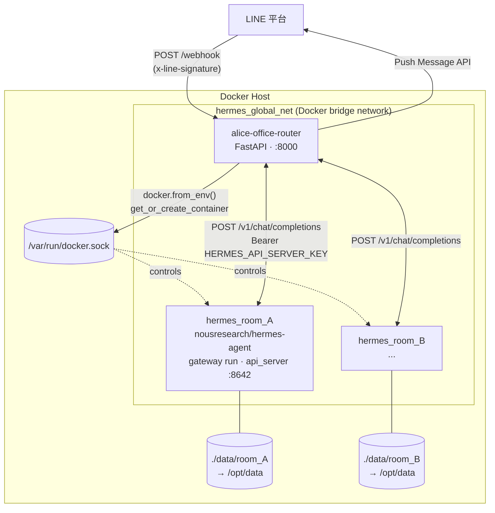
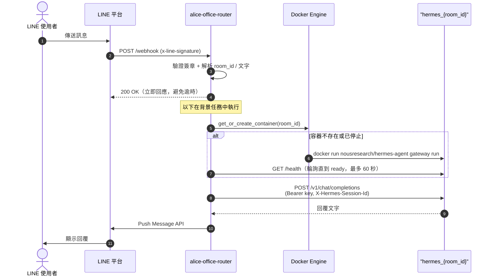

# alice-office-router

LINE OA 多租戶 Webhook 路由器。接收來自 LINE 平台的 Webhook，依據聊天室 ID 動態建立隔離的 Docker 容器（真實的 [Hermes Agent](https://github.com/NousResearch/hermes-agent)），把訊息轉發給對應容器的 LLM 大腦，再由 router 自己把回覆推播回 LINE。

## 架構概覽

Router 擁有 LINE 進出的全部責任（驗簽、收訊息、push 回覆）；Hermes container 完全不碰 LINE，只透過內建的 `api_server` platform（OpenAI-compatible API）被動回答問題。



每個聊天室擁有獨立容器與獨立資料夾，容器之間無法互相存取。Router 透過掛載的 `docker.sock` 控制這些「兄弟容器」（sibling containers）——這個模式讓 router 本身也能跑在 container 裡（見下方「部署模式」）。

單則訊息的完整流程：



## 部署模式

`ROUTER_IN_DOCKER` 決定 router 怎麼找到 Hermes 容器：

| 模式 | `ROUTER_IN_DOCKER` | Router 執行位置 | 如何連到 Hermes 容器 |
|---|---|---|---|
| 本機開發 | `false` | Host OS（`uv run uvicorn ...`） | 容器建立時發布隨機 host port，router 走 `http://localhost:<port>` |
| Container 化（正式/未來） | `true`（預設） | 自己也是 `hermes_global_net` 上的一個容器 | 直接用容器名稱解析，如 `http://hermes_room_A:8642` |

Container 化模式已經在 `docker-compose.yml` 中就緒——把 `/var/run/docker.sock` 掛進 router 自己的容器，讓它能對 Host 的 Docker Daemon 下指令生成「兄弟容器」（sibling containers），而不是需要 Docker-in-Docker：

```bash
docker compose up -d --build
```

已用 `docker compose up` + 真實的 LINE webhook 請求驗證過：router 在自己的 container 內仍能正常呼叫 `docker.sock` 建立 `hermes_{room_id}` 容器、透過容器名稱互連、並把回覆 push 回 LINE。

## 環境需求

- Docker（宿主機）
- Python 3.12（本地開發用）
- [uv](https://docs.astral.sh/uv/)（套件管理）

## 快速開始

### 1. 設定環境變數

```bash
cp .env.example .env
```

編輯 `.env`：

```env
LINE_CHANNEL_SECRET=your_channel_secret_here
LINE_CHANNEL_ACCESS_TOKEN=your_channel_access_token_here
HOST_DATA_DIR=/absolute/path/to/alice-office-router/data
HERMES_API_SERVER_KEY=change-me
LLM_BASE_URL=change-me
LLM_API_KEY=change-me
LLM_MODEL=change-me
```

> `HOST_DATA_DIR` 必須是**宿主機**的絕對路徑，Docker 掛載 Volume 時需要用到。
> `HERMES_API_SERVER_KEY` 用 `openssl rand -hex 32` 產生，router 與每個 Hermes 容器共用同一把密鑰。
> `LLM_*` 是共用的 LLM 後端設定，會自動寫入每個新房間的 `config.yaml`。

### 2. 啟動服務

```bash
docker compose up -d
```

服務啟動後監聽 `http://localhost:8000`。

將 LINE OA 的 Webhook URL 設為：`https://your-domain.com/webhook`

### 3. 驗證運作

模擬聊天室 A 發送訊息：

```bash
curl -X POST http://localhost:8000/webhook \
  -H "Content-Type: application/json" \
  -H "x-line-signature: <valid_sig>" \
  -d '{"events":[{"type":"message","source":{"type":"room","roomId":"room_AAA"},"message":{"type":"text","text":"hello"}}]}'
```

確認容器自動建立：

```bash
docker ps | grep hermes_room_AAA
ls data/room_AAA/          # 內含自動產生的 config.yaml
docker logs hermes_room_AAA | grep "/v1/chat/completions"  # 確認 Hermes agent 收到並回覆了訊息
```

> 也可以用 `uv run python scripts/test_webhook.py` 快速跑一輪模擬測試，不用手動組 curl 和簽章。

## 本地開發

```bash
uv sync                          # 安裝依賴
uv run fastapi dev src/alice_office_router/main.py  # 開發伺服器
```

## 指令速查

| 指令 | 說明 |
|------|------|
| `uv run pytest` | 執行所有測試 |
| `uv run pytest --cov=src --cov-report=term-missing` | 含覆蓋率 |
| `uv run mypy src/` | 型別檢查 |
| `uv run ruff check .` | Lint |
| `uv run ruff format .` | 格式化 |

提交前必跑：

```bash
uv run ruff check . && uv run mypy src/ && uv run pytest
```

## 專案結構

```
alice-office-router/
├── src/
│   └── alice_office_router/
│       ├── main.py              # FastAPI app factory + lifespan
│       ├── router.py            # POST /webhook 端點 + 取得回覆並 push 回 LINE
│       ├── line_verify.py       # LINE HMAC-SHA256 簽章驗證
│       ├── line_client.py       # 呼叫 LINE Push Message API
│       ├── hermes_client.py     # 呼叫 Hermes 容器的 /v1/chat/completions
│       ├── container_manager.py # Docker 容器動態管理
│       └── config.py            # pydantic-settings 設定
├── tests/
│   ├── conftest.py
│   ├── test_line_verify.py
│   ├── test_line_client.py
│   ├── test_hermes_client.py
│   ├── test_router.py
│   └── test_container_manager.py
├── scripts/
│   └── test_webhook.py          # 手動 end-to-end 測試腳本
├── docs/
│   └── hermes-agent-real-integration.md  # 架構變更紀錄
├── docker-compose.yml
├── Dockerfile
├── pyproject.toml
└── .env.example
```

## 環境變數說明

| 變數 | 必填 | 說明 |
|------|------|------|
| `LINE_CHANNEL_SECRET` | ✅ | LINE Webhook 簽章驗證用 |
| `LINE_CHANNEL_ACCESS_TOKEN` | ✅ | Router 自己用來呼叫 LINE Push Message API（不會傳入 Hermes 容器） |
| `HOST_DATA_DIR` | ✅ | 宿主機上 `data/` 的絕對路徑，用於 Docker Volume 掛載 |
| `HERMES_API_SERVER_KEY` | ✅ | Router 與每個 Hermes 容器共用的 Bearer 密鑰（容器的 `api_server` platform 靠它啟用與驗證） |
| `DATA_DIR` | | 容器內 data 目錄（預設 `/app/data`） |
| `HERMES_IMAGE` | | Hermes Agent 映像（預設 `nousresearch/hermes-agent`） |
| `HERMES_NETWORK` | | Docker 內網名稱（預設 `hermes_global_net`） |
| `HERMES_INTERNAL_PORT` | | Hermes Agent `api_server` 監聽 Port（預設 `8642`） |
| `LLM_BASE_URL` / `LLM_API_KEY` / `LLM_MODEL` | | 共用 LLM 後端設定，自動寫入每個新房間的 `config.yaml` |
| `ROUTER_IN_DOCKER` | | Router 是否跑在 Docker 內（預設 `true`）；本機開發用 `uv run uvicorn` 時設為 `false`，容器會改為發布隨機 host port |

## 安全性

- 每個 Webhook 請求均驗證 LINE HMAC-SHA256 簽章，驗證失敗回傳 `400`。
- 各聊天室的 Hermes Agent 容器僅掛載自己的 Volume（`/opt/data`），容器間硬碟資料完全隔離。
- Hermes 容器完全不接觸 LINE 憑證，只透過 `HERMES_API_SERVER_KEY` 與 Router 的內部 API 通訊；`api_server` 本身只在 Docker 內網（`hermes_global_net`）可達。
- `LINE_CHANNEL_SECRET`、`LINE_CHANNEL_ACCESS_TOKEN`、`HERMES_API_SERVER_KEY` 僅存於 `.env`，不進版控。
