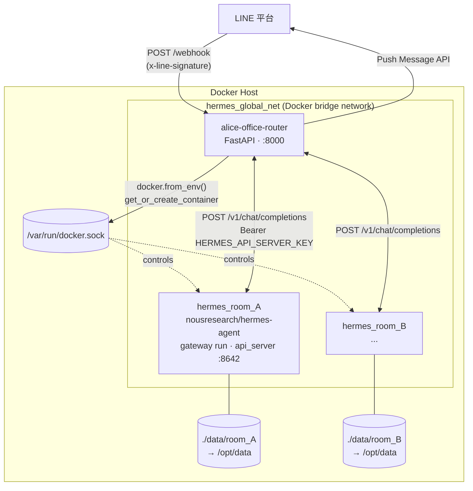
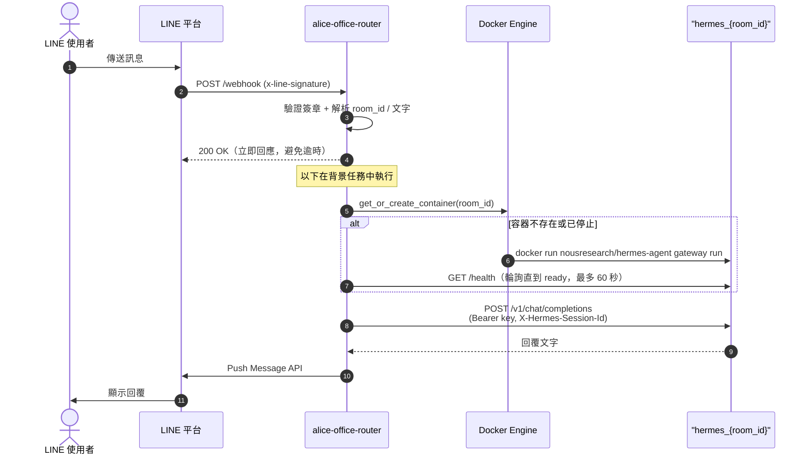

# alice-office-router

LINE OA 多租戶 Webhook 路由器。接收來自 LINE 平台的 Webhook，依據聊天室 ID 動態建立隔離的 Docker 容器（真實的 [Hermes Agent](https://github.com/NousResearch/hermes-agent)），把訊息轉發給對應容器的 LLM 大腦，再由 router 自己把回覆推播回 LINE。

## 架構概覽

Router 擁有 LINE 進出的全部責任（驗簽、收訊息、push 回覆）；Hermes container 完全不碰 LINE，只透過內建的 `api_server` platform（OpenAI-compatible API）被動回答問題。



每個聊天室擁有獨立容器與獨立資料夾，容器之間無法互相存取。Router 透過掛載的 `docker.sock` 控制這些「兄弟容器」（sibling containers）——這個模式讓 router 本身也能跑在 container 裡（見下方「部署模式」）。

單則訊息的完整流程：



## LINE 訊息類型支援

Router 會處理整個 webhook body 裡的**所有** event（不只第一個），逐一解析、去重、排背景任務：

| 訊息類型 | 處理方式 |
|---|---|
| `text` | 直接轉發文字給 Hermes agent |
| `image` / `audio` / `video` / `file` | 用 LINE Content API 下載二進位內容，寫進該房間掛載的 volume（`data/<room_id>/incoming/`，container 內對應 `/opt/data/incoming/`），送一則文字通知 agent 檔案路徑——由 container 內**真正的 Hermes agent** 用自己的 vision/STT/檔案工具處理，router 不做任何內容解析 |
| `sticker` / `location` | 轉成佔位文字（如 `[使用者傳送了貼圖：...]`）送給 agent |
| 其他／未知類型 | 記錄一行 log 後略過 |

回覆時：

- **Reply token 優先、Push 為 fallback**：webhook 事件裡的 `replyToken`（免費、單次、~60 秒內有效）優先使用；若已過期或被 LINE 拒絕，自動 fallback 到 Push Message API。
- **長文自動分段 + Markdown 去除**：LLM 回覆會先去除 LINE 無法渲染的 Markdown 語法（保留連結可點擊），再依 LINE 單則 bubble 5000 字上限智慧分段（最多 5 則/次）。
- **Webhook 事件去重**：LINE 的 webhook 是 at-least-once 語意，可能重送同一個 event；router 用 `webhookEventId` 做 in-memory 去重，避免同一則訊息被回覆兩次。

以上邏輯 1:1 參考自 Hermes Agent 內建 LINE adapter 的演算法（詳見 `docs/hermes-agent-line-gateway-comparison.md`），但因為架構不同（router 與 container 分離、只透過 `api_server` + 共用 volume 溝通），媒體處理走的是「檔案落地 + 文字通知」而非 Hermes 內建的多模態 API 路徑。

Outbound 媒體（agent 主動產生圖片/語音/影片送回 LINE）與 slow-LLM postback 按鈕尚未實作，見同一份文件的
「未做（Phase 2）」項目。

## 部署模式

`ROUTER_IN_DOCKER` 決定 router 怎麼找到 Hermes 容器：

| 模式 | `ROUTER_IN_DOCKER` | Router 執行位置 | 如何連到 Hermes 容器 |
|---|---|---|---|
| 本機開發 | `false` | Host OS（`uv run uvicorn ...`） | 容器建立時發布隨機 host port，router 走 `http://localhost:<port>` |
| Container 化（正式/未來） | `true`（預設） | 自己也是 `hermes_global_net` 上的一個容器 | 直接用容器名稱解析，如 `http://hermes_room_A:8642` |

Container 化模式已經在 `docker-compose.yml` 中就緒——把 `/var/run/docker.sock` 掛進 router 自己的容器，讓它能對 Host 的 Docker Daemon 下指令生成「兄弟容器」（sibling containers），而不是需要 Docker-in-Docker：

```bash
docker compose up -d --build
```

已用 `docker compose up` + 真實的 LINE webhook 請求驗證過：router 在自己的 container 內仍能正常呼叫 `docker.sock` 建立 `hermes_{room_id}` 容器、透過容器名稱互連、並把回覆 push 回 LINE。

## 環境需求

- Docker（宿主機）
- Python 3.12（本地開發用）
- [uv](https://docs.astral.sh/uv/)（套件管理）
- [ngrok](https://ngrok.com/)（選配——只有接真 LINE 端到端驗收時需要）

## 快速開始

### 1. 設定環境變數

```bash
cp .env.example .env
```

編輯 `.env`：

```env
LINE_CHANNEL_SECRET=your_channel_secret_here
LINE_CHANNEL_ACCESS_TOKEN=your_channel_access_token_here
HOST_DATA_DIR=/absolute/path/to/alice-office-router/data
HERMES_API_SERVER_KEY=change-me
LLM_BASE_URL=change-me
LLM_API_KEY=change-me
LLM_MODEL=change-me
```

> `HOST_DATA_DIR` 必須是**宿主機**的絕對路徑，Docker 掛載 Volume 時需要用到。
> `HERMES_API_SERVER_KEY` 用 `openssl rand -hex 32` 產生，router 與每個 Hermes 容器共用同一把密鑰。
> `LLM_*` 是共用的 LLM 後端設定，會自動寫入每個新房間的 `config.yaml`。
>
> **本機開發不需要真的 LINE channel**：`LINE_CHANNEL_SECRET` / `LINE_CHANNEL_ACCESS_TOKEN`
> 填任意假值即可——`scripts/test_webhook.py` 會用你填的 secret 計算簽章，兩邊一致就能通過驗簽。
> 只有要接真 LINE 端到端驗收時才需要真憑證（見下方「接真的 LINE」）。

### 2. 建立 Docker 網路、拉取 Hermes image

```bash
docker network create hermes_global_net
docker pull nousresearch/hermes-agent:<pinned-tag>
```

> `hermes_global_net` 在 `docker-compose.yml` 中宣告為 `external`，沒先建立會直接啟動失敗。
> `nousresearch/hermes-agent` 是 Docker Hub 公開 image，不需要任何 registry 權限，
> 但請在 `.env` 的 `HERMES_IMAGE` **pin 版本 tag**（如 `nousresearch/hermes-agent:v2026.4.16`），
> 不要用預設的 `latest`——版本漂移是這個架構最容易踩的雷之一。

### 3. 啟動服務

```bash
docker compose up -d
```

服務啟動後監聽 `http://localhost:8000`。

將 LINE OA 的 Webhook URL 設為：`https://your-domain.com/webhook`

### 4. 驗證運作

模擬聊天室 A 發送訊息：

```bash
curl -X POST http://localhost:8000/webhook \
  -H "Content-Type: application/json" \
  -H "x-line-signature: <valid_sig>" \
  -d '{"events":[{"type":"message","source":{"type":"room","roomId":"room_AAA"},"message":{"type":"text","text":"hello"}}]}'
```

確認容器自動建立：

```bash
docker ps | grep hermes_room_AAA
ls data/room_AAA/          # 內含自動產生的 config.yaml
docker logs hermes_room_AAA | grep "/v1/chat/completions"  # 確認 Hermes agent 收到並回覆了訊息
```

> 也可以用 `uv run python scripts/test_webhook.py` 快速跑一輪模擬測試，不用手動組 curl 和簽章。

第一次觸發某個房間時會拉起 `hermes_<room_id>` 容器，Hermes 開機（s6 supervision + skill sync）
需要 30–60 秒，不是卡住。成功後 `data/<room_id>/` 會出現完整的 agent home
（sessions、memories、skills…）——這個目錄就是該房間的「記憶」，容器可以隨時砍掉重建而不失憶，
但不要手動修改裡面的狀態檔。

## 本地開發

日常開發一律用 host 模式（`ROUTER_IN_DOCKER=false`），改 code 即時 reload、不用重 build image：

```bash
uv sync                          # 安裝依賴
uv run fastapi dev src/alice_office_router/main.py  # 開發伺服器
uv run python scripts/test_webhook.py               # 隨手驗證整條路
```

Container 模式（`docker compose up --build`）只在動到 Dockerfile / compose /
`container_manager.py` 連線邏輯時才需要驗一次。

### 接真的 LINE（端到端驗收才需要）

每位開發者自建免費 LINE OA，互不干擾（一個 channel 同時只能設一個 webhook URL，共用會互搶）：

1. [LINE Developers Console](https://developers.line.biz/) → 建 Provider → 建 **Messaging API** channel，
   把 channel secret / access token 填入 `.env`
2. `ngrok http 8000`，將 `https://<id>.ngrok-free.app/webhook` 填入 channel 的 Webhook URL，
   開啟 "Use webhook"
3. 用手機加該 OA 為好友，傳訊息 → 應收到 Hermes 回覆

## 開發工作流程

### 三條開發線

改動前先認清你在改哪一種東西——三者的生效方式與交付路徑完全不同：

| 交付物 | 改動位置 | 生效方式 | 頻率 |
|--------|----------|----------|------|
| **A. Router feature** | `src/alice_office_router/` | 重建 router image | 低頻 |
| **B. Hermes skill** | skill 檔案（`SKILL.md` + `scripts/`） | 放進房間的 `/opt/data/skills/`，restart 容器 | 高頻 |
| **C. Plugin / MCP** | MCP server（獨立 HTTP/SSE 容器）或 Hermes 衍生 image | 改房間 `config.yaml` + restart；或換 `HERMES_IMAGE` | 低頻 |

共同的鐵律（對 Hermes `0.18.0` 實測確認）：

- `HERMES_HOME=/opt/data`——掛載的 volume 就是完整 agent home，
  **file-drop 設定（skills / plugins / hooks / MCP / SOUL.md）都真的有效**。
- **沒有熱載入**。透過 `/v1/chat/completions` 送 `/reload-mcp` 之類的 slash command
  不會被攔截（會被當一般文字丟給 LLM）。設定變更的通用生效手段就是 **restart 容器**。
- 部署版本的 Jobs REST API（`/api/jobs`）**沒有開**（`/v1/capabilities` 回報
  `jobs_admin: false`）——官方文件寫有不代表真的有，開發前先打 `/v1/capabilities` 確認。

### A. Router feature

Trunk-based，短分支：

```bash
git checkout -b feat/xxx        # 或 fix/xxx
# ... host 模式開發，scripts/test_webhook.py 隨手驗 ...
uv run ruff check . && uv run mypy src/ && uv run pytest   # 提交前必跑
```

- `main` 永遠保持可 release。做一半的功能用環境變數 feature flag 藏起來照樣合併——
  **小步合併，不養長分支**。
- 單元測試 mock 掉 LINE API 與 Docker（照 `tests/conftest.py` 現有模式）；
  但編排邏輯（`container_manager.py`）的改動要另外用 `scripts/test_webhook.py`
  對真容器驗一次——單元測試全 mock，測不到最容易壞的 Docker 層。

### B. Hermes skill

Skill 是純檔案，格式照 `data/<room>/skills/` 裡的現成範例
（`DESCRIPTION.md` + 各 skill 的 `SKILL.md`，選配 `scripts/`、`references/`）：

1. 把 skill 放進自己測試房間的 `data/<room_id>/skills/<name>/`
2. `docker restart hermes_<room_id>`
3. 用 `test_webhook.py` 送會觸發該 skill 的訊息驗證

### C. Plugin / MCP

**預設路徑：MCP server 做成獨立的 HTTP/SSE 容器**（sibling container），不進 Hermes image。
image 裡雖有 node / npx / uvx 可跑 stdio MCP，但那樣每個房間容器都要各自複製一份 runtime；
HTTP/SSE 一份服務所有房間共用：

1. 開發並 `docker build`，`docker run --network hermes_global_net` 起起來
2. 在測試房間的 `data/<room_id>/config.yaml` 加 MCP 設定（指向 `http://<container-name>:<port>`）
3. `docker restart hermes_<room_id>`，用 `test_webhook.py` 驗證 agent 呼叫得到該 tool

只有當功能必須跑在 Hermes **進程內**（真 plugin，不是 MCP）才走衍生 image：
`FROM nousresearch/hermes-agent:<pin>`，改 `HERMES_IMAGE` 逐房重建。
這條路每次升級 Hermes 都要 rebase，成本高，沒必要不要走。

### 驗證層級（由快到慢）

| 層級 | 工具 | 驗什麼 | 什麼時候跑 |
|------|------|--------|-----------|
| 1 | `pytest`（全 mock） | router 邏輯 | 每次改動，秒級 |
| 2 | `scripts/test_webhook.py` | 驗簽 → 容器編排 → LLM 整條路 | 動到編排/協定時 |
| 3 | 真 LINE（自建 OA + ngrok） | LINE 平台行為（媒體、reply token…） | 驗收、動到 LINE 相關 code 時 |
| 4 | canary 房間 | 正式環境、真使用者流量 | release 前 |

## 疑難排解

- **compose 啟動直接失敗**：`hermes_global_net` 沒建（network 宣告為 `external`），
  先 `docker network create hermes_global_net`。
- **host 模式連 Hermes 容器 timeout**：忘了把 `ROUTER_IN_DOCKER` 設 `false`，
  router 在用容器名連線，host 上解析不到。
- **第一次訊息很久才回**：Hermes 容器首次啟動要 30–60 秒（s6 + skill sync）屬正常；
  慢機器上 `_wait_until_ready` 的 60 秒 timeout 偶爾不夠，可調 `container_manager.py`。
- **改了掛載來源的 symlink 沒生效**：Docker bind mount 在**建容器時**就把 symlink
  解析成實體路徑，之後切 symlink 對既有容器無效，`docker restart` 也不會重新解析——
  必須 recreate 容器。
- **改了 config.yaml / skills / MCP 設定沒生效**：Hermes 沒有熱載入，
  restart 該房間容器才會生效。

## 指令速查

| 指令 | 說明 |
|------|------|
| `uv run pytest` | 執行所有測試 |
| `uv run pytest --cov=src --cov-report=term-missing` | 含覆蓋率 |
| `uv run mypy src/` | 型別檢查 |
| `uv run ruff check .` | Lint |
| `uv run ruff format .` | 格式化 |

提交前必跑：

```bash
uv run ruff check . && uv run mypy src/ && uv run pytest
```

## 專案結構

```
alice-office-router/
├── src/
│   └── alice_office_router/
│       ├── main.py              # FastAPI app factory + lifespan
│       ├── router.py            # POST /webhook 端點 + 取得回覆並 push 回 LINE
│       ├── line_verify.py       # LINE HMAC-SHA256 簽章驗證
│       ├── line_client.py       # 呼叫 LINE Reply/Push Message API + Content API 下載媒體
│       ├── line_format.py       # Markdown 去除 + 長文分段（LINE bubble 限制）
│       ├── line_dedup.py        # Webhook event 去重（in-memory）
│       ├── hermes_client.py     # 呼叫 Hermes 容器的 /v1/chat/completions
│       ├── container_manager.py # Docker 容器動態管理
│       └── config.py            # pydantic-settings 設定
├── tests/
│   ├── conftest.py
│   ├── test_line_verify.py
│   ├── test_line_client.py
│   ├── test_line_format.py
│   ├── test_line_dedup.py
│   ├── test_hermes_client.py
│   ├── test_router.py
│   └── test_container_manager.py
├── scripts/
│   └── test_webhook.py          # 手動 end-to-end 測試腳本
├── docs/                        # 設計文件（不進版控，clone 不會有；實質內容以本 README 為準）
│   ├── hermes-agent-real-integration.md         # 從 mock 換成真實 Hermes Agent 的變更紀錄
│   ├── hermes-agent-line-gateway-comparison.md  # 為何不用 Hermes 內建 LINE gateway、對照表
│   ├── line-hermes-message-flow.md              # 單則訊息從 LINE 到 Hermes container 的完整流程
│   ├── cicd-plan.md                             # CI/CD 與客戶交付流程設計
│   └── developer-workflow.md                    # 開發工作流程完整版（本 README 的擴充）
├── docker-compose.yml
├── Dockerfile
├── pyproject.toml
└── .env.example
```

## 環境變數說明

| 變數 | 必填 | 說明 |
|------|------|------|
| `LINE_CHANNEL_SECRET` | ✅ | LINE Webhook 簽章驗證用 |
| `LINE_CHANNEL_ACCESS_TOKEN` | ✅ | Router 自己用來呼叫 LINE Push Message API（不會傳入 Hermes 容器） |
| `HOST_DATA_DIR` | ✅ | 宿主機上 `data/` 的絕對路徑，用於 Docker Volume 掛載 |
| `HERMES_API_SERVER_KEY` | ✅ | Router 與每個 Hermes 容器共用的 Bearer 密鑰（容器的 `api_server` platform 靠它啟用與驗證） |
| `DATA_DIR` | | 容器內 data 目錄（預設 `/app/data`） |
| `HERMES_IMAGE` | | Hermes Agent 映像（預設 `nousresearch/hermes-agent`，等同 `latest`——請改成 pin 版本 tag，如 `nousresearch/hermes-agent:v2026.4.16`） |
| `HERMES_NETWORK` | | Docker 內網名稱（預設 `hermes_global_net`） |
| `HERMES_INTERNAL_PORT` | | Hermes Agent `api_server` 監聽 Port（預設 `8642`） |
| `LLM_BASE_URL` / `LLM_API_KEY` / `LLM_MODEL` | | 共用 LLM 後端設定，自動寫入每個新房間的 `config.yaml` |
| `ROUTER_IN_DOCKER` | | Router 是否跑在 Docker 內（預設 `true`）；本機開發用 `uv run uvicorn` 時設為 `false`，容器會改為發布隨機 host port |

## 安全性

- 每個 Webhook 請求均驗證 LINE HMAC-SHA256 簽章，驗證失敗回傳 `400`。
- 各聊天室的 Hermes Agent 容器僅掛載自己的 Volume（`/opt/data`），容器間硬碟資料完全隔離；使用者傳送的圖片/檔案/語音/影片也是落在各自房間的 `incoming/` 子目錄下，同樣不互通。
- Hermes 容器完全不接觸 LINE 憑證，只透過 `HERMES_API_SERVER_KEY` 與 Router 的內部 API 通訊；`api_server` 本身只在 Docker 內網（`hermes_global_net`）可達。
- `LINE_CHANNEL_SECRET`、`LINE_CHANNEL_ACCESS_TOKEN`、`HERMES_API_SERVER_KEY` 僅存於 `.env`，不進版控。
