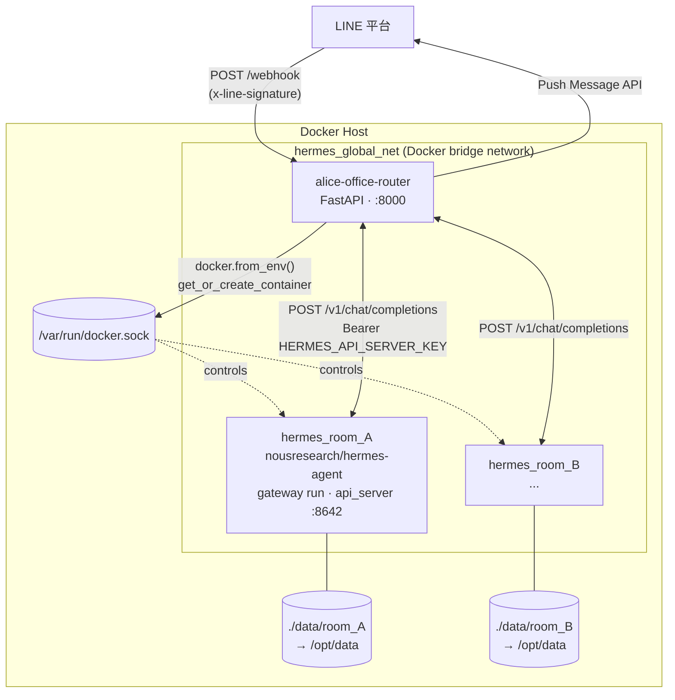
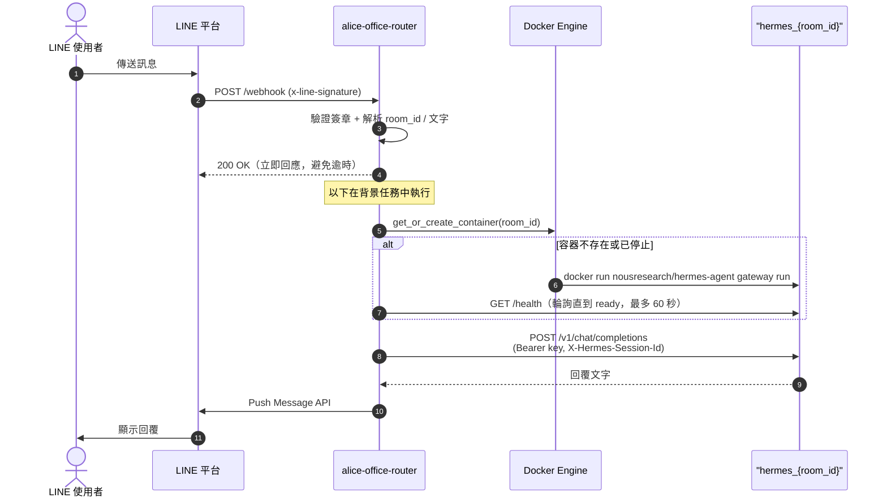

# alice-office-router

LINE OA 多租戶 Webhook 路由器。接收來自 LINE 平台的 Webhook，依據聊天室 ID 動態建立隔離的 Docker 容器（真實的 [Hermes Agent](https://github.com/NousResearch/hermes-agent)），把訊息轉發給對應容器的 LLM 大腦，再由 router 自己把回覆推播回 LINE。

## 架構概覽

Router 擁有 LINE 進出的全部責任（驗簽、收訊息、push 回覆）；Hermes container 完全不碰 LINE，只透過內建的 `api_server` platform（OpenAI-compatible API）被動回答問題。



每個聊天室擁有獨立容器與獨立資料夾，容器之間無法互相存取。Router 透過掛載的 `docker.sock` 控制這些「兄弟容器」（sibling containers）——這個模式讓 router 本身也能跑在 container 裡（見下方「部署模式」）。

單則訊息的完整流程：



## LINE 訊息類型支援

Router 會處理整個 webhook body 裡的**所有** event（不只第一個），逐一解析、去重、排背景任務：

| 訊息類型 | 處理方式 |
|---|---|
| `text` | 直接轉發文字給 Hermes agent |
| `image` / `audio` / `video` / `file` | 用 LINE Content API 下載二進位內容，寫進該房間掛載的 volume（`data/<room_id>/incoming/`，container 內對應 `/opt/data/incoming/`），送一則文字通知 agent 檔案路徑——由 container 內**真正的 Hermes agent** 用自己的 vision/STT/檔案工具處理，router 不做任何內容解析 |
| `sticker` / `location` | 轉成佔位文字（如 `[使用者傳送了貼圖：...]`）送給 agent |
| 其他／未知類型 | 記錄一行 log 後略過 |

回覆時：

- **Reply token 優先、Push 為 fallback**：webhook 事件裡的 `replyToken`（免費、單次、~60 秒內有效）優先使用；若已過期或被 LINE 拒絕，自動 fallback 到 Push Message API。
- **長文自動分段 + Markdown 去除**：LLM 回覆會先去除 LINE 無法渲染的 Markdown 語法（保留連結可點擊），再依 LINE 單則 bubble 5000 字上限智慧分段（最多 5 則/次）。
- **Webhook 事件去重**：LINE 的 webhook 是 at-least-once 語意，可能重送同一個 event；router 用 `webhookEventId` 做 in-memory 去重，避免同一則訊息被回覆兩次。

以上邏輯 1:1 參考自 Hermes Agent 內建 LINE adapter 的演算法（詳見 `docs/hermes-agent-line-gateway-comparison.md`），但因為架構不同（router 與 container 分離、只透過 `api_server` + 共用 volume 溝通），媒體處理走的是「檔案落地 + 文字通知」而非 Hermes 內建的多模態 API 路徑。

Outbound 媒體（agent 主動產生圖片/語音/影片送回 LINE）與 slow-LLM postback 按鈕尚未實作，見同一份文件的
「未做（Phase 2）」項目。

## 部署模式

`ROUTER_IN_DOCKER` 決定 router 怎麼找到 Hermes 容器：

| 模式 | `ROUTER_IN_DOCKER` | Router 執行位置 | 如何連到 Hermes 容器 |
|---|---|---|---|
| 本機開發 | `false` | Host OS（`uv run uvicorn ...`） | 容器建立時發布隨機 host port，router 走 `http://localhost:<port>` |
| Container 化（正式/未來） | `true`（預設） | 自己也是 `hermes_global_net` 上的一個容器 | 直接用容器名稱解析，如 `http://hermes_room_A:8642` |

Container 化模式已經在 `docker-compose.yml` 中就緒——把 `/var/run/docker.sock` 掛進 router 自己的容器，讓它能對 Host 的 Docker Daemon 下指令生成「兄弟容器」（sibling containers），而不是需要 Docker-in-Docker：

```bash
docker compose up -d --build
```

已用 `docker compose up` + 真實的 LINE webhook 請求驗證過：router 在自己的 container 內仍能正常呼叫 `docker.sock` 建立 `hermes_{room_id}` 容器、透過容器名稱互連、並把回覆 push 回 LINE。

正式部署時 `.env` 用真的 LINE 憑證、`ROUTER_IN_DOCKER=true`，並把 LINE OA 的
Webhook URL 設為 `https://your-domain.com/webhook`（服務監聽 `http://localhost:8000`）。
日常開發不用起 compose——只在動到 Dockerfile / compose / `container_manager.py`
連線邏輯時，才需要用 container 模式驗一次。

## 環境需求

- Docker（宿主機）
- Python 3.12（本地開發用）
- [uv](https://docs.astral.sh/uv/)（套件管理）
- [ngrok](https://ngrok.com/)（選配——只有接真 LINE 端到端驗收時需要）

## 快速開始

從 git clone 到改 code 看到更動。照著做即可，全程不需要真的 LINE channel——
`scripts/test_webhook.py` 會模擬 LINE 平台的簽章與訊息。

### 1. 安裝依賴

```bash
uv sync
```

### 2. 設定環境變數

```bash
cp .env.example .env
```

編輯 `.env`：

```env
LINE_CHANNEL_SECRET=dev-fake-secret        # 開發用假值即可，test_webhook.py 用它算簽章
LINE_CHANNEL_ACCESS_TOKEN=dev-fake-token   # 同上——接真 LINE 驗收才需要真憑證
ROUTER_IN_DOCKER=false                     # 開發用 host 模式；容器化部署才設 true
DATA_DIR=/absolute/path/to/alice-office-router/data       # host 模式下必填，見下方註解
HOST_DATA_DIR=/absolute/path/to/alice-office-router/data
HERMES_TEMPLATES_DIR=/absolute/path/to/alice-office-router/src/hermes  # host 模式下必填，見下方註解
HERMES_IMAGE=alice-hermes-agent:v1
HERMES_API_SERVER_KEY=change-me            # openssl rand -hex 32
LLM_BASE_URL=change-me                     # 唯一不能假的：可用的 OpenAI-compatible endpoint
LLM_API_KEY=change-me
LLM_MODEL=change-me
```

> `HOST_DATA_DIR` 必須是**宿主機**的絕對路徑，Docker 掛載 volume 時需要用到。
> `DATA_DIR` 預設是 `/app/data`（給 router 自己也跑在容器裡的部署模式用）——**host 模式
> （`uv run fastapi dev`）下必須另外覆寫成跟 `HOST_DATA_DIR` 一樣的絕對路徑**，因為
> router 進程會直接在宿主機上對這個路徑做 `mkdir`／寫 `config.yaml`；沒設的話會拿預設值
> `/app/data`，在 macOS／Linux host 上通常不存在也不可寫，會在建立房間時整個失敗，
> 且錯誤只會出現在 router 自己的 terminal（背景任務吞掉例外），對 `test_webhook.py` 呼叫方
> 看起來像是「container 一直不存在」而非明確報錯。`HERMES_TEMPLATES_DIR` 是同一種
> router-local 路徑，同樣道理：host 模式下要覆寫成 repo 的 `src/hermes` 絕對路徑。
> `HERMES_API_SERVER_KEY` 是 router 與每個 Hermes 容器共用的密鑰。
> `LLM_*` 是共用的 LLM 後端設定，會自動寫入每個新房間的 `config.yaml`。

### 3. 建立 Docker 網路、準備 Hermes image

```bash
docker network create hermes_global_net
docker build -f Dockerfile.hermes -t alice-hermes-agent:v1 .   # 含 plugin + MCP 共用依賴
```

> `hermes_global_net` 在 `docker-compose.yml` 中宣告為 `external`，沒先建立會直接啟動失敗。
>
> 趕時間可以跳過 build，先 `docker pull nousresearch/hermes-agent:<pinned-tag>`（Docker Hub
> 公開 image，免權限）填進 `HERMES_IMAGE`——local-tools 的 4 個 stdlib 工具能動，但
> math／OCR／webdriver 與 secretary-mcp（缺 `/opt/node_modules`）不行，差別見
> 「[預裝 Plugin](#預裝-pluginlocal-tools)」。
> 不論哪種，`HERMES_IMAGE` 都 **pin 版本 tag**，不要 `latest`——版本漂移是這個架構最容易踩的雷之一。

### 4. 啟動 router、建立測試房間

```bash
uv run fastapi dev src/alice_office_router/main.py        # terminal A，保持開著
uv run python scripts/test_webhook.py --user-id U_LOCAL_TEST --text "你好"   # terminal B
```

確認容器自動建立：

```bash
docker ps | grep hermes_U_LOCAL_TEST
ls data/U_LOCAL_TEST/          # 內含自動產生的 config.yaml
docker logs hermes_U_LOCAL_TEST | grep "/v1/chat/completions"  # Hermes agent 收到並回覆了訊息
```

第一次觸發某個房間時會拉起 `hermes_<room_id>` 容器，Hermes 開機（s6 supervision + skill sync）
需要 30–60 秒，不是卡住。成功後 `data/<room_id>/` 會出現完整的 agent home
（sessions、memories、skills…），其中 `mcp/` 與 `plugins/` 是從 `src/hermes/{mcp,plugin}/`
自動 seed 出來的**這個房間自己的副本**（見「[C. Plugin / MCP](#c-plugin--mcp)」）——這個
目錄就是該房間的「記憶」＋「工具原始碼」，容器可以隨時砍掉重建而不失憶，但除了
`mcp/`／`plugins/`（本來就是給你編輯的）之外，不要手動修改裡面的其他狀態檔。

agent 的回覆去哪看：假 user id 推不回真的 LINE（router log 出現 `Failed to push LINE reply`
屬預期），所以看 `docker logs -f hermes_U_LOCAL_TEST` 與 router terminal 的 log。

### 5. 日常開發迴圈

```bash
# terminal A：router
uv run fastapi dev src/alice_office_router/main.py

# terminal B：watcher——監看測試房間自己 seed 出來的 mcp/plugins 副本，存檔自動 restart
uv run python scripts/watch_restart.py --room-id U_LOCAL_TEST

# terminal C：改 code → 存檔 → 等 watcher 顯示 restart 完成（warm restart 約 10–15 秒）
#            → 送訊息驗證
vim data/U_LOCAL_TEST/plugins/local-tools/tools.py    # 或 data/U_LOCAL_TEST/mcp/secretary/tools/*.mjs
uv run python scripts/test_webhook.py --user-id U_LOCAL_TEST --text "呼叫 math 工具，expression=\"2+2\""
```

- 改 **router code**（`src/alice_office_router/`）：`fastapi dev` 自己會 reload，不用動任何容器。
- 改 **plugin / MCP**：改的是**測試房間自己的副本**（`data/<room_id>/{plugins,mcp}/`，不是
  `src/hermes/` 底下的樣板——樣板只在房間第一次建立時 seed 一次），watcher 自動 restart
  測試房間。更細的生效條件見「[C. Plugin / MCP](#c-plugin--mcp)」。
- 改 **skill**：放進 `data/<room_id>/skills/` 後 restart 該房間（見「[B. Hermes skill](#b-hermes-skill)」）。

### 接真的 LINE（端到端驗收才需要）

每位開發者自建免費 LINE OA，互不干擾（一個 channel 同時只能設一個 webhook URL，共用會互搶）：

1. [LINE Developers Console](https://developers.line.biz/) → 建 Provider → 建 **Messaging API** channel，
   把 channel secret / access token 填入 `.env`
2. `ngrok http 8000`，將 `https://<id>.ngrok-free.app/webhook` 填入 channel 的 Webhook URL，
   開啟 "Use webhook"
3. 用手機加該 OA 為好友，傳訊息 → 應收到 Hermes 回覆

## 開發工作流程

### 三條開發線

改動前先認清你在改哪一種東西——三者的生效方式與交付路徑完全不同：

| 交付物 | 改動位置 | 生效方式 | 頻率 |
|--------|----------|----------|------|
| **A. Router feature** | `src/alice_office_router/` | 重建 router image | 低頻 |
| **B. Hermes skill** | skill 檔案（`SKILL.md` + `scripts/`） | 放進房間的 `/opt/data/skills/`，restart 容器 | 高頻 |
| **C. Plugin / MCP** | MCP server（獨立 HTTP/SSE 容器）或 Hermes 衍生 image | 改房間 `config.yaml` + restart；或換 `HERMES_IMAGE` | 低頻 |

共同的鐵律（對 Hermes `0.18.0` 實測確認）：

- `HERMES_HOME=/opt/data`——掛載的 volume 就是完整 agent home，
  **file-drop 設定（skills / plugins / hooks / MCP / SOUL.md）都真的有效**。
- **沒有熱載入**。透過 `/v1/chat/completions` 送 `/reload-mcp` 之類的 slash command
  不會被攔截（會被當一般文字丟給 LLM）。設定變更的通用生效手段就是 **restart 容器**。
- 部署版本的 Jobs REST API（`/api/jobs`）**沒有開**（`/v1/capabilities` 回報
  `jobs_admin: false`）——官方文件寫有不代表真的有，開發前先打 `/v1/capabilities` 確認。

### A. Router feature

Trunk-based，短分支：

```bash
git checkout -b feat/xxx        # 或 fix/xxx
# ... host 模式開發，scripts/test_webhook.py 隨手驗 ...
uv run ruff check . && uv run mypy src/ && uv run pytest   # 提交前必跑
```

- `main` 永遠保持可 release。做一半的功能用環境變數 feature flag 藏起來照樣合併——
  **小步合併，不養長分支**。
- 單元測試 mock 掉 LINE API 與 Docker（照 `tests/conftest.py` 現有模式）；
  但編排邏輯（`container_manager.py`）的改動要另外用 `scripts/test_webhook.py`
  對真容器驗一次——單元測試全 mock，測不到最容易壞的 Docker 層。

### B. Hermes skill

Skill 是純檔案，格式照 `data/<room>/skills/` 裡的現成範例
（`DESCRIPTION.md` + 各 skill 的 `SKILL.md`，選配 `scripts/`、`references/`）：

1. 把 skill 放進自己測試房間的 `data/<room_id>/skills/<name>/`
2. `docker restart hermes_<room_id>`
3. 用 `test_webhook.py` 送會觸發該 skill 的訊息驗證

### C. Plugin / MCP

MCP server 原始碼放在 `src/hermes/mcp/<name>/`（目前只有 `secretary/`）。**每個房間
第一次建立 container 時，會各自從這裡 seed 一份自己的、可自由編輯的副本**到
`data/<room_id>/mcp/<name>/`（見 `container_manager.py` 的 `_ensure_mcp_seed`）——
之後房間之間互不影響，改一個房間的副本不會動到其他房間。這是 stdio MCP（Hermes
gateway 直接 spawn `node server.mjs` 子進程），每個房間各自一份 process，靠
`SECRETARY_LINE_USER_ID` = `room_id`（見 `src/hermes/mcp/secretary/mcp.manifest.yaml`）
做房間隔離。`src/hermes/mcp/` 底下有幾個子目錄，`_ensure_mcp_seed` 就會幫每個新房間
各 seed 一份，`_format_mcp_section` 對每個房間 seed 出來的 MCP 各自產生一段
`mcp_servers.<name>` 寫進 `config.yaml`。

> 如果某個 MCP 天生就該所有房間共用同一份、不需要各房間各自客製化（例如純無狀態的
> 公用查詢服務），做成獨立的 HTTP/SSE sibling container、`config.yaml` 用
> `http://<container-name>:<port>` 連線，仍然是更省資源的選項——這裡的 seed 機制
> 是特別為了「每個房間需要能各自修改」這個需求設計的，不是唯一路徑。

**write-once（frozen）**：seed 只在房間第一次建立時發生一次，之後永不覆蓋——跟
`config.yaml` 的規則一樣，讓你放心手改房間自己的副本而不怕被蓋掉。代價是：改
`src/hermes/mcp/<name>/` 的原始碼**只會影響之後新建立的房間**，已存在的房間要嘛
自己去改它自己 `data/<room_id>/mcp/<name>/` 底下的那份，要嘛整個重建（見下方
「測試 MCP 修改」）。

MCP server 是 ESM（`"type": "module"`），依賴解析靠從檔案位置往上找 `node_modules`
（ESM 不吃 `NODE_PATH`）。每個房間的副本落在 `/opt/data/mcp/<name>/`（被房間自己的
bind mount 蓋住），所以共用的相依套件改烤在再上一層的 `/opt/node_modules`（見
`Dockerfile.hermes`）——所有房間、所有 MCP 共用同一份，改依賴版本要重 build image；
改 MCP 的程式邏輯只要房間自己 restart。

#### 每個 MCP 自己的密鑰

`GOOGLE_MAPS_API_KEY` 這類 secretary MCP 專屬密鑰**不走這個 repo 的 `.env` /
router `Settings`**：房間第一次建立時，`_ensure_mcp_seed` 會把
`src/hermes/mcp/secretary/.env.example` 複製成該房間自己的
`data/<room_id>/mcp/secretary/.env`——`server.mjs` 啟動時用 Node 內建的
`process.loadEnvFile()` 自己讀。之後要改哪個房間的密鑰，直接編輯那個房間自己的
`.env` 檔（`docker restart` 生效），不影響其他房間，也不用改這個 repo 任何地方。
router 完全不會碰到這個檔案的內容。

`.dockerignore` 排除了所有層級的 `.env`（`**/.env`），所以就算 `src/hermes/mcp/`
底下某個開發者的本機 checkout 不小心留了真的 `.env`，也不會被 `Dockerfile.hermes`
烤進 image、不會意外流入 image layer。

#### 測試 MCP 修改

**Level 0（最快，不碰 Docker/Hermes）**——用官方 MCP inspector 直接對某個 MCP 樣板
打 stdio protocol：

```bash
cd src/hermes/mcp/secretary && npm install   # 第一次要裝依賴（僅供本機獨立測試用）
SECRETARY_LINE_USER_ID=test_room npx @modelcontextprotocol/inspector node server.mjs
```

開瀏覽器 UI，可直接呼叫個別 tool、驗 schema、看回傳值，不用經過 Hermes。

**Level 1（透過 Hermes 容器驗證，改房間自己的副本）**：

1. 確保測試房間容器已存在過一次（`_ensure_mcp_seed` 才會把 MCP 樣板 seed 進
   `data/<room_id>/mcp/<name>/`）：`uv run python scripts/test_webhook.py --user-id U_LOCAL_TEST`
2. 直接改該房間自己的副本，例如 `data/U_LOCAL_TEST/mcp/secretary/tools/todo.mjs`——
   **不要改 `src/hermes/mcp/` 底下的樣板**，那份只在房間第一次建立時生效一次
3. `docker restart hermes_<room_id>` 讓 Hermes gateway 重新 spawn MCP server process，
   讀到新程式碼——這步可以用 `uv run python scripts/watch_restart.py --room-id U_LOCAL_TEST`
   自動化，存檔即觸發
4. `uv run python scripts/test_webhook.py` 送會觸發該 tool 的訊息（例如「幫我加一筆待辦」），
   `docker logs hermes_<room_id>` 找 `[secretary-mcp] ready; lineUserId=...` 確認 spawn 成功、有無報錯

**要測「改了 repo 樣板之後全新房間長什麼樣」**：因為 write-once，既有測試房間看不到
樣板改動——用一個新的 `--user-id`，或 `docker rm -f hermes_<room_id>` 並刪掉
`data/<room_id>/{mcp,plugins,config.yaml}` 讓它下次重新從樣板 seed。

**Level 2（完整驗證，套件有變動時必跑）**：改了某個 MCP 的 `package.json`
（新增/升級依賴）時，記得同步更新 `src/hermes/mcp/package.json`（所有 MCP 共用依賴的
聯集），然後重 build，因為共用的 `/opt/node_modules` 只在 image build 時安裝一次：

```bash
docker build -f Dockerfile.hermes -t alice-hermes-agent:v2 .
# .env 改 HERMES_IMAGE=alice-hermes-agent:v2，docker rm -f 測試房間容器重建
```

#### 預裝 Plugin（local-tools）

`src/hermes/plugin/local-tools/` 是一套 Hermes standalone plugin（台灣薪資計算、法規查詢、工程計算機、長期記憶、AI 生態系索引、OCR、瀏覽器自動化），**每個房間第一次建立 container 時自動 seed 為預設工具**。運作方式：

- **原始碼**：房間第一次建立時，從 `src/hermes/plugin/local-tools/` seed 一份到該房間自己的
  `data/<room_id>/plugins/local-tools/`（見 `container_manager.py` 的 `_ensure_plugin_seed`）——
  跟 MCP 一樣是 write-once：之後改 repo 樣板不會反映到已存在的房間，房間可以自由編輯
  自己的副本
- **啟用**：每個新房間的 `config.yaml` 模板自動寫入 `plugins.enabled: [local-tools]`
- **執行資料**（SQLite、快取）：落在各房間的 `/opt/data/local-tools-data/`（房間隔離，
  跟原始碼所在的 `/opt/data/plugins/local-tools/` 不同層）

工具的 Python 依賴分為兩類：

| 工具 | 依賴 | 上游 image 是否內建 |
|------|------|---------------------|
| hr / law / longmem / research | 純 stdlib | ✅ 直接可用 |
| math | `sympy` | ❌ 需衍生 image |
| image_ocr | `pymupdf` + 外部 Vision API | ❌ 需衍生 image + API server |
| webdriver | `selenium` + geckodriver + Firefox | ❌ 需衍生 image（plugin 自動隱藏） |

**Production 建法**——用 `Dockerfile.hermes` 建衍生 image 預裝 sympy + pymupdf（烤進
Hermes venv，跟 plugin 原始碼本身無關——原始碼一律是 seed，從不烤進 image）：

```bash
docker build -f Dockerfile.hermes -t alice-hermes-agent:v1 .
# .env 設 HERMES_IMAGE=alice-hermes-agent:v1
```

> 一般開發時用上游 `nousresearch/hermes-agent` 即可，4 個 stdlib 工具直接可用。

只有當功能必須跑在 Hermes **進程內**（真 plugin，不是 MCP）才走衍生 image：
`FROM nousresearch/hermes-agent:<pin>`，改 `HERMES_IMAGE` 逐房重建。
這條路每次升級 Hermes 都要 rebase，成本高，沒必要不要走。

##### 測試 plugins 修改

**Level 0（最快，不碰 Docker/Hermes）**——每個 tool 是一支獨立可執行的 CLI script
（`tools.py` 用 `subprocess.run([PYTHON, script, *argv])` 呼叫，吃 CLI args、吐 JSON stdout），
可以直接跑，邏輯對不對這層就測得完：

```bash
python3 src/hermes/plugin/local-tools/scripts/hr/alice-payroll-engine.py --help
python3 src/hermes/plugin/local-tools/scripts/hr/alice-payroll-engine.py <實際參數>
```

**Level 1（驗證 Hermes 真的呼叫得到 tool，改房間自己的副本）**：

1. 確保測試房間容器已存在過一次（`_ensure_plugin_seed` 才會把 plugin 樣板 seed 進
   `data/<room_id>/plugins/local-tools/`）
2. 直接改該房間自己的副本，例如 `data/U_LOCAL_TEST/plugins/local-tools/tools.py`——
   **不要改 `src/hermes/plugin/` 底下的樣板**，那份只在房間第一次建立時生效一次
3. `docker restart hermes_<room_id>`——新加的 tool 或改了 `plugin.yaml` / `schemas.py`
   需要 restart 才生效；純改 script 內容其實每次呼叫都是重新 spawn subprocess，
   通常不用重啟，但 restart 保險
4. `uv run python scripts/test_webhook.py` 送一句會觸發該 tool 的訊息，看 agent 回覆
5. 有問題就 `docker logs -f hermes_<room_id>` 看 stderr

**不想每次手動打 restart？** `scripts/watch_restart.py` 會輪詢指定房間自己 seed 出來的
`data/<room_id>/{mcp,plugins}/` 檔案異動，存檔自動 `docker restart hermes_<room_id>`：

```bash
uv run python scripts/watch_restart.py --room-id U_LOCAL_TEST
```

只是把「你自己打 restart」自動化，容器怎麼建立、seed 什麼都還是
`container_manager.py` 那唯一一份邏輯決定的——不是另外養一份 compose service
設定，不會有兩份設定漂移的風險。

只有新增的 tool 需要新的 Python 套件（不在上游 image 也不在 `Dockerfile.hermes` 已裝清單裡）
時，才需要重 build 衍生 image——單純改 script 邏輯完全不用。

### 驗證層級（由快到慢）

| 層級 | 工具 | 驗什麼 | 什麼時候跑 |
|------|------|--------|-----------|
| 1 | `pytest`（全 mock） | router 邏輯 | 每次改動，秒級 |
| 2 | `scripts/test_webhook.py` | 驗簽 → 容器編排 → LLM 整條路 | 動到編排/協定時 |
| 3 | 真 LINE（自建 OA + ngrok） | LINE 平台行為（媒體、reply token…） | 驗收、動到 LINE 相關 code 時 |
| 4 | canary 房間 | 正式環境、真使用者流量 | release 前 |

## 疑難排解

- **compose 啟動直接失敗**：`hermes_global_net` 沒建（network 宣告為 `external`），
  先 `docker network create hermes_global_net`。
- **host 模式連 Hermes 容器 timeout**：忘了把 `ROUTER_IN_DOCKER` 設 `false`，
  router 在用容器名連線，host 上解析不到。
- **`test_webhook.py` 一直回報「Container 不存在」，router 回應卻是 200**：先看 router
  自己的 terminal（不是 container log）——`_process_and_reply` 對容器編排失敗只會
  log、不會讓 `/webhook` 的回應變成非 200，所以 `test_webhook.py` 看不到真正的錯誤。
  最常見原因是 host 模式下沒設 `DATA_DIR`：預設值 `/app/data` 在宿主機上通常不存在也
  不可寫，log 會看到 `[Errno 30] Read-only file system: '/app'`；解法是把 `DATA_DIR`
  設成跟 `HOST_DATA_DIR` 一樣的絕對路徑（見上方環境變數說明）。
- **第一次訊息很久才回**：Hermes 容器首次啟動要 30–60 秒（s6 + skill sync）屬正常；
  慢機器上 `_wait_until_ready` 的 60 秒 timeout 偶爾不夠，可調 `container_manager.py`。
- **改了掛載來源的 symlink 沒生效**：Docker bind mount 在**建容器時**就把 symlink
  解析成實體路徑，之後切 symlink 對既有容器無效，`docker restart` 也不會重新解析——
  必須 recreate 容器。
- **改了 config.yaml / skills / MCP 設定沒生效**：Hermes 沒有熱載入，
  restart 該房間容器才會生效。

## 指令速查

| 指令 | 說明 |
|------|------|
| `uv run pytest` | 執行所有測試 |
| `uv run pytest --cov=src --cov-report=term-missing` | 含覆蓋率 |
| `uv run mypy src/` | 型別檢查 |
| `uv run ruff check .` | Lint |
| `uv run ruff format .` | 格式化 |
| `uv run fastapi dev src/alice_office_router/main.py` | 開發伺服器（host 模式） |
| `uv run python scripts/test_webhook.py --user-id U_LOCAL_TEST --text "..."` | 模擬 LINE 訊息打整條路 |
| `uv run python scripts/watch_restart.py --room-id U_LOCAL_TEST` | 監看 extension 原始碼，存檔自動 restart |

提交前必跑：

```bash
uv run ruff check . && uv run mypy src/ && uv run pytest
```

## 專案結構

```
alice-office-router/
├── src/
│   └── alice_office_router/
│       ├── main.py              # FastAPI app factory + lifespan
│       ├── router.py            # POST /webhook 端點 + 取得回覆並 push 回 LINE
│       ├── line_verify.py       # LINE HMAC-SHA256 簽章驗證
│       ├── line_client.py       # 呼叫 LINE Reply/Push Message API + Content API 下載媒體
│       ├── line_format.py       # Markdown 去除 + 長文分段（LINE bubble 限制）
│       ├── line_dedup.py        # Webhook event 去重（in-memory）
│       ├── hermes_client.py     # 呼叫 Hermes 容器的 /v1/chat/completions
│       ├── container_manager.py # Docker 容器動態管理
│       └── config.py            # pydantic-settings 設定
├── tests/
│   ├── conftest.py
│   ├── test_line_verify.py
│   ├── test_line_client.py
│   ├── test_line_format.py
│   ├── test_line_dedup.py
│   ├── test_hermes_client.py
│   ├── test_router.py
│   └── test_container_manager.py
├── src/hermes/                  # MCP / plugin 原始碼樣板（seed 進每個房間，見上方「C. Plugin / MCP」）
│   ├── config.yaml.template     # 每個新房間 config.yaml 的樣板（_ensure_config_yaml 讀取後 .format() 填值）
│   ├── mcp/
│   │   ├── package.json         # 所有 MCP 共用依賴（烤進 image 的 /opt/node_modules）
│   │   └── secretary/           # todo/meeting/translate/... MCP server（Node ESM stdio）
│   └── plugin/
│       └── local-tools/         # 台灣薪資/法規/數學/記憶/OCR/瀏覽器 工具包
├── scripts/
│   └── test_webhook.py          # 手動 end-to-end 測試腳本
├── docs/                        # 設計文件（不進版控，clone 不會有；實質內容以本 README 為準）
├── docker-compose.yml
├── Dockerfile                   # Router image
├── Dockerfile.hermes            # 衍生 Hermes image（預裝 plugin + MCP 共用依賴，production 用）
├── pyproject.toml
└── .env.example
```

## 環境變數說明

| 變數 | 必填 | 說明 |
|------|------|------|
| `LINE_CHANNEL_SECRET` | ✅ | LINE Webhook 簽章驗證用 |
| `LINE_CHANNEL_ACCESS_TOKEN` | ✅ | Router 自己用來呼叫 LINE Push Message API（不會傳入 Hermes 容器） |
| `HOST_DATA_DIR` | ✅ | 宿主機上 `data/` 的絕對路徑，用於 Docker Volume 掛載 |
| `HERMES_API_SERVER_KEY` | ✅ | Router 與每個 Hermes 容器共用的 Bearer 密鑰（容器的 `api_server` platform 靠它啟用與驗證） |
| `DATA_DIR` | ⚠️ | Router 進程自己讀寫房間資料夾（`mkdir`、寫 `config.yaml`、seed mcp/plugins）用的路徑，預設 `/app/data`。**Container 化部署免設**（router 自己也在容器裡，`/app/data` 就是掛載進來的路徑）；**host 模式（`ROUTER_IN_DOCKER=false`）必填**，要設成跟 `HOST_DATA_DIR` 一樣的絕對路徑，否則 router 會嘗試在宿主機上建立 `/app/data`（通常不存在也不可寫）而整個建房間失敗 |
| `HERMES_TEMPLATES_DIR` | ⚠️ | Router 進程自己讀取 MCP/plugin 樣板（`mcp/<name>/`、`plugin/<name>/`）用的路徑，預設 `/app/hermes-templates`。**Container 化部署免設**（compose 已把 `./src/hermes` 掛進 router 自己的容器）；**host 模式必填**，要設成 repo 的 `src/hermes` 絕對路徑，道理跟 `DATA_DIR` 一樣 |
| `HERMES_IMAGE` | | Hermes Agent 映像（預設 `nousresearch/hermes-agent`，等同 `latest`——請改成 pin 版本 tag，如 `nousresearch/hermes-agent:v2026.4.16`） |
| `HERMES_NETWORK` | | Docker 內網名稱（預設 `hermes_global_net`） |
| `HERMES_INTERNAL_PORT` | | Hermes Agent `api_server` 監聽 Port（預設 `8642`） |
| `LLM_BASE_URL` / `LLM_API_KEY` / `LLM_MODEL` | | 共用 LLM 後端設定，自動寫入每個新房間的 `config.yaml` |
| `ROUTER_IN_DOCKER` | | Router 是否跑在 Docker 內（預設 `true`）；本機開發用 `uv run uvicorn` 時設為 `false`，容器會改為發布隨機 host port |
| `DEFAULT_PLUGINS` | | 寫入每個新房間 config.yaml 的預設 plugin 清單（逗號分隔，預設 `local-tools`），名稱需對應 `HERMES_TEMPLATES_DIR/plugin/` 底下已 seed 的目錄名 |

## 安全性

- 每個 Webhook 請求均驗證 LINE HMAC-SHA256 簽章，驗證失敗回傳 `400`。
- 各聊天室的 Hermes Agent 容器僅掛載自己的 Volume（`/opt/data`），容器間硬碟資料完全隔離；使用者傳送的圖片/檔案/語音/影片也是落在各自房間的 `incoming/` 子目錄下，同樣不互通。
- Hermes 容器完全不接觸 LINE 憑證，只透過 `HERMES_API_SERVER_KEY` 與 Router 的內部 API 通訊；`api_server` 本身只在 Docker 內網（`hermes_global_net`）可達。
- `LINE_CHANNEL_SECRET`、`LINE_CHANNEL_ACCESS_TOKEN`、`HERMES_API_SERVER_KEY` 僅存於 `.env`，不進版控。
