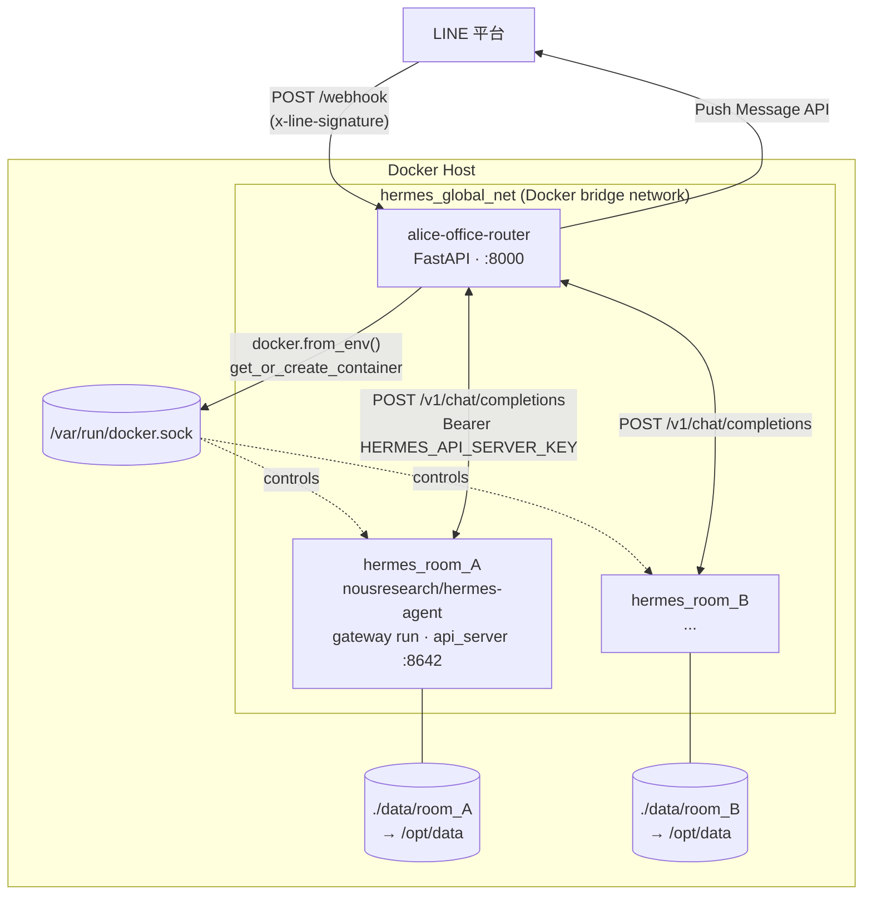
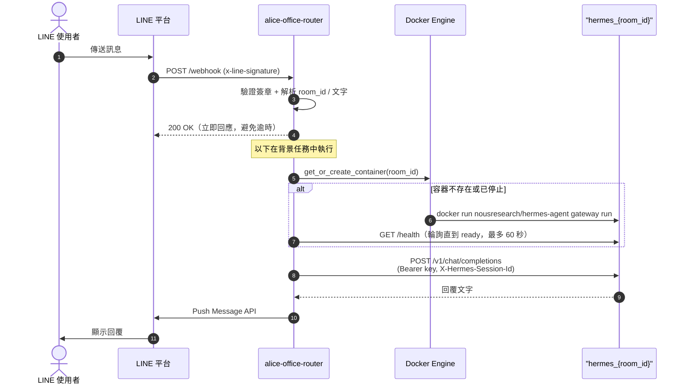

# alice-office-router

LINE OA 多租戶 Webhook 路由器。接收來自 LINE 平台的 Webhook，依據聊天室 ID 動態建立隔離的 Docker 容器（真實的 [Hermes Agent](https://github.com/NousResearch/hermes-agent)），把訊息轉發給對應容器的 LLM 大腦，再由 router 自己把回覆推播回 LINE。

## 目錄

- [架構概覽](#架構概覽)
- [LINE 訊息類型支援](#line-訊息類型支援)
- [部署模式](#部署模式)
  - [選配：集中式 log（Loki）](#選配集中式-logloki)
  - [選配：自架 SearXNG 網頁搜尋](#選配自架-searxng-網頁搜尋)
- [環境需求](#環境需求)
- [快速開始](#快速開始)
  - [1. 安裝依賴](#1-安裝依賴)
  - [2. 設定環境變數](#2-設定環境變數)
  - [3. 建立 Docker 網路、準備 Hermes image](#3-建立-docker-網路準備-hermes-image)
  - [4. 啟動 router、建立測試房間](#4-啟動-router建立測試房間)
  - [5. 日常開發迴圈](#5-日常開發迴圈)
  - [接真的 LINE（端到端驗收才需要）](#接真的-line端到端驗收才需要)
  - [用 API 通道打進房間（不經 LINE）](#用-api-通道打進房間不經-line)
- [開發工作流程](#開發工作流程)
  - [三條開發線](#三條開發線)
  - [A. Router feature](#a-router-feature)
  - [B. Hermes skill](#b-hermes-skill)
  - [C. Plugin / MCP](#c-plugin--mcp)
  - [驗證層級（由快到慢）](#驗證層級由快到慢)
- [Google Workspace 整合](#google-workspace-整合)
- [疑難排解](#疑難排解)
- [指令速查](#指令速查)
- [專案結構](#專案結構)
- [環境變數說明](#環境變數說明)
- [安全性](#安全性)

## 架構概覽

Router 擁有 LINE 進出的全部責任（驗簽、收訊息、push 回覆）；Hermes container 完全不碰 LINE，只透過內建的 `api_server` platform（OpenAI-compatible API）被動回答問題。


```mermaid
graph TD
    LINE["LINE 平台"]

    subgraph Host["Docker Host"]
        Sock[("/var/run/docker.sock")]

        subgraph Net["hermes_global_net (Docker bridge network)"]
            Router["alice-office-router<br/>FastAPI · :8000"]
            HermesA["hermes_room_A<br/>nousresearch/hermes-agent<br/>gateway run · api_server :8642"]
            HermesB["hermes_room_B<br/>..."]
        end

        DataA[("./data/room_A<br/>→ /opt/data")]
        DataB[("./data/room_B<br/>→ /opt/data")]
    end

    LINE -- "POST /webhook<br/>(x-line-signature)" --> Router
    Router -- "docker.from_env()<br/>get_or_create_container" --> Sock
    Sock -.controls.-> HermesA
    Sock -.controls.-> HermesB
    Router <-- "POST /v1/chat/completions<br/>Bearer HERMES_API_SERVER_KEY" --> HermesA
    Router <-- "POST /v1/chat/completions" --> HermesB
    Router -- "Push Message API" --> LINE
    HermesA --- DataA
    HermesB --- DataB
```

每個聊天室擁有獨立容器與獨立資料夾，容器之間無法互相存取。Router 透過掛載的 `docker.sock` 控制這些「兄弟容器」（sibling containers）——這個模式讓 router 本身也能跑在 container 裡（見下方「部署模式」）。

單則訊息的完整流程：


```mermaid
sequenceDiagram
    autonumber
    actor User as LINE 使用者
    participant LINE as LINE 平台
    participant Router as alice-office-router
    participant Docker as Docker Engine
    participant Agent as "hermes_{room_id}"

    User->>LINE: 傳送訊息
    LINE->>Router: POST /webhook (x-line-signature)
    Router->>Router: 驗證簽章 + 解析 room_id / 文字
    Router-->>LINE: 200 OK（立即回應，避免逾時）

    Note over Router: 以下在背景任務中執行
    Router->>Docker: get_or_create_container(room_id)
    alt 容器不存在或已停止
        Docker->>Agent: docker run nousresearch/hermes-agent gateway run
        Router->>Agent: GET /health（輪詢直到 ready，最多 60 秒）
    end
    Router->>Agent: POST /v1/chat/completions<br/>(Bearer key, X-Hermes-Session-Id)
    Agent-->>Router: 回覆文字
    Router->>LINE: Push Message API
    LINE->>User: 顯示回覆
```

完整訊息流程（去重、背景任務、錯誤處理）見 [`docs/line-hermes-message-flow.md`](docs/line-hermes-message-flow.md)；router↔container 協定細節見 [`docs/router-hermes-agent-protocol.md`](docs/router-hermes-agent-protocol.md)；為何不用 Hermes 內建 LINE gateway、兩者能力對照見 [`docs/hermes-agent-line-gateway-comparison.md`](docs/hermes-agent-line-gateway-comparison.md)。

## LINE 訊息類型支援

Router 會處理整個 webhook body 裡的**所有** event（不只第一個），逐一解析、去重、排背景任務：

| 訊息類型 | 處理方式 |
|---|---|
| `text` | 直接轉發文字給 Hermes agent |
| `image` / `audio` / `video` / `file` | 用 LINE Content API 下載二進位內容，寫進該房間掛載的 volume（`data/<room_id>/incoming/`，container 內對應 `/opt/data/incoming/`），送一則文字通知 agent 檔案路徑——由 container 內**真正的 Hermes agent** 用自己的 vision/STT/檔案工具處理，router 不做任何內容解析 |
| `sticker` / `location` | 轉成佔位文字（如 `[使用者傳送了貼圖：...]`）送給 agent |
| 其他／未知類型 | 記錄一行 log 後略過 |

回覆時：

- **Reply token 優先、Push 為 fallback**：webhook 事件裡的 `replyToken`（免費、單次、~60 秒內有效）優先使用；若已過期或被 LINE 拒絕，自動 fallback 到 Push Message API。
- **長文自動分段 + Markdown 去除**：LLM 回覆會先去除 LINE 無法渲染的 Markdown 語法（保留連結可點擊），再依 LINE 單則 bubble 5000 字上限智慧分段（最多 5 則/次）。
- **Webhook 事件去重**：LINE 的 webhook 是 at-least-once 語意，可能重送同一個 event；router 用 `webhookEventId` 做 in-memory 去重，避免同一則訊息被回覆兩次。

以上邏輯 1:1 參考自 Hermes Agent 內建 LINE adapter 的演算法（詳見 [`docs/hermes-agent-line-gateway-comparison.md`](docs/hermes-agent-line-gateway-comparison.md)），但因為架構不同（router 與 container 分離、只透過 `api_server` + 共用 volume 溝通），媒體處理走的是「檔案落地 + 文字通知」而非 Hermes 內建的多模態 API 路徑。

Outbound 媒體（agent 主動產生圖片/語音/影片送回 LINE）與 slow-LLM postback 按鈕尚未實作，見同一份文件的
「未做（Phase 2）」項目。

## 部署模式

`ROUTER_IN_DOCKER` 決定 router 怎麼找到 Hermes 容器：

| 模式 | `ROUTER_IN_DOCKER` | Router 執行位置 | 如何連到 Hermes 容器 |
|---|---|---|---|
| 本機開發 | `false` | Host OS（`uv run uvicorn ...`） | 容器建立時發布隨機 host port，router 走 `http://localhost:<port>` |
| Container 化（正式/未來） | `true`（預設） | 自己也是 `hermes_global_net` 上的一個容器 | 直接用容器名稱解析，如 `http://hermes_room_A:8642` |

Container 化模式已經在 `docker-compose.yml` 中就緒——把 `/var/run/docker.sock` 掛進 router 自己的容器，讓它能對 Host 的 Docker Daemon 下指令生成「兄弟容器」（sibling containers），而不是需要 Docker-in-Docker：

```bash
docker compose up -d --build
```

已用 `docker compose up` + 真實的 LINE webhook 請求驗證過：router 在自己的 container 內仍能正常呼叫 `docker.sock` 建立 `hermes_{room_id}` 容器、透過容器名稱互連、並把回覆 push 回 LINE。

正式部署時 `.env` 用真的 LINE 憑證、`ROUTER_IN_DOCKER=true`，並把 LINE OA 的
Webhook URL 設為 `https://your-domain.com/webhook`（服務監聽 `http://localhost:8000`）。
日常開發不用起 compose——只在動到 Dockerfile / compose / `container_manager.py`
連線邏輯時，才需要用 container 模式驗一次。

### 選配：集中式 log（Loki）

預設**不開**。router 與每個 `hermes_<room_id>` 容器的 stdout 由 Docker 的
`json-file` driver 保存（各 10 MB × 3），每房間的檔案 log 在
`data/<room_id>/logs/`，用 `docker compose logs` / `docker logs` / `tail` 就能查。

房間多到要跨 router、容器 stdout、檔案 log 三種來源追同一則訊息時，
`deploy/logging/` 有一組現成的 Alloy（收集）→ Loki（儲存，30 天）→
Grafana（查詢）堆疊，跟 router 同一台主機，但**掛在自己的 `logging_net` 上、不接
`hermes_global_net`**（Loki 沒有 auth，同網段就等於每個房間的 agent 都讀得到所有房間
的 log）。Alloy 讀 log 走的是 docker.sock 與 ro mount，不需要那個網段：

```bash
# 1. .env 設定 Grafana 的 admin 密碼（router 不讀這個變數，只給 compose 用）
echo "GRAFANA_ADMIN_PASSWORD=$(openssl rand -hex 16)" >> .env

# 2. 在 repo 根目錄多疊一個 -f（主 compose 的行為完全不變）
docker compose -f docker-compose.yml -f deploy/logging/docker-compose.logging.yml up -d
#    全新主機用部署腳本的話：./scripts/deploy_host.sh --with-logging

# 3. Grafana 只綁 127.0.0.1:3000（Loki 完全不對外開 port），從自己的機器開 tunnel
ssh -N -L 3000:127.0.0.1:3000 <user>@<host>
#    → 瀏覽器開 http://localhost:3000，帳號 admin / 上面那組密碼
#    → Explore（Loki 資料來源已自動接好）→ 例：{room_id="line_U1234..."}
```

> **既有房間容器要重建一次**：Alloy 靠 `alice.*` label 發現容器，而 label 是建立時
> 寫死的。這個版本之前建的 `hermes_<room_id>` 容器沒有 label，Grafana 裡不會出現。
> `docker rm -f hermes_<room_id>` 之後 router 會在下一則訊息進來時自動重建（`data/`
> 不受影響，只中斷一次開機時間）。

關掉就是 `docker compose -f docker-compose.yml -f deploy/logging/docker-compose.logging.yml
stop alloy loki grafana`——router 不受影響，它從頭到尾不知道這個堆疊存在。
成本約 480 MB RAM（實測 Alloy 65 / Loki 107 / Grafana 310 MB）。常用 LogQL 查詢見
[`docs/troubleshooting.md`](docs/troubleshooting.md) 第 1 節，設計與方案比較見 [`docs/logging-design.md`](docs/logging-design.md)。

### 選配：自架 SearXNG 網頁搜尋

預設**不開**。Hermes 內建的 `web_search` 工具要有一個搜尋 provider 才會出現在 agent 的
工具清單裡；沒有 provider 時 agent 只剩瀏覽器工具，會拿沒有防偵測的 headless Chromium
硬闖 Google/Bing 的搜尋頁，幾乎每次被 bot 驗證擋下——「查一個沒有固定網址的東西」
（統編查公司名、查冷門商家）就是這樣失敗的；有固定 API 的查詢（天氣、股價）不受影響，
agent 本來就用 `terminal` 直接打。

`deploy/searxng/` 有一份現成的 [SearXNG](https://docs.searxng.org/)（免費、自架的
metasearch），跟 router 同一台主機、**掛在 `hermes_global_net` 上**讓每個房間容器用容器
名 `searxng` 打它（跟 Loki 相反：SearXNG 無狀態、不留任何房間資料，所以可以同網段）。
router 只負責把 URL 當 env 轉傳進每個房間容器，Hermes 偵測到 `SEARXNG_URL` 就自動選它，
不用改任何房間的 `config.yaml`、不用重烤 image：

```bash
# 1. .env 設兩個值：URL 給 router 轉傳，secret 只給 compose 用（router 不讀）
echo "SEARXNG_URL=http://searxng:8080" >> .env
echo "SEARXNG_SECRET=$(openssl rand -hex 32)" >> .env

# 2. 在 repo 根目錄多疊一個 -f（主 compose 的行為完全不變）
docker compose -f docker-compose.yml -f deploy/searxng/docker-compose.searxng.yml up -d
#    全新主機用部署腳本的話：./scripts/deploy_host.sh --with-searxng

# 3. 驗證：SearXNG 不對外開 port，從任一房間容器打它
docker exec hermes_<room_id> curl -s 'http://searxng:8080/search?q=test&format=json' | head -c 300
#    → 看到 {"query": "test", "results": [...]} 就通了（403 = settings.yml 少了 json format）
```

> **既有房間容器要重建一次**：容器 env 只在建立時寫入，這個版本之前建的
> `hermes_<room_id>` 沒有 `SEARXNG_URL`，agent 的工具清單裡就不會有 `web_search`。
> `docker rm -f hermes_<room_id>` 之後 router 會在下一則訊息進來時自動重建（`data/`
> 不受影響，只中斷一次開機時間）。

已知限制：SearXNG 只做搜尋，Hermes 同組的 `web_extract` 工具呼叫會回「search-only
backend」錯誤，agent 讀結果頁要改用 `browser_navigate`（開一般網頁本來就正常，被擋的
只有搜尋引擎的結果頁）。上游引擎偶爾會把 SearXNG 判成 bot（實測 DuckDuckGo 第一次就
回 CAPTCHA，其他引擎正常），`deploy/searxng/settings.yml` 已先拿掉最兇的 Google；哪個
引擎一直被擋看 `docker logs searxng`，排查見 [`docs/troubleshooting.md`](docs/troubleshooting.md) 2.12。
關掉就是 `.env` 拿掉 `SEARXNG_URL` → 重啟 router → `docker rm -f` 各房間，再
`docker compose -f docker-compose.yml -f deploy/searxng/docker-compose.searxng.yml stop searxng`。

> Alloy 用 `HOST_DATA_DIR` 把 `data/` 以唯讀掛進 `/rooms` 讀每房間的
> `logs/*.log`，所以 `HOST_DATA_DIR` 必須跟 router 用的是同一個目錄
> （見 [`docs/env-data-paths.md`](docs/env-data-paths.md)）；host 模式（`ROUTER_IN_DOCKER=false`）的 router
> 直接跑在主機上、沒有 Docker label，它的 stdout **不會**被收進去，這是預期行為。

## 環境需求

- Docker（宿主機）
- Python 3.12（本地開發用）
- [uv](https://docs.astral.sh/uv/)（套件管理）
- [ngrok](https://ngrok.com/)（選配——只有接真 LINE 端到端驗收時需要）

## 快速開始

從 git clone 到改 code 看到更動。照著做即可，全程不需要真的 LINE channel——
`scripts/test_webhook.py` 會模擬 LINE 平台的簽章與訊息。

### 1. 安裝依賴

```bash
uv sync
```

### 2. 設定環境變數

```bash
cp .env.example .env
```

編輯 `.env`：

```env
LINE_CHANNEL_SECRET=dev-fake-secret        # 開發用假值即可，test_webhook.py 用它算簽章
LINE_CHANNEL_ACCESS_TOKEN=dev-fake-token   # 同上——接真 LINE 驗收才需要真憑證
ROUTER_IN_DOCKER=false                     # 開發用 host 模式；容器化部署才設 true
DATA_DIR=/absolute/path/to/alice-office-router/data       # host 模式下必填，見下方註解
HOST_DATA_DIR=/absolute/path/to/alice-office-router/data
HERMES_TEMPLATES_DIR=/absolute/path/to/alice-office-router/src/hermes  # host 模式下必填，見下方註解
HERMES_IMAGE=alice-hermes-agent:v1
HERMES_API_SERVER_KEY=change-me            # openssl rand -hex 32
LLM_BASE_URL=change-me                     # 唯一不能假的：可用的 OpenAI-compatible endpoint
LLM_API_KEY=change-me
LLM_MODEL=change-me
```

> `HOST_DATA_DIR` 必須是**宿主機**的絕對路徑，Docker 掛載 volume 時需要用到。
> **host 模式（`uv run fastapi dev`）下 `DATA_DIR`／`HERMES_TEMPLATES_DIR` 必須另外覆寫**
> 成跟 `HOST_DATA_DIR`／repo 的 `src/hermes` 一樣的絕對路徑，否則 router 會嘗試在宿主機上
> 建立不存在的預設路徑（`/app/data`、`/app/hermes-templates`）而建房間失敗；忘了覆寫時
> `Settings` 的 `model_validator` 會在 app 啟動當下直接 fail-fast，不用等到建房間才發現。
> 這幾個變數的關係與為什麼要分開，見 [`docs/env-data-paths.md`](docs/env-data-paths.md)。
> `HERMES_API_SERVER_KEY` 是 router 與每個 Hermes 容器共用的密鑰。
> `LLM_*` 是共用的 LLM 後端設定，會自動寫入每個新房間的 `config.yaml`。

### 3. 建立 Docker 網路、準備 Hermes image

```bash
docker network create hermes_global_net
docker build -f Dockerfile.hermes -t alice-hermes-agent:v1 .   # 含 plugin + MCP 共用依賴
```

> `hermes_global_net` 在 `docker-compose.yml` 中宣告為 `external`，沒先建立會直接啟動失敗。
>
> 趕時間可以跳過 build，先 `docker pull nousresearch/hermes-agent:<pinned-tag>`（Docker Hub
> 公開 image，免權限）填進 `HERMES_IMAGE`——local-tools 的 4 個 stdlib 工具能動，但
> math／OCR／webdriver 與 secretary-mcp（缺 `/opt/node_modules`）不行，差別見
> [`docs/mcp-plugin-development.md`](docs/mcp-plugin-development.md)「預裝 Plugin（local-tools）」。
> 不論哪種，`HERMES_IMAGE` 都 **pin 版本 tag**，不要 `latest`——版本漂移是這個架構最容易踩的雷之一。

### 4. 啟動 router、建立測試房間

```bash
uv run fastapi dev src/alice_office_router/main.py --reload-dir src   # terminal A，保持開著
uv run python scripts/test_webhook.py --user-id U_LOCAL_TEST --text "你好"   # terminal B
```

確認容器自動建立：

```bash
docker ps | grep hermes_U_LOCAL_TEST
ls data/U_LOCAL_TEST/          # 內含自動產生的 config.yaml
docker logs hermes_U_LOCAL_TEST | grep "/v1/chat/completions"  # Hermes agent 收到並回覆了訊息
```

第一次觸發某個房間時會拉起 `hermes_<room_id>` 容器，Hermes 開機（s6 supervision + skill sync）
需要 30–60 秒，不是卡住。成功後 `data/<room_id>/` 會出現完整的 agent home
（sessions、memories、skills…），其中 `mcp/` 與 `plugins/` 是從 `src/hermes/{mcp,plugin}/`
自動 seed 出來的**這個房間自己的副本**（見「[C. Plugin / MCP](#c-plugin--mcp)」）——這個
目錄就是該房間的「記憶」＋「工具原始碼」，容器可以隨時砍掉重建而不失憶，但除了
`mcp/`／`plugins/`（本來就是給你編輯的）之外，不要手動修改裡面的其他狀態檔。

agent 的回覆去哪看：假 user id 推不回真的 LINE（router log 出現 `Failed to push LINE reply`
屬預期），所以看 `docker logs -f hermes_U_LOCAL_TEST` 與 router terminal 的 log。

### 5. 日常開發迴圈

```bash
# terminal A：router
uv run fastapi dev src/alice_office_router/main.py --reload-dir src

# terminal B：watcher——監看測試房間自己 seed 出來的 mcp/plugins 副本，存檔自動 restart
uv run python scripts/watch_restart.py --room-id U_LOCAL_TEST

# terminal C：改 code → 存檔 → 等 watcher 顯示 restart 完成（warm restart 約 10–15 秒）
#            → 送訊息驗證
vim data/U_LOCAL_TEST/plugins/local-tools/tools.py    # 或 data/U_LOCAL_TEST/mcp/secretary/tools/*.mjs
uv run python scripts/test_webhook.py --user-id U_LOCAL_TEST --text "呼叫 math 工具，expression=\"2+2\""
```

- 改 **router code**（`src/alice_office_router/`）：`fastapi dev` 自己會 reload，不用動任何容器。
  **`--reload-dir src` 不能省**：`fastapi dev` 預設監看整個 repo，而 `data/` 就在 repo 底下，
  Hermes 容器每分鐘都往房間目錄寫檔（`cron/ticker_heartbeat`、agent 自己產出的 `.py`／`.md`），
  每次寫入都會被當成「code 改了」觸發 reload。reload 時 uvicorn 先停收新請求、等手上那輪
  agent 對話跑完才真的重啟，於是這段時間 LINE 的 webhook 全部被丟掉，症狀是「訊息完全沒回應、
  `curl localhost:8000/docs` 也卡住」，而容器 `agent.log` 卻顯示 agent 還在跑（見
  [`docs/troubleshooting.md`](docs/troubleshooting.md) 2.1）。
- 改 **plugin / MCP**：改的是**測試房間自己的副本**（`data/<room_id>/{plugins,mcp}/`，不是
  `src/hermes/` 底下的樣板——樣板只在房間第一次建立時 seed 一次），watcher 自動 restart
  測試房間。更細的生效條件見「[C. Plugin / MCP](#c-plugin--mcp)」。
- 改 **skill**：放進 `data/<room_id>/skills/` 後 restart 該房間（見「[B. Hermes skill](#b-hermes-skill)」）。

### 接真的 LINE（端到端驗收才需要）

每位開發者自建免費 LINE OA，互不干擾（一個 channel 同時只能設一個 webhook URL，共用會互搶）：

1. [LINE Developers Console](https://developers.line.biz/) → 建 Provider → 建 **Messaging API** channel，
   把 channel secret / access token 填入 `.env`
2. `ngrok http 8000`，將 `https://<id>.ngrok-free.app/webhook` 填入 channel 的 Webhook URL，
   開啟 "Use webhook"
3. 用手機加該 OA 為好友，傳訊息 → 應收到 Hermes 回覆

### 用 API 通道打進房間（不經 LINE）

TUI、mobile app 與開發時的 curl 走**第一方 API 通道**（`channels/api.py`，設計
文件 §4.4）：不需要 LINE 驗簽或 reply token，回覆**同步**放在 HTTP response，
且是 agent 的**原始 markdown**（不剝除、不切塊——渲染交給 client 自己）。它走
跟 LINE 完全相同的 gate → 容器 → agent 管線。

先在 `.env` 設 `API_CHANNEL_TOKEN`（`openssl rand -hex 32`；留空＝通道不掛載，
端點回 `404`），重啟 router，即可對**任何 `room_key`** 發訊：

```bash
# 開一個新的 api_* 房間（api_<slug>，slug 為 [a-z0-9-]{1,32}）
curl -s -X POST localhost:8000/webhooks/api/messages \
  -H "Authorization: Bearer $API_CHANNEL_TOKEN" \
  -H 'Content-Type: application/json' \
  -d '{"room_key":"api_dev","text":"回覆一個字：好"}'
# → {"replies": ["好"]}

# 也能打進既有 line_* 房間除錯（回覆只回到 curl，不驚動真的 LINE 使用者）
curl -s -X POST localhost:8000/webhooks/api/messages \
  -H "Authorization: Bearer $API_CHANNEL_TOKEN" \
  -H 'Content-Type: application/json' \
  -d '{"room_key":"line_U0123456789abcdef0123456789abcdef","text":"你剛剛用了什麼工具？"}'
```

token 不對 → `401`；`room_key` 不是 `line_<native id>` 或 `api_<slug>`、或 `text`
空白 → `422`。第一次打某個新 `room_key` 會拉起它自己的 `hermes_<room_key>` 容器
並 seed `data/<room_key>/`（同 LINE 房間，開機 30–60 秒）。除錯用途另見
[docs/troubleshooting.md §2.7](docs/troubleshooting.md)。

想一鍵驗整條管線（起拋棄式 router、打上面這些檢查、跑一次真 LLM happy path，再
自動清乾淨）：`uv run python scripts/e2e_smoke.py`（`--line` 另驗合法簽章的 LINE
webhook、`--keep` 保留產物、`--port` 換 port），見
[docs/troubleshooting.md §2.8](docs/troubleshooting.md)。

## 開發工作流程

### 三條開發線

改動前先認清你在改哪一種東西——三者的生效方式與交付路徑完全不同：

| 交付物 | 改動位置 | 生效方式 | 頻率 |
|--------|----------|----------|------|
| **A. Router feature** | `src/alice_office_router/` | 重建 router image | 低頻 |
| **B. Hermes skill** | skill 檔案（`SKILL.md` + `scripts/`） | 放進房間的 `/opt/data/skills/`，restart 容器 | 高頻 |
| **C. Plugin / MCP** | MCP server（獨立 HTTP/SSE 容器）或 Hermes 衍生 image | 改房間 `config.yaml` + restart；或換 `HERMES_IMAGE` | 低頻 |

共同的鐵律（對 Hermes `0.18.0` 實測確認）：

- `HERMES_HOME=/opt/data`——掛載的 volume 就是完整 agent home，
  **file-drop 設定（skills / plugins / hooks / MCP / SOUL.md）都真的有效**。
- **沒有熱載入**。透過 `/v1/chat/completions` 送 `/reload-mcp` 之類的 slash command
  不會被攔截（會被當一般文字丟給 LLM）。設定變更的通用生效手段就是 **restart 容器**。
- 部署版本的 Jobs REST API（`/api/jobs`）**沒有開**（`/v1/capabilities` 回報
  `jobs_admin: false`）——官方文件寫有不代表真的有，開發前先打 `/v1/capabilities` 確認。

### A. Router feature

Trunk-based，短分支：

```bash
git checkout -b feat/xxx        # 或 fix/xxx
# ... host 模式開發，scripts/test_webhook.py 隨手驗 ...
uv run ruff check . && uv run mypy src/ && uv run pytest   # 提交前必跑
```

- `main` 永遠保持可 release。做一半的功能用環境變數 feature flag 藏起來照樣合併——
  **小步合併，不養長分支**。
- 單元測試 mock 掉 LINE API 與 Docker（照 `tests/conftest.py` 現有模式）；
  但編排邏輯（`container_manager.py`）的改動要另外用 `scripts/test_webhook.py`
  對真容器驗一次——單元測試全 mock，測不到最容易壞的 Docker 層。

### B. Hermes skill

Skill 是純檔案，格式照 `data/<room>/skills/` 裡的現成範例
（`DESCRIPTION.md` + 各 skill 的 `SKILL.md`，選配 `scripts/`、`references/`）：

1. 把 skill 放進自己測試房間的 `data/<room_id>/skills/<name>/`
2. `docker restart hermes_<room_id>`
3. 用 `test_webhook.py` 送會觸發該 skill 的訊息驗證

要讓**所有房間（含之後新建的）**都拿到的 skill，放進 `src/hermes/skill/<category>/<name>/`
並 rebuild image（`Dockerfile.hermes` 會 COPY 到 `/opt/hermes/skills/`，Hermes 開機的
manifest sync 自動發到每個房間、跳過房間手改過的副本）。目前只有 `alice/runtime-env`
（告訴 agent 三個 Python 環境各是誰的、使用者檔案在 `/opt/data/incoming/`）。

### C. Plugin / MCP

MCP server 原始碼放在 `src/hermes/mcp/<name>/`；plugin 原始碼放在
`src/hermes/plugin/<name>/`。兩者都是房間第一次建立時 write-once seed 到
`data/<room_id>/{mcp,plugins}/` 的自己副本，改 repo 樣板只影響之後新建立的房間；
預裝的 `local-tools` plugin 也是走同一套機制。怎麼寫 Python MCP server、密鑰放哪、
幾種測試 level、`local-tools` 的完整細節，見 [`docs/mcp-plugin-development.md`](docs/mcp-plugin-development.md)。

### 驗證層級（由快到慢）

| 層級 | 工具 | 驗什麼 | 什麼時候跑 |
|------|------|--------|-----------|
| 1 | `pytest`（全 mock） | router 邏輯 | 每次改動，秒級 |
| 2 | `scripts/test_webhook.py` | 驗簽 → 容器編排 → LLM 整條路 | 動到編排/協定時 |
| 3 | 真 LINE（自建 OA + ngrok） | LINE 平台行為（媒體、reply token…） | 驗收、動到 LINE 相關 code 時 |
| 4 | canary 房間 | 正式環境、真使用者流量 | release 前 |

## Google Workspace 整合

Calendar / Gmail / Drive 三個 MCP，讓每個房間各自完成 Google OAuth 後，agent 可以讀寫
該房間使用者自己的日曆／信箱／雲端硬碟。跟 `secretary` 一樣是 per-room seed、per-room
process，token／憑證也逐房隔離（`data/<room_id>/google/`），房間之間互不可見；
`rm -rf data/<room_id>` 會把該房間的 Google 授權一併清空，需重新授權（見下方
「疑難排解」的完整重置流程）。

GCP Console 設定、憑證檔案放置、環境變數、訊息授權判斷流程與容易忽略的坑，見
[`docs/google-workspace-setup.md`](docs/google-workspace-setup.md)；**完整架構決策**（為何 oauth gate 是 router 邏輯
而非 Hermes plugin、為何原本獨立的 Flask OAuth server 併進了 router、憑證掛載路徑與
seed 時序的取捨）見 [`docs/google-workspace-integration-summary.md`](docs/google-workspace-integration-summary.md)。

## 疑難排解

> 這節是**部署/建置期**一次性的坑。服務跑起來之後，日常「這則訊息為什麼卡住／
> agent 用了什麼工具／MCP 為什麼噴錯」這類**運行期** debug，見
> [`docs/troubleshooting.md`](docs/troubleshooting.md)（含一鍵診斷腳本
> `scripts/debug_room.py`）。

- **compose 啟動直接失敗**：`hermes_global_net` 沒建（network 宣告為 `external`），
  先 `docker network create hermes_global_net`。
- **host 模式連 Hermes 容器 timeout**：忘了把 `ROUTER_IN_DOCKER` 設 `false`，
  router 在用容器名連線，host 上解析不到。
- **`test_webhook.py` 一直回報「Container 不存在」，router 回應卻是 200**：先看 router
  自己的 terminal（不是 container log）——`_process_and_reply` 對容器編排失敗只會
  log、不會讓 `/webhook` 的回應變成非 200，所以 `test_webhook.py` 看不到真正的錯誤。
  最常見原因是 host 模式下沒設 `DATA_DIR`：預設值 `/app/data` 在宿主機上通常不存在也
  不可寫，log 會看到 `[Errno 30] Read-only file system: '/app'`；解法是把 `DATA_DIR`
  設成跟 `HOST_DATA_DIR` 一樣的絕對路徑（見上方環境變數說明）。
- **第一次訊息很久才回**：Hermes 容器首次啟動要 30–60 秒（s6 + skill sync）屬正常；
  慢機器上 `_wait_until_ready` 的 60 秒 timeout 偶爾不夠，可調 `container_manager.py`。
- **改了掛載來源的 symlink 沒生效**：Docker bind mount 在**建容器時**就把 symlink
  解析成實體路徑，之後切 symlink 對既有容器無效，`docker restart` 也不會重新解析——
  必須 recreate 容器。
- **改了 config.yaml / skills / MCP 設定沒生效**：Hermes 沒有熱載入，
  restart 該房間容器才會生效。
- **房間建立「看似成功」（container 活著、`/health` 200），但每次對話都 500**：跟上面
  `DATA_DIR` 沒設的失敗模式不一樣——這種是**安靜的失敗**，先查 host 模式下
  `HERMES_TEMPLATES_DIR` 是否也覆寫成 repo 的 `src/hermes` 絕對路徑（沒設一樣會拿
  `/app/hermes-templates` 預設值，host 上不存在）。router 自己的 terminal 會有一行
  `ERROR ... Missing config.yaml template at ... skipping room`，但因為容器照樣建立、
  照樣通過健康檢查，這行 log 很容易被忽略；等到真的傳訊息才會在 `/v1/chat/completions`
  上看到 500，這時候 `docker logs hermes_<room_id>` 會看到一堆
  `FileNotFoundError: /opt/data/logs/...`、`sqlite3.OperationalError: unable to open
  database file`（Hermes 自己該補完整的 `logs/`、`cron`、`kanban.db` 全部沒有東西可以
  依附，因為房間根本沒有正確的 `config.yaml`）。
- **`docker run` 建容器失敗，訊息是 `pull access denied` 或建了但
  `exec: "gateway": executable file not found in $PATH`**：先確認 `HERMES_IMAGE`
  指到的 image **真的是**用 `docker build -f Dockerfile.hermes` 建出來的，不是隨手
  retag 一個名字很像但來源不同的 image（例如舊測試留下的 mock stand-in）。驗法：
  `docker inspect <image> --format '{{.Config.Entrypoint}}'` 應該要是
  `[/init /opt/hermes/docker/main-wrapper.sh]`；如果是空的 `[]`，代表這不是從
  `nousresearch/hermes-agent` 衍生出來的 image，`command=["gateway","run"]` 會直接
  找不到執行檔——retag 只會把「image 不存在」的錯誤換成這個更難查的錯誤，該重新
  build 才對。
- **本機起了 router 卻完全沒反應，ngrok 卻顯示 200/400 有打進來**：檢查 port 8000
  是不是被另一個 process 卡住（尤其手上如果有這個 repo的多份 checkout，很容易忘記
  關掉舊的 `fastapi dev`）：`lsof -nP -iTCP:8000 -sTCP:LISTEN`。同一個 port 號，
  `127.0.0.1:8000`（具體位址）會比 `0.0.0.0:8000`（萬用位址）優先攔截本機流量，
  所以就算你剛啟動的新 process 有正常跑起來，舊 process 沒關掉一樣會把 request 搶走。
- **要完整重置一個房間（不只是改設定，是想從零重新建立）**：container 和資料夾要
  **一起**清掉，只清其中一個會變成殭屍狀態（container 活著但掛載的資料夾是空的，
  或資料夾在但 container 名稱衝突建不了新的）：
  ```bash
  docker rm -f hermes_<room_id>
  rm -rf data/<room_id>
  ```
  下一次該房間收到訊息時會完整重新走一次 seed 流程（`config.yaml`／`mcp`／
  `plugins`／`google`）。**這也會把該房間的 Google 授權一併清空**（`tokens.json`
  跟該房間自己的憑證副本都在 `data/<room_id>/google/` 底下，是刻意設計，見上方
  「Google Workspace 整合」）——使用者要重新點一次授權連結。GCP 端的
  `client_secret`／舊 `refresh_token` 不受影響，只是本地不再記得它。

## 指令速查

| 指令 | 說明 |
|------|------|
| `uv run pytest` | 執行所有測試 |
| `uv run pytest --cov=src --cov-report=term-missing` | 含覆蓋率 |
| `uv run mypy src/` | 型別檢查 |
| `uv run ruff check .` | Lint |
| `uv run ruff format .` | 格式化 |
| `uv run fastapi dev src/alice_office_router/main.py --reload-dir src` | 開發伺服器（host 模式；`--reload-dir src` 必帶，否則 `data/` 的寫入會不停觸發 reload） |
| `uv run python scripts/test_webhook.py --user-id U_LOCAL_TEST --text "..."` | 模擬 LINE 訊息打整條路 |
| `uv run python scripts/watch_restart.py --room-id U_LOCAL_TEST` | 監看**單一房間自己的副本**，存檔自動 restart 該房間 |
| `uv run python scripts/dev_sync_src.py` | 監看 **repo 樣板**，變動時強制推到**所有已存在房間**再 restart（dev 專用，會覆蓋房間副本） |
| `uv run python scripts/google_reauth.py <room_id>` | 本機一次性 Google 授權（見「Google Workspace 整合」） |
| `uv run python scripts/debug_room.py <room_id>` | 印出單一房間的診斷快照（container 狀態、docker logs、各 log 檔 tail、關鍵檔案存在性，見 [`docs/troubleshooting.md`](docs/troubleshooting.md)） |

提交前必跑：

```bash
uv run ruff check . && uv run mypy src/ && uv run pytest
```

## 專案結構

```
alice-office-router/
├── src/
│   └── alice_office_router/
│       ├── main.py              # FastAPI app factory + lifespan；mount enabled_adapters() 的 routers
│       ├── core.py              # process_inbound：channel-free gate → 容器 → agent → list[str]
│       ├── hermes_client.py     # 呼叫 Hermes 容器的 /v1/chat/completions
│       ├── container_manager.py # Docker 容器動態管理
│       ├── google_oauth.py      # Google OAuth 路由 + 授權 gate（見「Google Workspace 整合」）
│       ├── config.py            # pydantic-settings 設定
│       └── channels/            # channel adapters（每個通道自己的 wire format）
│           ├── __init__.py      # enabled_adapters(config)
│           ├── base.py          # InboundMessage、ChannelAdapter Protocol
│           └── line/
│               ├── adapter.py   # LineAdapter：POST /webhooks/line 端點 + 回覆送出（reply token 優先，push 兜底）
│               ├── verify.py    # LINE HMAC-SHA256 簽章驗證
│               ├── client.py    # 呼叫 LINE Reply/Push Message API + Content API 下載媒體
│               ├── format.py    # Markdown 去除 + 長文分段（LINE bubble 限制）
│               ├── dedup.py     # Webhook event 去重（in-memory）
│               └── events.py    # LINE webhook 事件 pydantic model + inbound 文字解析
├── tests/
│   ├── conftest.py
│   ├── test_core.py
│   ├── test_hermes_client.py
│   ├── test_container_manager.py
│   ├── test_google_oauth.py
│   ├── test_hermes_shared_node_deps.py  # 檢查各 MCP package.json 與共用 package.json 同步
│   └── channels/line/           # LINE wire-format 測試（test_adapter/verify/client/format/dedup/events）
├── src/hermes/                  # MCP / plugin 原始碼樣板（seed 進每個房間，見上方「C. Plugin / MCP」）
│   ├── config.template.yml      # 每個新房間 config.yaml 的樣板（_ensure_config_yaml 讀取後 .format() 填值）
│   ├── mcp/
│   │   ├── package.json         # 所有 MCP 共用依賴（烤進 image 的 /opt/node_modules）
│   │   ├── package-lock.json    # 對應鎖版檔（image build 用 npm ci）
│   │   ├── secretary/           # todo/meeting/translate/... MCP server（Node ESM stdio）
│   │   ├── gmail/                # Gmail MCP server（Python stdio，requires_google_oauth）
│   │   ├── drive/                # Google Drive MCP server（Python stdio，requires_google_oauth）
│   │   └── google-calendar/      # thin registration，實際 server 是烤進 image 的 npm 套件
│   ├── plugin/
│   │   └── local-tools/         # 台灣薪資/法規/數學/記憶/OCR/瀏覽器 工具包
│   ├── runtime/                 # 烤進 image 的 Python 環境定義
│   │   ├── pyproject.toml       # 自家 plugin/MCP 套件清單 → /opt/tools/.venv（tools-python）
│   │   ├── uv.lock              # 對應鎖版檔（image build 用 uv sync --locked）
│   │   ├── skills-requirements.txt # 官方 bundled skill 預裝套件 → /opt/skills/.venv（python/pip）
│   │   └── profile-tools.sh     # login shell 用，export TOOLS_PYTHON + PATH
├── scripts/
│   └── test_webhook.py          # 手動 end-to-end 測試腳本
├── docs/                        # 架構設計文件（見下方各章節的「詳見 docs/...」連結）
├── docker-compose.yml
├── Dockerfile                   # Router image
├── Dockerfile.hermes            # 衍生 Hermes image（預裝 plugin + MCP 共用依賴，production 用）
├── pyproject.toml
└── .env.example
```

## 環境變數說明

| 變數 | 必填 | 說明 |
|------|------|------|
| `LINE_CHANNEL_SECRET` | ✅ | LINE Webhook 簽章驗證用 |
| `LINE_CHANNEL_ACCESS_TOKEN` | ✅ | Router 自己用來呼叫 LINE Push Message API（不會傳入 Hermes 容器） |
| `HOST_DATA_DIR` | ✅ | 宿主機上 `data/` 的絕對路徑，用於 Docker Volume 掛載 |
| `HERMES_API_SERVER_KEY` | ✅ | Router 與每個 Hermes 容器共用的 Bearer 密鑰（容器的 `api_server` platform 靠它啟用與驗證） |
| `DATA_DIR` | ⚠️ | Router 進程自己讀寫房間資料夾（`mkdir`、寫 `config.yaml`、seed mcp/plugins）用的路徑，預設 `/app/data`。**Container 化部署免設**（router 自己也在容器裡，`/app/data` 就是掛載進來的路徑）；**host 模式（`ROUTER_IN_DOCKER=false`）必填**，要設成跟 `HOST_DATA_DIR` 一樣的絕對路徑，否則 router 會嘗試在宿主機上建立 `/app/data`（通常不存在也不可寫）而整個建房間失敗 |
| `HERMES_TEMPLATES_DIR` | ⚠️ | Router 進程自己讀取 MCP/plugin 樣板（`mcp/<name>/`、`plugin/<name>/`）用的路徑，預設 `/app/hermes-templates`。**Container 化部署免設**（compose 已把 `./src/hermes` 掛進 router 自己的容器）；**host 模式必填**，要設成 repo 的 `src/hermes` 絕對路徑，道理跟 `DATA_DIR` 一樣 |
| `HERMES_IMAGE` | | Hermes Agent 映像（預設 `nousresearch/hermes-agent`，等同 `latest`——請改成 pin 版本 tag，如 `nousresearch/hermes-agent:v2026.4.16`） |
| `HERMES_NETWORK` | | Docker 內網名稱（預設 `hermes_global_net`） |
| `HERMES_INTERNAL_PORT` | | Hermes Agent `api_server` 監聽 Port（預設 `8642`） |
| `LLM_BASE_URL` / `LLM_API_KEY` / `LLM_MODEL` | | 共用 LLM 後端設定，自動寫入每個新房間的 `config.yaml` |
| `ROUTER_IN_DOCKER` | | Router 是否跑在 Docker 內（預設 `true`）；本機開發用 `uv run uvicorn` 時設為 `false`，容器會改為發布隨機 host port |
| `DEFAULT_PLUGINS` | | 寫入每個新房間 config.yaml 的預設 plugin 清單（逗號分隔，預設 `local-tools`），名稱需對應 `HERMES_TEMPLATES_DIR/plugin/` 底下已 seed 的目錄名 |
| `PUBLIC_BASE_URL` | | 這個 router 的公開 HTTPS base URL（不含結尾斜線），也就是使用者瀏覽器連得到的網址（通常是 Cloudflare tunnel）；Google 授權連結與 `{url}/oauth/callback` 用它組。Google 整合的開關是「它已設且 Web application 憑證檔存在」，見「[Google Workspace 整合](#google-workspace-整合)」。2026-09-17 由 `GOOGLE_OAUTH_PUBLIC_URL` 改名而來，舊名不再讀取——升級時請改 `.env` |
| `GOOGLE_OAUTH_GATE` | | 預設 `true`。設 `false` 時 Google OAuth 路由照常運作，只是不擋任何房間的訊息 |
| `API_CHANNEL_TOKEN` | | 第一方 API 通道（TUI / mobile / dev curl）的 Bearer token。留空（預設）＝通道不掛載，`POST /webhooks/api/messages` 回 `404`；設了才啟用，見「[用 API 通道打進房間（不經 LINE）](#用-api-通道打進房間不經-line)」 |
| `GROUP_TRIGGER_PREFIXES` | ⚠️ | 群組呼叫詞（逗號分隔）：群組文字訊息去掉前後空白後以其中之一開頭即視為點名 bot（單純前綴比對、大小寫敏感、不看字詞邊界，請挑成員平常不會拿來聊天或稱呼人的詞）。程式預設留空＝只能靠 @mention，但 **LINE 桌面版無法 @ 官方帳號**，留空時桌面版使用者在群組裡完全叫不動 bot——**要服務群組就至少設一個**。`.env.example` 範本值為 `小幫手`，對應入群自我介紹裡寫死的自稱，建議保留並以逗號追加 OA 名稱。群組重置指令也吃此前綴（如 `小幫手 /new`），見 [`docs/session-hygiene.md`](docs/session-hygiene.md)「1. 手動指令」 |
| `GROUP_OBSERVED_MAX_MESSAGES` | | 每個群組房間背景 buffer（`data/<room_id>/group_state/observed.jsonl`）最多保留幾則未點名訊息，超過丟最舊（預設 `50`；`0`＝不保留背景） |
| `GRAFANA_ADMIN_PASSWORD` | | **router 不讀的變數**（不在 `Settings` 裡），只給 `docker compose` 做變數替換用：選配的集中式 log 堆疊裡 Grafana 的 admin 密碼。沒啟用那份 compose 就留空；啟用了卻沒設會直接讓 compose 失敗（不會靜默起一個 `admin/admin` 的 Grafana）。見「[選配：集中式 log（Loki）](#選配集中式-logloki)」 |
| `SEARXNG_URL` | | 自架 SearXNG 的 base URL，router 原樣轉傳進每個房間容器的 env，Hermes 內建 `web_search` 偵測到就自動選它。留空（預設）＝`web_search` 不出現在 agent 工具清單，行為跟以前一樣；啟用填 `http://searxng:8080`。既有房間容器要 `docker rm -f` 重建才吃得到。見「[選配：自架 SearXNG 網頁搜尋](#選配自架-searxng-網頁搜尋)」 |
| `SEARXNG_SECRET` | | 跟 `GRAFANA_ADMIN_PASSWORD` 同類：router 不讀，只給 `deploy/searxng/docker-compose.searxng.yml` 做變數替換（SearXNG 的 `secret_key`）。帶了那份 compose 卻沒設會直接讓 compose 失敗 |

## 安全性

- 每個 Webhook 請求均驗證 LINE HMAC-SHA256 簽章，驗證失敗回傳 `400`。
- 各聊天室的 Hermes Agent 容器僅掛載自己的 Volume（`/opt/data`），容器間硬碟資料完全隔離；使用者傳送的圖片/檔案/語音/影片也是落在各自房間的 `incoming/` 子目錄下，同樣不互通。啟用 Google 整合時，`/opt/google-workspace`（含 tokens、GCP 憑證副本）也是逐房掛載，同一部署下不同房間的 container 讀不到彼此的 Google 授權——見「[Google Workspace 整合](#google-workspace-整合)」。
- Hermes 容器完全不接觸 LINE 憑證，只透過 `HERMES_API_SERVER_KEY` 與 Router 的內部 API 通訊；`api_server` 本身只在 Docker 內網（`hermes_global_net`）可達。
- `LINE_CHANNEL_SECRET`、`LINE_CHANNEL_ACCESS_TOKEN`、`HERMES_API_SERVER_KEY` 僅存於 `.env`，不進版控。
