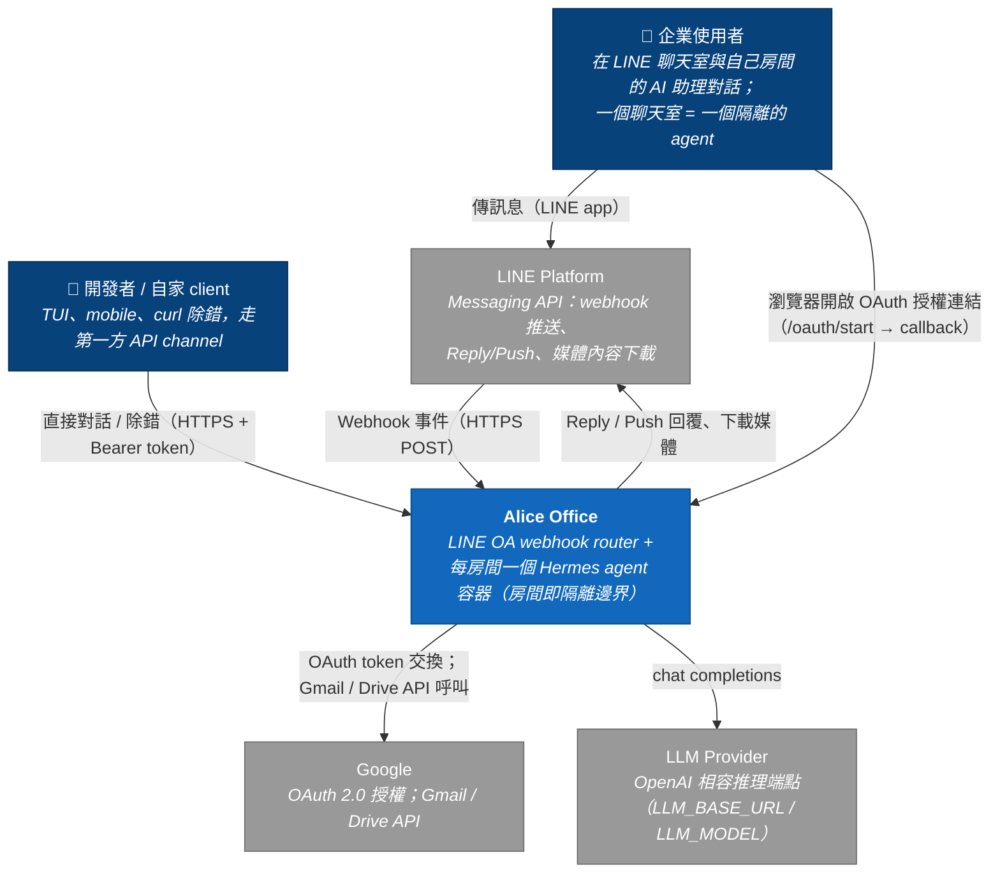
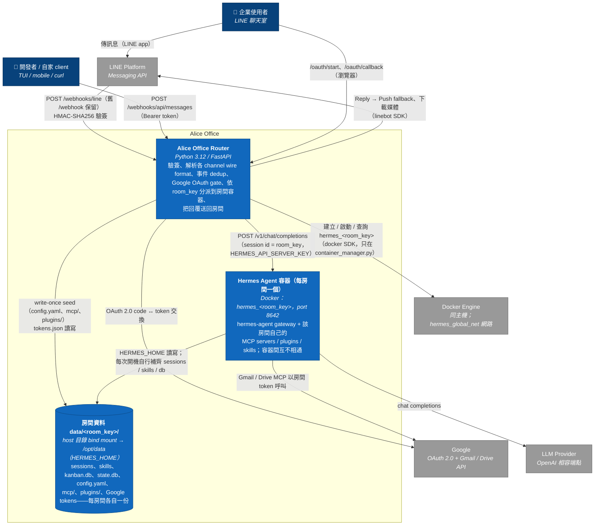
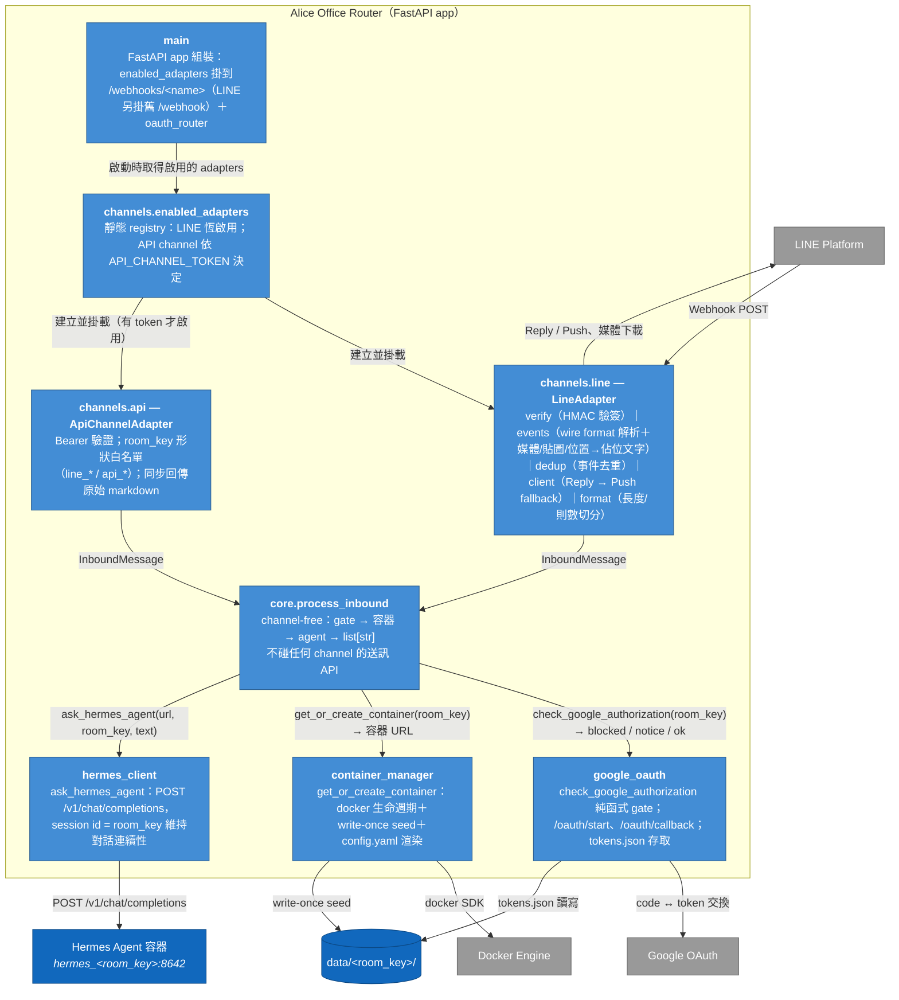
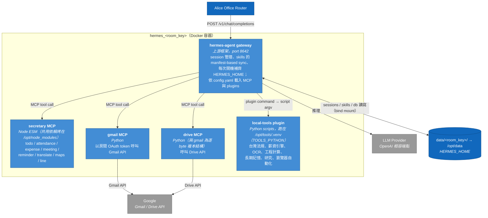

# C4 架構圖 — Alice Office Router

依 2026-07-15 的程式碼現況（channel adapter 重構 + 第一方 API channel 已落地）繪製。
三個層級：System Context → Container → Component；Class 層級暫不畫。

> **名詞澄清**：C4 的「Container」指的是「可獨立部署/執行的單元」，不等於 Docker
> container——只是在這個系統裡兩者剛好高度重合（router 是一個 process、每個房間的
> Hermes agent 是一個 Docker container）。

圖使用 Mermaid flowchart 語法搭配 C4 慣例配色（深藍＝人、藍＝系統內元素、灰＝外部
系統），GitHub 網頁與 VS Code Markdown 預覽可直接渲染。（不用 Mermaid 原生 C4
語法是因為其排版引擎會讓標籤重疊。）

---

## Level 1 — System Context

系統邊界是「Alice Office」整體：router 加上所有房間的 Hermes agent 容器。
使用者只透過 LINE（或自家 client）互動，感受上就像直接使用自己部署的 Hermes agent。

---

## Level 2 — Container

系統內三種可部署/執行單元：router（FastAPI process）、每房間一個的 Hermes agent
Docker container、以及每房間一份的資料目錄（bind mount，等同房間的持久化儲存）。
Docker Engine 視為部署環境的外部依賴——router 透過 docker SDK 動態建立房間容器。

責任分界（誰寫 `data/<room_key>/` 的哪部分）：

| 寫入者 | 內容 | 時機 |
|---|---|---|
| Router（container_manager） | `config.yaml`、`mcp/`、`plugins/` seed | 房間第一次建立，write-once，之後永不覆蓋 |
| Router（google_oauth） | Google `tokens.json` | OAuth callback / refresh |
| Hermes gateway | `sessions/`、`skills/`、`kanban.db`、`state.db`、`logs/`、lock 檔 | 每次容器開機自行補齊與執行期寫入 |

---

## Level 3 — Component：Alice Office Router

Router 內部的元件與訊息路徑。核心設計：channel adapter 各自擁有自己的 wire format
（驗簽、解析、dedup、送訊），唯一出口是 channel-free 的 `core.process_inbound`；
core 只認 `InboundMessage`（channel + room_key + 純文字），回傳 `list[str]`，
從不碰任何 channel 的送訊 API。

圖上刻意省略的兩個橫切元件（畫成箭頭會變蜘蛛網）：

- **`channels.base`** — `InboundMessage` model 與 `ChannelAdapter` Protocol，
  即圖中兩條「InboundMessage」邊所承載的契約本體。
- **`config.Settings`** — 環境變數與路徑推導（pydantic-settings），啟動時 fail-fast
  驗證；幾乎每個元件都讀它。

---

## Level 3（補充）— Component：Hermes 房間容器

這個 repo 也負責房間容器內容的 seed（MCP / plugin 模板）與 image 烘烤
（`Dockerfile.hermes`），所以補一張容器內部的元件圖。注意：gateway 本體是上游
`NousResearch/hermes-agent`，不是本 repo 的程式碼；本 repo 提供的是 MCP / plugin 模板。

---

## 與其他文件的關係

- channel adapter 契約與分層的完整設計：`docs/channel-interface-design.md`
- Router ↔ Hermes 的 HTTP 協定細節：`docs/router-hermes-agent-protocol.md`
- 訊息端到端流程：`docs/line-hermes-message-flow.md`
- 環境變數與路徑：`docs/env-data-paths.md`、`docs/runtime-env-summary.md`
