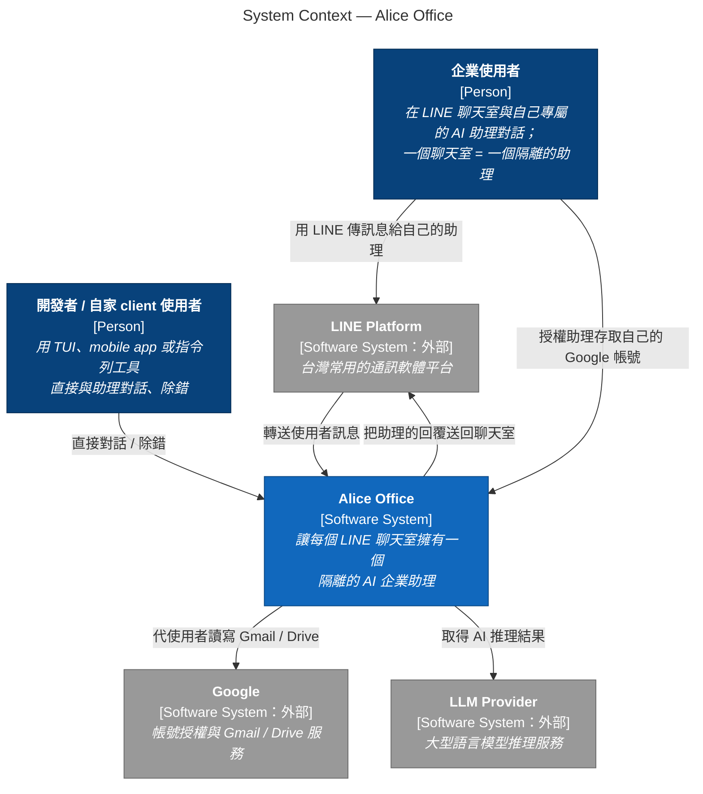
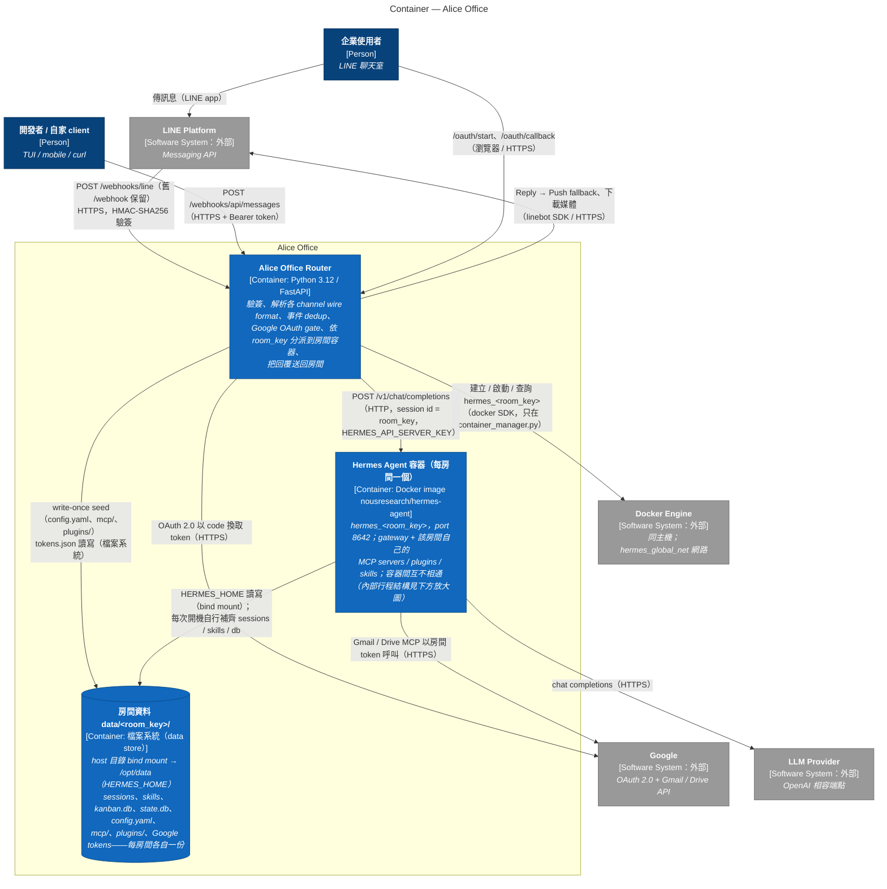
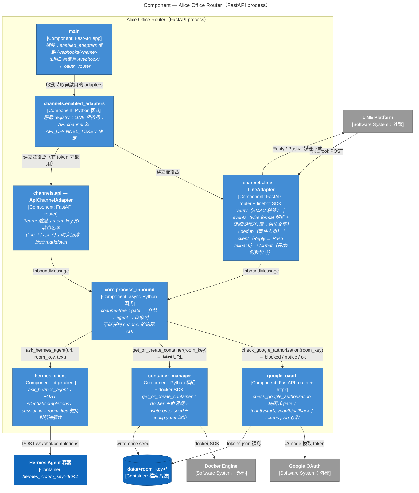
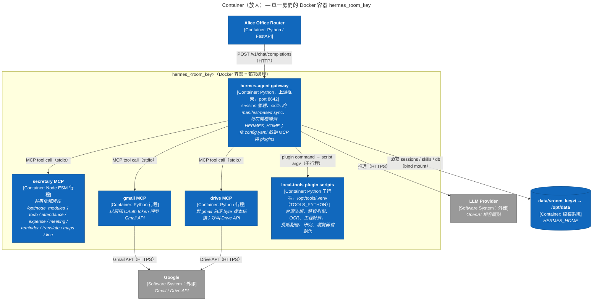

# C4 架構圖 — Alice Office Router

依 2026-07-15 的程式碼現況（channel adapter 重構 + 第一方 API channel 已落地）繪製，
並依 [c4model.com](https://c4model.com) 的官方定義核對過（見文末「與官方定義的對照」）。
三個層級：System Context → Container → Component；Code（class）層級暫不畫。

> **名詞澄清**：C4 的「Container」定義是「an application or a data store——something
> that needs to be running in order for the overall software system to work」，不等於
> Docker container。官方範例明確包含 file system，所以每房間的資料目錄也是一個
> C4 container（data store）。

**圖例（四張圖共用）**：深藍框＝Person；藍框（#1168bd）＝Context 圖的系統本身、
其他圖的 Container；淺藍框（#438dd5）＝Component；圓柱＝資料存放（data store）；
灰框＝外部軟體系統；黃底大框＝該圖的範圍邊界。
圖使用 Mermaid flowchart 語法（不用 Mermaid 原生 C4 語法是因為其排版引擎會讓標籤
重疊），GitHub 網頁與 VS Code Markdown 預覽可直接渲染。

---

## Level 1 — System Context

系統邊界是「Alice Office」整體：router 加上所有房間的 Hermes agent 容器。
使用者只透過 LINE（或自家 client）互動，感受上就像直接使用自己部署的 Hermes agent。
依官方定義，這一層只講「誰、跟哪些系統、為了什麼互動」，不放協定與技術細節
（那些在 Level 2）。受眾：所有人，包含非技術背景。

---

## Level 2 — Container

系統內的可執行單元與資料存放：router（application）、每房間一個的 Hermes agent
容器（application）、每房間一份的資料目錄（data store）。依官方定義，這一層
呈現主要技術選型與 container 之間的通訊協定。Docker Engine 在這裡不是部署細節，
而是 router 在執行期呼叫的外部系統（動態建立房間容器是核心功能）。
受眾：技術人員。

責任分界（誰寫 `data/<room_key>/` 的哪部分）：

| 寫入者 | 內容 | 時機 |
|---|---|---|
| Router（container_manager） | `config.yaml`、`mcp/`、`plugins/` seed | 房間第一次建立，write-once，之後永不覆蓋 |
| Router（google_oauth） | Google `tokens.json` | OAuth callback / refresh |
| Hermes gateway | `sessions/`、`skills/`、`kanban.db`、`state.db`、`logs/`、lock 檔 | 每次容器開機自行補齊與執行期寫入 |

> **簡化說明**：嚴格照 C4 定義，一個房間的 Docker 容器內其實跑著多個行程
> （gateway、MCP servers、plugin 子行程），每個行程都是獨立的 C4 container。
> 本圖把整個房間 Docker 容器畫成一個 container 是刻意的簡化——對外它只有
> gateway 一個入口（port 8642），行程級的拆解見下方的放大圖。

---

## Level 3 — Component：Alice Office Router

範圍：單一 container（Alice Office Router，一個 FastAPI process）。圖中每個
component 都是同一個 process 內的 Python 模組——符合官方定義「a grouping of
related functionality encapsulated behind a well-defined interface」且「all
components inside a container execute in the same process space」。

核心設計：channel adapter 各自擁有自己的 wire format（驗簽、解析、dedup、送訊），
唯一出口是 channel-free 的 `core.process_inbound`；core 只認 `InboundMessage`
（channel + room_key + 純文字），回傳 `list[str]`，從不碰任何 channel 的送訊 API。

圖上刻意省略的兩個橫切元件（畫成箭頭會變蜘蛛網）：

- **`channels.base`** — `InboundMessage` model 與 `ChannelAdapter` Protocol，
  即圖中兩條「InboundMessage」邊所承載的契約本體。
- **`config.Settings`** — 環境變數與路徑推導（pydantic-settings），啟動時 fail-fast
  驗證；幾乎每個元件都讀它。

---

## Level 2 放大 — 單一房間的 Docker 容器內部

**這張不是 Component 圖**：C4 定義 component 必須「與 container 在同一個 process
space 執行」，但 MCP servers（Node / Python）和 plugin scripts 都是 gateway 之外的
獨立行程——照定義它們各自是 C4 container。所以這是一張把 Level 2 的
「Hermes Agent 容器」放大後的 container 圖；房間的 Docker 容器在這裡是部署邊界
（deployment boundary），不是 C4 container。

這個 repo 負責這些行程的模板 seed（`src/hermes/{mcp,plugin}/`）與 image 烘烤
（`Dockerfile.hermes`）；gateway 本體是上游 `NousResearch/hermes-agent`。

---

## 與官方定義的對照（2026-07-16 依 c4model.com 核對）

- **System Context**：官方要求「focus on people and software systems rather than
  technologies, protocols and other low-level details」——本文件的 Context 圖因此
  只寫互動意圖，協定與路徑全部下放到 Container 層。
- **Container**：官方定義是「an application or a data store」，範例明確包含
  file system，所以 `data/<room_key>/` 畫成 container（data store）符合定義；
  這一層也正是官方要求呈現技術選型與 container 間通訊協定的地方。
- **Component**：官方定義 component「不是可獨立部署的單元，且與 container 同
  process space」——Router 的元件圖符合（全是同一 FastAPI process 內的模組）；
  房間容器內的 MCP／plugin 是獨立行程，所以那張圖改標為「Container 放大圖」。
- **Notation 檢查清單**：每個元素標了型別（[Person] / [Software System] /
  [Container: 技術] / [Component: 技術]）與一句職責描述；每條線皆為單向、有
  標籤；container 間的線標了協定；每張圖有標題；圖例在文件開頭。
- **官方對 Component 圖的提醒**：「only create component diagrams if you feel
  they add value」——Router 元件圖的價值在固定 adapter ↔ core 的分層契約，
  程式碼演進時此圖需要跟著維護。

---

## 與其他文件的關係

- channel adapter 契約與分層的完整設計：`docs/channel-interface-design.md`
- Router ↔ Hermes 的 HTTP 協定細節：`docs/router-hermes-agent-protocol.md`
- 訊息端到端流程：`docs/line-hermes-message-flow.md`
- 環境變數與路徑：`docs/env-data-paths.md`、`docs/runtime-env-summary.md`
