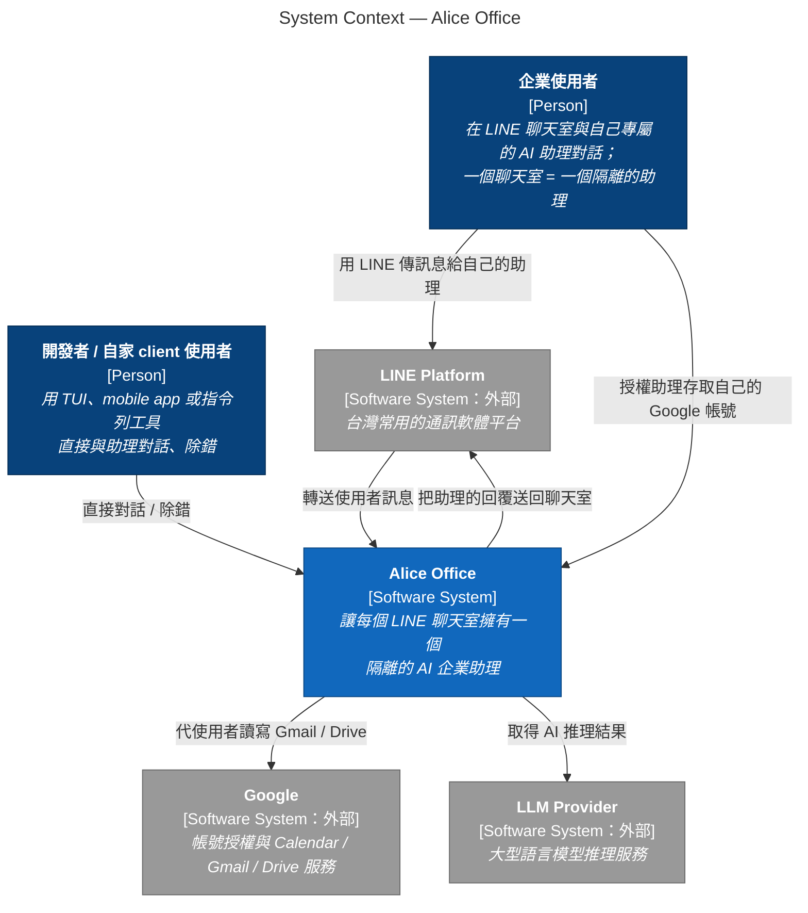
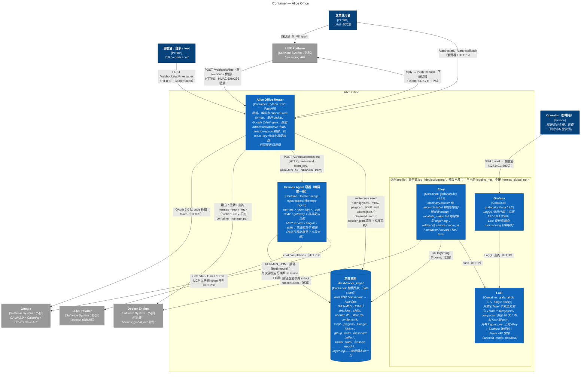
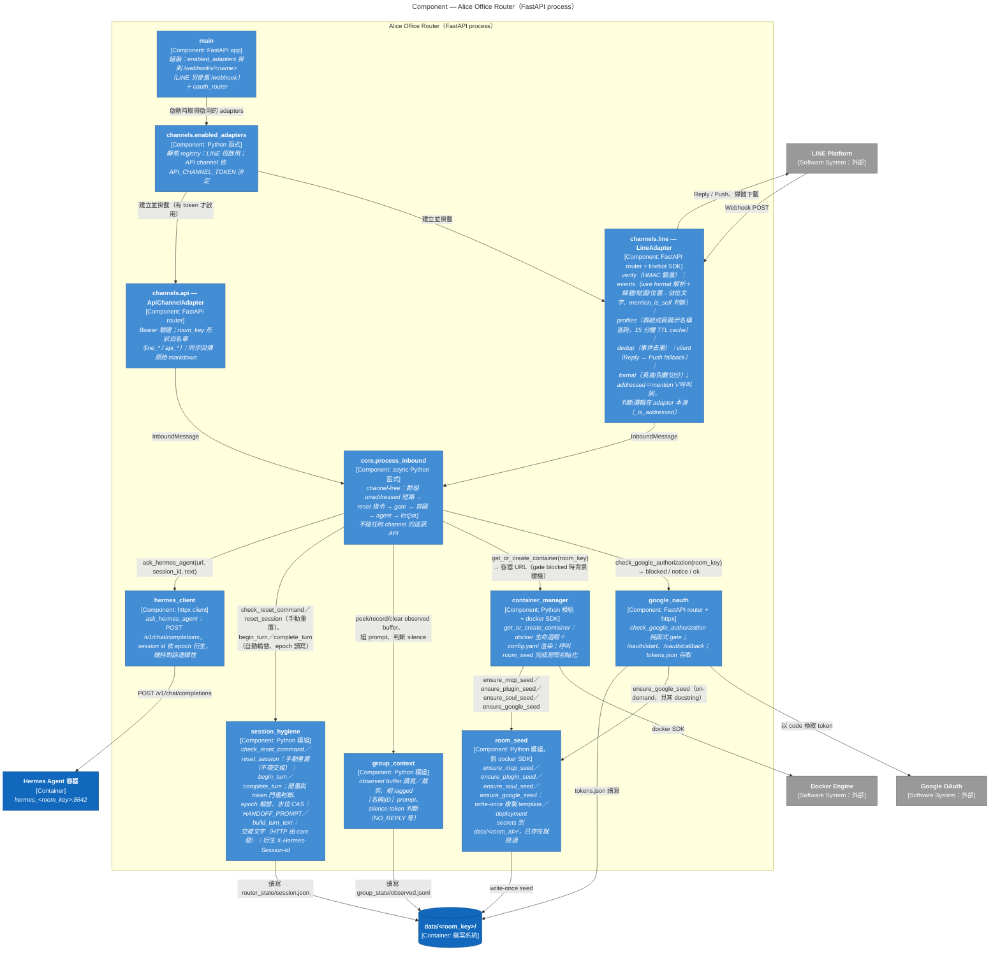
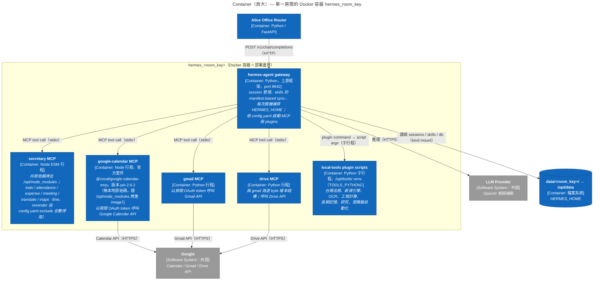

# C4 架構圖 — Alice Office Router

依 2026-09-14 的程式碼現況（channel adapter 重構、第一方 API channel、群組聊天
addressed/observe 判斷、session-epoch 輪替皆已落地；本次稽核補上遺漏的
google-calendar MCP、LineAdapter 的 profiles 子模組；同日再補上選配的集中式 log
profile——Alloy / Loki / Grafana，見 Level 2）繪製，
並依 [c4model.com](https://c4model.com) 的官方定義核對過（見文末「與官方定義的對照」）。
三個層級：System Context → Container → Component；Code（class）層級暫不畫。

> **名詞澄清**：C4 的「Container」定義是「an application or a data store——something
> that needs to be running in order for the overall software system to work」，不等於
> Docker container。官方範例明確包含 file system，所以每房間的資料目錄也是一個
> C4 container（data store）。

**圖例（四張圖共用）**：深藍框＝Person；藍框（#1168bd）＝Context 圖的系統本身、
其他圖的 Container；淺藍框（#438dd5）＝Component；圓柱＝資料存放（data store）；
灰框＝外部軟體系統；黃底大框＝該圖的範圍邊界。
圖使用 Mermaid flowchart 語法（不用 Mermaid 原生 C4 語法是因為其排版引擎會讓標籤
重疊），GitHub 網頁與 VS Code Markdown 預覽可直接渲染。

---

## Level 1 — System Context

系統邊界是「Alice Office」整體：router 加上所有房間的 Hermes agent 容器。
使用者只透過 LINE（或自家 client）互動，感受上就像直接使用自己部署的 Hermes agent。
依官方定義，這一層只講「誰、跟哪些系統、為了什麼互動」，不放協定與技術細節
（那些在 Level 2）。受眾：所有人，包含非技術背景。

```mermaid
---
title: "System Context — Alice Office"
---
flowchart TB
  classDef person fill:#08427b,color:#fff,stroke:#052e56
  classDef system fill:#1168bd,color:#fff,stroke:#0b4884
  classDef ext fill:#999999,color:#fff,stroke:#6b6b6b

  employee["<b>企業使用者</b><br/>[Person]<br/><i>在 LINE 聊天室與自己專屬的 AI 助理對話；<br/>一個聊天室 = 一個隔離的助理</i>"]:::person
  dev["<b>開發者 / 自家 client 使用者</b><br/>[Person]<br/><i>用 TUI、mobile app 或指令列工具<br/>直接與助理對話、除錯</i>"]:::person
  alice["<b>Alice Office</b><br/>[Software System]<br/><i>讓每個 LINE 聊天室擁有一個<br/>隔離的 AI 企業助理</i>"]:::system
  line["<b>LINE Platform</b><br/>[Software System：外部]<br/><i>台灣常用的通訊軟體平台</i>"]:::ext
  google["<b>Google</b><br/>[Software System：外部]<br/><i>帳號授權與 Calendar / Gmail / Drive 服務</i>"]:::ext
  llm["<b>LLM Provider</b><br/>[Software System：外部]<br/><i>大型語言模型推理服務</i>"]:::ext

  employee -- "用 LINE 傳訊息給自己的助理" --> line
  line -- "轉送使用者訊息" --> alice
  alice -- "把助理的回覆送回聊天室" --> line
  dev -- "直接對話 / 除錯" --> alice
  employee -- "授權助理存取自己的 Google 帳號" --> alice
  alice -- "代使用者讀寫 Gmail / Drive" --> google
  alice -- "取得 AI 推理結果" --> llm
```

---

## Level 2 — Container

系統內的可執行單元與資料存放：router（application）、每房間一個的 Hermes agent
容器（application）、每房間一份的資料目錄（data store），以及一組**選配**的
log 收集／儲存／查詢 container（Alloy / Loki / Grafana，預設不啟用）。依官方定義，
這一層呈現主要技術選型與 container 之間的通訊協定。Docker Engine 在這裡不是部署
細節，而是 router 在執行期呼叫的外部系統（動態建立房間容器是核心功能）；同理
Alloy 也是真的 application，不是「部署設定」，所以它在這一層而不是被省略。
受眾：技術人員。

```mermaid
---
title: "Container — Alice Office"
---
flowchart TB
  classDef person fill:#08427b,color:#fff,stroke:#052e56
  classDef container fill:#1168bd,color:#fff,stroke:#0b4884
  classDef ext fill:#999999,color:#fff,stroke:#6b6b6b

  employee["<b>企業使用者</b><br/>[Person]<br/><i>LINE 聊天室</i>"]:::person
  dev["<b>開發者 / 自家 client</b><br/>[Person]<br/><i>TUI / mobile / curl</i>"]:::person
  operator["<b>Operator（部署者）</b><br/>[Person]<br/><i>維運這台主機、追查<br/>「訊息為什麼沒回」</i>"]:::person
  line["<b>LINE Platform</b><br/>[Software System：外部]<br/><i>Messaging API</i>"]:::ext
  google["<b>Google</b><br/>[Software System：外部]<br/><i>OAuth 2.0 + Calendar / Gmail / Drive API</i>"]:::ext
  llm["<b>LLM Provider</b><br/>[Software System：外部]<br/><i>OpenAI 相容端點</i>"]:::ext
  docker["<b>Docker Engine</b><br/>[Software System：外部]<br/><i>同主機；hermes_global_net 網路</i>"]:::ext

  subgraph alice["Alice Office"]
    router["<b>Alice Office Router</b><br/>[Container: Python 3.12 / FastAPI]<br/><i>驗簽、解析各 channel wire format、事件 dedup、<br/>Google OAuth gate、群組 addressed/observe 判斷、<br/>session-epoch 輪替、依 room_key 分派到房間容器、<br/>把回覆送回房間</i>"]:::container
    hermes["<b>Hermes Agent 容器（每房間一個）</b><br/>[Container: Docker image nousresearch/hermes-agent]<br/><i>hermes_&lt;room_key&gt;，port 8642；gateway + 該房間自己的<br/>MCP servers / plugins / skills；容器間互不相通<br/>（內部行程結構見下方放大圖）</i>"]:::container
    roomdata[("<b>房間資料 data/&lt;room_key&gt;/</b><br/>[Container: 檔案系統（data store）]<br/><i>host 目錄 bind mount → /opt/data（HERMES_HOME）<br/>sessions、skills、kanban.db、state.db、config.yaml、<br/>mcp/、plugins/、Google tokens、<br/>group_state/（observed buffer）、<br/>router_state/（session epoch）、<br/>logs/*.log——每房間各自一份</i>")]:::container

    subgraph logging["選配 profile：集中式 log（deploy/logging/，預設不啟用；自己的 logging_net，不接 hermes_global_net）"]
      alloy["<b>Alloy</b><br/>[Container: grafana/alloy v1.19]<br/><i>discovery.docker 依 alice.role label 動態發現容器並收 stdout；<br/>local.file_match tail 每房間的 logs/*.log；<br/>relabel 成 service / room_id / container / source / file / level</i>"]:::container
      loki["<b>Loki</b><br/>[Container: grafana/loki 3.7，single binary]<br/><i>只索引 label 不做全文索引；tsdb ＋ filesystem，<br/>compactor 保留 30 天；不對 host 開 port，<br/>只有 logging_net 上的 Alloy／Grafana 連得到；<br/>delete API 關閉（deletion_mode: disabled）</i>"]:::container
      grafana["<b>Grafana</b><br/>[Container: grafana/grafana 13.2]<br/><i>LogQL 查詢介面；只綁 127.0.0.1:3000，<br/>Loki 資料來源由 provisioning 自動接好</i>"]:::container
    end
  end

  employee -- "傳訊息（LINE app）" --> line
  line -- "POST /webhooks/line（舊 /webhook 保留）<br/>HTTPS，HMAC-SHA256 驗簽" --> router
  router -- "Reply → Push fallback、下載媒體<br/>（linebot SDK / HTTPS）" --> line
  dev -- "POST /webhooks/api/messages<br/>（HTTPS + Bearer token）" --> router
  employee -- "/oauth/start、/oauth/callback<br/>（瀏覽器 / HTTPS）" --> router
  router -- "OAuth 2.0 以 code 換取 token（HTTPS）" --> google
  router -- "建立 / 啟動 / 查詢 hermes_&lt;room_key&gt;<br/>（docker SDK，只在 container_manager.py）" --> docker
  router -- "POST /v1/chat/completions<br/>（HTTP，session id = room_key，HERMES_API_SERVER_KEY）" --> hermes
  router -- "write-once seed（config.yaml、mcp/、plugins/、SOUL.md）<br/>tokens.json／observed.jsonl／session.json 讀寫（檔案系統）" --> roomdata
  hermes -- "HERMES_HOME 讀寫（bind mount）；<br/>每次開機自行補齊 sessions / skills / db" --> roomdata
  hermes -- "chat completions（HTTPS）" --> llm
  hermes -- "Calendar / Gmail / Drive MCP 以房間 token 呼叫（HTTPS）" --> google
  alloy -- "讀容器清單與 stdout<br/>（docker.sock，唯讀）" --> docker
  alloy -- "tail logs/*.log<br/>（/rooms，唯讀）" --> roomdata
  alloy -- "push（HTTP）" --> loki
  grafana -- "LogQL 查詢（HTTP）" --> loki
  operator -- "SSH tunnel → 瀏覽器<br/>（127.0.0.1:3000）" --> grafana
```

logging profile 的三個設計重點（細節見 `docs/logging-design.md`）：

- **router 與房間容器都不知道它存在**。兩者唯一提供的東西是建立時掛上的
  `alice.role` / `alice.room_id` Docker label（`docker-compose.yml` 與
  `container_manager.py`），Alloy 走 `docker.sock` 自己去發現——所以新房間的容器
  一冒出來就自動被收，不需要改容器生命週期邏輯，也不需要重啟 Alloy。
- **上面那三個箭頭都不是容器網路**。Alloy → Docker Engine 是 docker.sock，
  Alloy → 房間資料是 ro mount；三個 logging 容器只掛自己的 `logging_net`，跟房間
  容器所在的 `hermes_global_net` 完全不相通。Loki 沒有 auth，同網段就等於每個房間
  的 agent 都能讀走／竄改所有房間的 log（`docs/logging-design.md` §6）。
- **三個容器全部關掉，router 行為完全不變**。這是它做成 opt-in（多疊一個 `-f`）
  而不是寫進主 `docker-compose.yml` 的理由：客戶部署預設維持最小化。

責任分界（誰寫 `data/<room_key>/` 的哪部分）：

| 寫入者 | 內容 | 時機 |
|---|---|---|
| Router（container_manager／room_seed） | `config.yaml`、`mcp/`、`plugins/`、`SOUL.md` seed | 房間第一次建立，write-once，之後永不覆蓋 |
| Router（google_oauth） | Google `tokens.json` | OAuth callback / refresh |
| Router（group_context） | `group_state/observed.jsonl` | 每則未點名的群組訊息追加；點名回覆成功後裁剪已讀取的部分 |
| Router（session_hygiene） | `router_state/session.json` | 每則進 agent 的訊息讀寫；手動重置／自動輪替（閒置、token 門檻）時更新 epoch |
| Hermes gateway | `sessions/`、`skills/`、`kanban.db`、`state.db`、`logs/`、lock 檔 | 每次容器開機自行補齊與執行期寫入 |

> **簡化說明**：嚴格照 C4 定義，一個房間的 Docker 容器內其實跑著多個行程
> （gateway、MCP servers、plugin 子行程），每個行程都是獨立的 C4 container。
> 本圖把整個房間 Docker 容器畫成一個 container 是刻意的簡化——對外它只有
> gateway 一個入口（port 8642），行程級的拆解見下方的放大圖。

---

## Level 3 — Component：Alice Office Router

範圍：單一 container（Alice Office Router，一個 FastAPI process）。圖中每個
component 都是同一個 process 內的 Python 模組——符合官方定義「a grouping of
related functionality encapsulated behind a well-defined interface」且「all
components inside a container execute in the same process space」。

核心設計：channel adapter 各自擁有自己的 wire format（驗簽、解析、dedup、送訊），
唯一出口是 channel-free 的 `core.process_inbound`；core 只認 `InboundMessage`
（channel + room_key + 純文字），回傳 `list[str]`，從不碰任何 channel 的送訊 API。

```mermaid
---
title: "Component — Alice Office Router（FastAPI process）"
---
flowchart TB
  classDef comp fill:#438dd5,color:#fff,stroke:#2e6295
  classDef ext fill:#999999,color:#fff,stroke:#6b6b6b
  classDef container fill:#1168bd,color:#fff,stroke:#0b4884

  line["<b>LINE Platform</b><br/>[Software System：外部]"]:::ext
  google["<b>Google OAuth</b><br/>[Software System：外部]"]:::ext
  docker["<b>Docker Engine</b><br/>[Software System：外部]"]:::ext
  hermes["<b>Hermes Agent 容器</b><br/>[Container]<br/><i>hermes_&lt;room_key&gt;:8642</i>"]:::container
  roomdata[("<b>data/&lt;room_key&gt;/</b><br/>[Container: 檔案系統]")]:::container

  subgraph router["Alice Office Router（FastAPI process）"]
    main["<b>main</b><br/>[Component: FastAPI app]<br/><i>組裝：enabled_adapters 掛到 /webhooks/&lt;name&gt;<br/>（LINE 另掛舊 /webhook）＋ oauth_router</i>"]:::comp
    registry["<b>channels.enabled_adapters</b><br/>[Component: Python 函式]<br/><i>靜態 registry：LINE 恆啟用；<br/>API channel 依 API_CHANNEL_TOKEN 決定</i>"]:::comp
    line_adapter["<b>channels.line — LineAdapter</b><br/>[Component: FastAPI router + linebot SDK]<br/><i>verify（HMAC 驗簽）｜events（wire format 解析＋<br/>媒體/貼圖/位置→佔位文字、mention_is_self 判斷）｜<br/>profiles（群組成員顯示名稱查詢，15 分鐘 TTL cache）｜<br/>dedup（事件去重）｜client（Reply → Push fallback）｜<br/>format（長度/則數切分）；addressed＝mention∨呼叫詞，<br/>判斷邏輯在 adapter 本身（_is_addressed）</i>"]:::comp
    api_adapter["<b>channels.api — ApiChannelAdapter</b><br/>[Component: FastAPI router]<br/><i>Bearer 驗證；room_key 形狀白名單<br/>（line_* / api_*）；同步回傳原始 markdown</i>"]:::comp
    core["<b>core.process_inbound</b><br/>[Component: async Python 函式]<br/><i>channel-free：群組 unaddressed 短路 →<br/>reset 指令 → gate → 容器 → agent → list[str]<br/>不碰任何 channel 的送訊 API</i>"]:::comp
    group_ctx["<b>group_context</b><br/>[Component: Python 模組]<br/><i>observed buffer 讀寫／裁剪、組 tagged<br/>［名稱|ID］prompt、silence token 判斷（NO_REPLY 等）</i>"]:::comp
    sess_hyg["<b>session_hygiene</b><br/>[Component: Python 模組]<br/><i>check_reset_command／reset_session：手動重置（不帶交接）｜<br/>begin_turn／complete_turn：閒置與 token 門檻判斷、<br/>epoch 輪替、水位 CAS｜HANDOFF_PROMPT／build_turn_text：<br/>交接文字（HTTP 由 core 發）｜衍生 X-Hermes-Session-Id</i>"]:::comp
    oauth["<b>google_oauth</b><br/>[Component: FastAPI router + httpx]<br/><i>check_google_authorization 純函式 gate；<br/>/oauth/start、/oauth/callback；tokens.json 存取</i>"]:::comp
    cm["<b>container_manager</b><br/>[Component: Python 模組 + docker SDK]<br/><i>get_or_create_container：docker 生命週期＋<br/>config.yaml 渲染；呼叫 room_seed 完成房間初始化</i>"]:::comp
    room_seed["<b>room_seed</b><br/>[Component: Python 模組，無 docker SDK]<br/><i>ensure_mcp_seed／ensure_plugin_seed／ensure_soul_seed／<br/>ensure_google_seed：write-once 複製 template／deployment<br/>secrets 到 data/&lt;room_id&gt;/，已存在就跳過</i>"]:::comp
    hc["<b>hermes_client</b><br/>[Component: httpx client]<br/><i>ask_hermes_agent：POST /v1/chat/completions，<br/>session id 依 epoch 衍生，維持對話連續性</i>"]:::comp
  end

  main -- "啟動時取得啟用的 adapters" --> registry
  registry -- "建立並掛載" --> line_adapter
  registry -- "建立並掛載（有 token 才啟用）" --> api_adapter
  line -- "Webhook POST" --> line_adapter
  line_adapter -- "Reply / Push、媒體下載" --> line
  line_adapter -- "InboundMessage" --> core
  api_adapter -- "InboundMessage" --> core
  core -- "check_google_authorization(room_key)<br/>→ blocked / notice / ok" --> oauth
  core -- "get_or_create_container(room_key)<br/>→ 容器 URL（gate blocked 時背景暖機）" --> cm
  core -- "peek/record/clear observed buffer、<br/>組 prompt、判斷 silence" --> group_ctx
  core -- "check_reset_command／reset_session（手動重置）、<br/>begin_turn／complete_turn（自動輪替、epoch 讀寫）" --> sess_hyg
  core -- "ask_hermes_agent(url, session_id, text)" --> hc
  cm -- "docker SDK" --> docker
  cm -- "ensure_mcp_seed／ensure_plugin_seed／<br/>ensure_soul_seed／ensure_google_seed" --> room_seed
  room_seed -- "write-once seed" --> roomdata
  group_ctx -- "讀寫 group_state/observed.jsonl" --> roomdata
  sess_hyg -- "讀寫 router_state/session.json" --> roomdata
  oauth -- "以 code 換取 token" --> google
  oauth -- "ensure_google_seed（on-demand，見其 docstring）" --> room_seed
  oauth -- "tokens.json 讀寫" --> roomdata
  hc -- "POST /v1/chat/completions" --> hermes
```

圖上刻意省略的兩個橫切元件（畫成箭頭會變蜘蛛網）：

- **`channels.base`** — `InboundMessage` model 與 `ChannelAdapter` Protocol，
  即圖中兩條「InboundMessage」邊所承載的契約本體。
- **`config.Settings`** — 環境變數與路徑推導（pydantic-settings），啟動時 fail-fast
  驗證；幾乎每個元件都讀它。

---

## Level 2 放大 — 單一房間的 Docker 容器內部

**這張不是 Component 圖**：C4 定義 component 必須「與 container 在同一個 process
space 執行」，但 MCP servers（Node / Python）和 plugin scripts 都是 gateway 之外的
獨立行程——照定義它們各自是 C4 container。所以這是一張把 Level 2 的
「Hermes Agent 容器」放大後的 container 圖；房間的 Docker 容器在這裡是部署邊界
（deployment boundary），不是 C4 container。

這個 repo 負責這些行程的模板 seed（`src/hermes/{mcp,plugin}/`）與 image 烘烤
（`Dockerfile.hermes`）；gateway 本體是上游 `NousResearch/hermes-agent`。

```mermaid
---
title: "Container（放大）— 單一房間的 Docker 容器 hermes_room_key"
---
flowchart TB
  classDef container fill:#1168bd,color:#fff,stroke:#0b4884
  classDef ext fill:#999999,color:#fff,stroke:#6b6b6b

  router["<b>Alice Office Router</b><br/>[Container: Python / FastAPI]"]:::container
  llm["<b>LLM Provider</b><br/>[Software System：外部]<br/><i>OpenAI 相容端點</i>"]:::ext
  google["<b>Google</b><br/>[Software System：外部]<br/><i>Calendar / Gmail / Drive API</i>"]:::ext
  roomdata[("<b>data/&lt;room_key&gt;/ → /opt/data</b><br/>[Container: 檔案系統]<br/><i>HERMES_HOME</i>")]:::container

  subgraph hermes["hermes_&lt;room_key&gt;（Docker 容器 = 部署邊界）"]
    gateway["<b>hermes-agent gateway</b><br/>[Container: Python，上游框架，port 8642]<br/><i>session 管理、skills 的 manifest-based sync、<br/>每次開機補齊 HERMES_HOME；<br/>依 config.yaml 啟動 MCP 與 plugins</i>"]:::container
    secretary["<b>secretary MCP</b><br/>[Container: Node ESM 行程]<br/><i>共用依賴烤在 /opt/node_modules；<br/>todo / attendance / expense / meeting /<br/>translate / maps（line、reminder 由<br/>config.yaml exclude 全數停用）</i>"]:::container
    gcal["<b>google-calendar MCP</b><br/>[Container: Node 行程，官方套件<br/>@cocal/google-calendar-mcp，版本 pin 2.6.2<br/>（無本地原始碼，隨 /opt/node_modules 烤進 image）]<br/><i>以房間 OAuth token 呼叫 Google Calendar API</i>"]:::container
    gmail["<b>gmail MCP</b><br/>[Container: Python 行程]<br/><i>以房間 OAuth token 呼叫 Gmail API</i>"]:::container
    drive["<b>drive MCP</b><br/>[Container: Python 行程]<br/><i>與 gmail 為逐 byte 複本結構；呼叫 Drive API</i>"]:::container
    plugins["<b>local-tools plugin scripts</b><br/>[Container: Python 子行程，/opt/tools/.venv（TOOLS_PYTHON）]<br/><i>台灣法規、薪資引擎、OCR、工程計算、<br/>長期記憶、研究、瀏覽器自動化</i>"]:::container
  end

  router -- "POST /v1/chat/completions（HTTP）" --> gateway
  gateway -- "推理（HTTPS）" --> llm
  gateway -- "MCP tool call（stdio）" --> secretary
  gateway -- "MCP tool call（stdio）" --> gcal
  gateway -- "MCP tool call（stdio）" --> gmail
  gateway -- "MCP tool call（stdio）" --> drive
  gateway -- "plugin command → script argv（子行程）" --> plugins
  gcal -- "Calendar API（HTTPS）" --> google
  gmail -- "Gmail API（HTTPS）" --> google
  drive -- "Drive API（HTTPS）" --> google
  gateway -- "讀寫 sessions / skills / db（bind mount）" --> roomdata
```

---

## 與官方定義的對照（2026-07-16 依 c4model.com 核對）

- **System Context**：官方要求「focus on people and software systems rather than
  technologies, protocols and other low-level details」——本文件的 Context 圖因此
  只寫互動意圖，協定與路徑全部下放到 Container 層。
- **Container**：官方定義是「an application or a data store」，範例明確包含
  file system，所以 `data/<room_key>/` 畫成 container（data store）符合定義；
  這一層也正是官方要求呈現技術選型與 container 間通訊協定的地方。
- **Component**：官方定義 component「不是可獨立部署的單元，且與 container 同
  process space」——Router 的元件圖符合（全是同一 FastAPI process 內的模組）；
  房間容器內的 MCP／plugin 是獨立行程，所以那張圖改標為「Container 放大圖」。
- **Notation 檢查清單**：每個元素標了型別（[Person] / [Software System] /
  [Container: 技術] / [Component: 技術]）與一句職責描述；每條線皆為單向、有
  標籤；container 間的線標了協定；每張圖有標題；圖例在文件開頭。
- **官方對 Component 圖的提醒**：「only create component diagrams if you feel
  they add value」——Router 元件圖的價值在固定 adapter ↔ core 的分層契約，
  程式碼演進時此圖需要跟著維護。

---

## 與其他文件的關係

- channel adapter 契約與分層的完整設計：`docs/channel-interface-design.md`
- Router ↔ Hermes 的 HTTP 協定細節：`docs/router-hermes-agent-protocol.md`
- 訊息端到端流程：`docs/line-hermes-message-flow.md`
- 群組聊天 addressed/observe 判斷：`docs/group-chat-design.md`
- Session-epoch 輪替與交接摘要：`docs/session-hygiene.md`
- 環境變數與路徑：`docs/env-data-paths.md`、`docs/runtime-env-summary.md`
