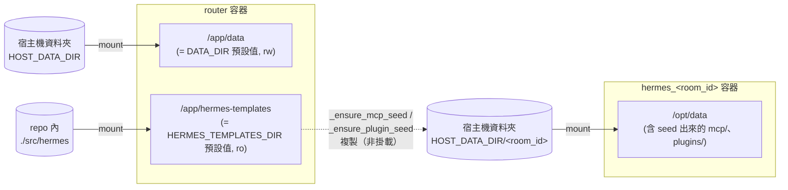
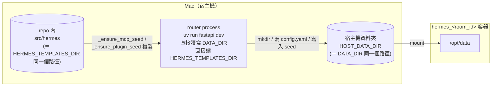

# DATA_DIR / HOST_DATA_DIR / HERMES_TEMPLATES_DIR / ROUTER_IN_DOCKER 關係

這幾個變數常搞混，因為它們其實在回答兩個不同的問題。拆開看就清楚了。

## 先分兩種身份

- **`DATA_DIR` / `HERMES_TEMPLATES_DIR`** —— 這是 **router 這個 process 自己**要讀寫
  檔案時用的路徑。`DATA_DIR` 是「router 自己往哪裡寫房間資料？」（`mkdir`、寫
  `config.yaml`、把 MCP/plugin 樣板 seed 進房間）；`HERMES_TEMPLATES_DIR` 是「router
  自己要去哪裡讀 MCP/plugin 樣板？」（`src/hermes/{mcp,plugin}/` 底下有哪些子目錄）。
  兩者都是純粹的 Python 檔案系統操作（`Path.mkdir()`、`shutil.copytree()`……），
  發生在 router 自己的 process 裡，跟 Docker 完全無關。

- **`HOST_DATA_DIR`** —— 這是 router 呼叫 `docker.sock` **建立 Hermes 兄弟容器**時，
  告訴 Docker daemon 要把宿主機的哪個資料夾掛進新容器的 `/opt/data`。它問的問題是：
  「Docker daemon 要去宿主機的哪裡挖資料夾出來掛？」

這兩者是**分開的兩份設定**，因為 `docker.sock` 永遠是對「宿主機的 Docker daemon」
下指令，所以 `HOST_*` 永遠必須是宿主機視角的絕對路徑——不管 router 自己在哪裡跑。

程式碼對應：

- `DATA_DIR` 用於 `container_manager.py` 的 `_ensure_data_dir()`、`_ensure_mcp_seed()`、
  `_ensure_plugin_seed()`、`_ensure_config_yaml()`（router 進程自己的檔案系統操作）。
- `HERMES_TEMPLATES_DIR` 同樣用於 `_ensure_mcp_seed()` / `_ensure_plugin_seed()`，
  是 `_seed_templates()` 讀取樣板來源的那一端。
- `HOST_DATA_DIR` 用於 `_build_volume_config()`，組成傳給
  `docker.containers.run(volumes=...)` 的宿主機路徑——現在整個函式只剩這一條掛載。

> **這是架構上刻意的簡化**：MCP/plugin 原始碼以前是另外兩個 `HOST_*` 變數
> （`HOST_PLUGINS_DIR`、`HOST_SECRETARY_MCP_DIR`），一樣講給 Docker daemon 聽、
> 一樣是全房間共用的唯讀掛載。現在改成**每個房間各自 seed 一份、可自由編輯**（見
> `container_manager.py` 的 `_ensure_mcp_seed` / `_ensure_plugin_seed`），複製動作是
> router process 自己做的檔案系統操作，不再假手 Docker daemon，所以它自然就落進
> `DATA_DIR` 這一類（router 自己看得到的路徑），而不是 `HOST_*` 那一類。

## `ROUTER_IN_DOCKER` 是決定 router 自己活在哪個世界的開關

它還決定 router 怎麼連線到 Hermes 容器（見 `container_manager.py` 的
`_get_agent_url`），但跟這題最相關的是它連帶決定 `DATA_DIR` / `HERMES_TEMPLATES_DIR`
該怎麼填：

| 模式 | `ROUTER_IN_DOCKER` | router 進程跑在哪 | `DATA_DIR` / `HERMES_TEMPLATES_DIR` 該填什麼 |
|---|---|---|---|
| 容器化部署 | `true`（預設） | router 自己也是 `hermes_global_net` 上的一個 container | 都不用設，吃預設值 `/app/data` / `/app/hermes-templates`——因為 `docker-compose.yml` 已經把宿主機的 `HOST_DATA_DIR` 掛進 router **自己這個容器**的 `/app/data`（rw），把 `./src/hermes` 掛進 `/app/hermes-templates`（ro） |
| 本機開發 | `false` | router 直接跑在你的 Mac 上（`uv run fastapi dev`） | **都必填**：`DATA_DIR` 要跟 `HOST_DATA_DIR` 填**一模一樣**的絕對路徑；`HERMES_TEMPLATES_DIR` 要填 repo 的 `src/hermes` 絕對路徑——因為這時候 router 沒有被容器包住，它講的 `/app/data`／`/app/hermes-templates` 就是 Mac 上真的那兩個路徑，通常不存在，所以才要覆寫成真實路徑 |

## 畫成圖

**容器化部署（`ROUTER_IN_DOCKER=true`）**：

router 容器和 Hermes 容器各自被掛了一份宿主機的 `data/<room_id>/`，只是掛入路徑不同
（`/app/data` vs `/opt/data`）。`/app/hermes-templates` 則只掛進 router 容器——router
讀到樣板後用一般的檔案複製把它寫進 `HOST_DATA_DIR/<room_id>/`，Hermes 容器完全不知道
（也不需要知道）樣板原本從哪裡來，它只會看到 `/opt/data/mcp/`、`/opt/data/plugins/`
底下已經有現成的檔案。

**本機開發（`ROUTER_IN_DOCKER=false`）**：

這裡沒有「router 自己的容器」了，所以 `DATA_DIR` 跟 `HOST_DATA_DIR` 剛好會被要求
填**同一個值**——只是因為 router 現在直接站在宿主機上，兩個變數指的恰好是同一個
視角，並非巧合的規則，而是視角重合的結果。`HERMES_TEMPLATES_DIR` 則單純就是
router 進程自己要讀的那個路徑，沒有對應的 `HOST_*` 版本——它從來就不需要講給
Docker daemon 聽。

## 一句話總結

`ROUTER_IN_DOCKER` 決定 router 自己活在容器裡還是宿主機上；`DATA_DIR` /
`HERMES_TEMPLATES_DIR` 永遠是「router 自己看到的路徑」；`HOST_DATA_DIR` 永遠是
「講給 Docker daemon 聽的宿主機路徑」——本機開發模式下 `DATA_DIR` 跟 `HOST_DATA_DIR`
剛好要填一樣，是因為 router 這時候就站在宿主機上。

## 常見踩雷

- 本機開發忘了設 `DATA_DIR` / `HERMES_TEMPLATES_DIR`：預設值 `/app/data` /
  `/app/hermes-templates` 在 Mac/Linux host 上通常不存在，建房間會整個失敗
  （`DATA_DIR` 缺失）或悄悄 seed 不出任何 MCP/plugin（`HERMES_TEMPLATES_DIR` 缺失、
  `_seed_templates` 的 `if not templates_root.is_dir(): return` 會直接跳過，不報錯）。
  錯誤只出現在 router 自己的 terminal（背景任務吞掉例外），對呼叫端看起來像是
  「container 一直不存在」或「MCP 都沒生效」。
- `DATA_DIR` / `HOST_DATA_DIR` 填到別的 repo clone 的路徑（例如複製 `.env` 時沒改
  路徑）：容器會正常建立、資料也會正常寫入，但寫到的是別的資料夾，這個專案目錄下的
  `data/<room_id>/` 會是空的，讓人誤以為沒有成功。
- **在 router 程式碼裡對 `HOST_*` 路徑做 `Path(...).exists()` 判斷**：這是實際發生過的
  bug（`container_manager.py` 曾經想「`secretary-mcp/.env` 存在才掛」，用
  `Path(config.HOST_SECRETARY_MCP_DIR, ".env").exists()` 判斷）。這個判斷式是在
  **router 自己的 container 裡**執行的，而 `HOST_*` 是「講給 Docker daemon 聽的宿主機
  路徑」，router 自己的檔案系統壓根看不到它——`.exists()` 永遠是 `False`，而且不會
  報錯，看起來像功能正常但其實整條 mount 邏輯沒生效。這正是後來把 MCP/plugin 原始碼
  改成 `HERMES_TEMPLATES_DIR`（`DATA_DIR` 那一類）而不是 `HOST_*` 的原因之一：
  `_seed_templates()` 現在對 `HERMES_TEMPLATES_DIR` 做 `.is_dir()` 判斷是完全安全的，
  因為它是 router 自己看得到的路徑。這條雷只留給唯一還剩下的 `HOST_DATA_DIR`：
  它的存在與否判斷（要有的話）必須留給實際讀那個掛載點的一方（Hermes 容器自己），
  不能在 router 這端用 `Path(...).exists()` 檢查——用 `docker exec <router 容器>
  ls <該路徑>` 可以直接證實「router 看不到」。
