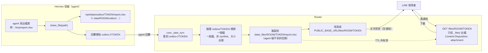
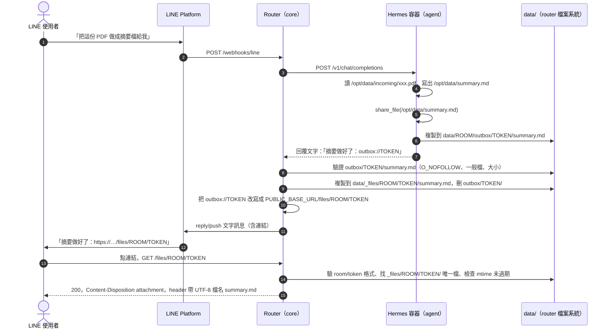
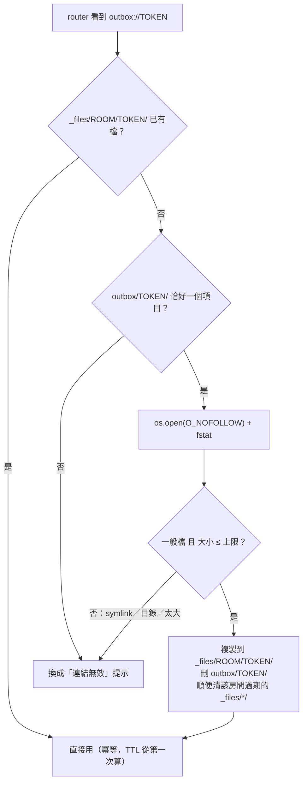
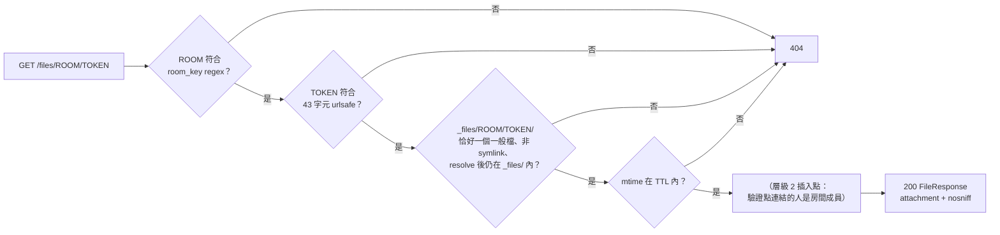

# 檔案分享機制設計：agent 產出的檔案怎麼交給 LINE 使用者

> 狀態：已實作並通過本機 e2e（2026-09-16）；2026-09-17 公開網址變數改名為 `PUBLIC_BASE_URL`、
> 下載 route 補上 HEAD。本文說明「機制」；實作細節以程式碼為準
> （`src/alice_office_router/file_links.py`、`src/hermes/plugin/local-tools/` 的
> `share_file`）。

## 1. 問題

使用者可以從 LINE 傳 PDF／圖片／檔案進來（落在 `data/<room>/incoming/`，agent 讀得到），
但反方向不通：**LINE Messaging API 不允許 bot 傳檔案給使用者**。官方 reference 與
`line/line-openapi` 定義列出的出站訊息型別只有 text／sticker／image／video／audio／location／
coupon／imagemap／template／flex，沒有任何「file」型別。連 image／video／audio 也不是上傳，
而是給 LINE 平台一個公開 HTTPS URL 讓它自己去抓。

所以 agent 做出來的 `summary.md`、`report.xlsx`、`payroll.xlsx` 目前無路可回。更糟的是
Hermes 的 deliverable mode 會讓 agent 在回覆裡貼 `/opt/data/report.pdf` 這種路徑或
`MEDIA:/opt/data/chart.png` 標籤，這些會原樣漏到 LINE，使用者看到一個打不開的字串。

## 2. 結論：router 提供下載連結

唯一可行的路是「檔案放在某個 HTTPS 位置 + 把連結當文字傳」。我們選擇讓 **router 自己
host**（而不是上傳到 Google Drive），理由：不依賴 Google、任何檔案型別都行、不開新的第三方
依賴。

權限模型是**能力型連結（capability URL）**：

- 連結裡有一段猜不到的隨機 token（`secrets.token_urlsafe(32)`，43 字元，256 bit）。
- 誰拿到連結誰就能下載，router **不問你是誰**。
- 有效期預設 24 小時（`FILE_LINK_TTL_HOURS`）。
- 安全性來自「token 猜不到」＋「連結只發進這個房間」。這跟 LINE 原生傳檔是同一個等級：
  檔案傳進群組，成員也可以轉傳出去；連結一樣。

真正「只有房間成員能開」要靠 LIFF／LINE Login 問出點連結的人是誰，再用
`GET /v2/bot/group/{groupId}/member/{userId}`（非成員回 404）驗證成員身分。那是層級 2，
本次不做，但 route 設計預留了插入點（見 §7）。

## 3. 全貌

### 3.1 三個角色、三個目錄

| 目錄 | 誰寫 | 誰讀 | 用途 |
|---|---|---|---|
| `data/<room>/outbox/<token>/<檔名>` | agent（容器內 `/opt/data/outbox/`） | router | agent 宣告「這個檔要給使用者」的交接區 |
| `data/_files/<room>/<token>/<檔名>` | router | router | 真正對外出檔的地方；**agent 碰不到**（在房間 mount 之外） |
| `{PUBLIC_BASE_URL}/files/<room>/<token>` | — | 使用者的瀏覽器 | 下載連結 |

### 3.2 一次完整的時序

## 4. 為什麼要複製兩次

直覺做法是 route 直接從 `data/<room>/outbox/` 出檔，少一次複製。不這樣做的原因是
**agent 完全掌控 `data/<room>/`**（那是它的 `HERMES_HOME`，rw bind mount），它可以：

- 在 `outbox/<token>/` 放一個 **symlink** 指到 `../../line_U別人/google/tokens.json`。
  容器裡解析不到（別的房間沒 mount 進來），但 router 的程序看得到整個 `DATA_DIR`，
  一 follow 就把別人的 Google token 送出去了。
- `touch` 檔案把 mtime 往後推，**無限延長 TTL**。
- 不走 `share_file` 工具，直接用 shell 往 `outbox/` 塞 500 MB，**繞過大小上限**。

所以 router 在改寫連結的那一刻把檔案**複製一次**到自己專屬的 `data/_files/`
（跟 `data/_conversations/` 一樣放在房間目錄之外，agent 永遠寫不到），複製時用
`O_NOFOLLOW` 開檔＋`fstat` 確認是一般檔＋檢查大小。之後 TTL 看的是 router 自己寫下的
mtime，route 只信 `_files/`。複製成功後 `outbox/<token>/` 就刪掉，房間目錄不會堆東西。

## 5. 為什麼容器不直接產生真實 URL

`share_file` 回傳的是 `outbox://<token>` 佔位字串，不是 `https://…` 真實連結，由 router
送出前改寫。理由：

- 現有架構是「container 對 LINE 零知情」（`docs/router-hermes-agent-protocol.md`）：容器
  不知道自己的 room_id、不知道 router 的公開網址。維持這條線，容器就不用新增任何環境變數，
  **既有房間不必 `docker rm -f` 重建**（容器 env 只在建立時讀）。
- 改寫發生在 `core._take_turn`，是 1:1 與群組回覆共用的唯一接縫，而且在 channel adapter
  之前——所以 LINE 和 API channel（TUI／mobile）拿到的都是真實 URL。
- `PUBLIC_BASE_URL` 沒設時，router 把佔位換成一句「此部署未設定檔案下載連結」，agent
  端不用知道功能有沒有開。

## 6. URL 為什麼不帶檔名

`/files/<room>/<token>`，沒有 `/summary.md`。檔名走 HTTP header
`Content-Disposition: attachment; filename*=utf-8''…`，瀏覽器存檔時還是會用正確檔名。

中文檔名在這個產品是常態；放進 URL 會被 LINE 客戶端的自動連結和 `channels/line/format.py`
的 markdown-link 解析切壞。token 字元集 `[A-Za-z0-9_-]` 兩邊都安全。

`room_id` 留在 URL 裡（1:1 房間就是 LINE userId）：被轉傳的人會看到它。這跟現有的
`oauth/start?user_id=<room>` 授權連結同等級，而且層級 2 的成員驗證需要它，接受。

route 同時接 **GET 與 HEAD**：下載管理器和連結預覽爬蟲常先 HEAD 問大小與檔名再 GET，
FastAPI 不會自動幫 GET route 回 HEAD（會 405），所以要明寫；`FileResponse` 對 HEAD 只回 header。

## 7. 安全邊界一覽

| 威脅 | 擋在哪 |
|---|---|
| 猜 token | 256 bit 隨機，不可能 |
| A 房間的 agent 做出 B 房間的有效連結 | agent 只能寫自己的 `outbox/`；router 只從 `_files/<A>/` 找 A 的 token |
| outbox 放 symlink 指到房外 | 複製時 `O_NOFOLLOW`＋`fstat` 是一般檔才複製；`outbox/<token>/` 這層目錄本身也用 `O_NOFOLLOW｜O_DIRECTORY` 開，檔案再以那個 fd 為基準開（`dir_fd=`），所以連「把 token 目錄換成 symlink」也擋掉，且中間沒有 TOCTOU 窗口 |
| `touch` 延長 TTL | TTL 看 `_files/` 副本的 mtime（router 寫的） |
| 塞超大檔 | 複製時檢查 `st_size <= FILE_LINK_MAX_BYTES`（預設 50 MB） |
| URL 裡塞 `..`／`_files`／`_google` 當 room_id | room_id 必須 fullmatch `line_[UCR]<32 hex>` 或 `api_<slug>`（跟 API channel 同一個 regex） |
| 用 route 當 XSS 跳板（同 origin 有 `/oauth/*`） | 永遠 `attachment`、加 `X-Content-Type-Options: nosniff`，不 inline |
| 用錯誤訊息列舉 token | 格式錯、不存在、過期、symlink 一律 404，不區分 |
| token 進 log | 只記前 8 碼：`file_links` 自己的事件記 `token_prefix`，而 access log 的 `path` 由 `logging_setup._redact_path` 把 `/files/<room>/<token>` 的 token 截成前 8 碼（否則每一次下載都會把完整憑證寫進要離開主機的 log 流）。回覆內容本來就不進 envelope |
| 檔名帶控制字元／引號，污染 `Content-Disposition` | 複製時 router 自己再清一次檔名（控制字元、引號、反斜線、分隔符換成 `_`，去掉開頭的點）——plugin 那邊的清洗不算數，agent 可以繞過工具直接寫 outbox |
| 連結被轉傳給房外的人 | **不擋**（層級 1 的定義），TTL 限制暴露窗口 |

下載 route 的判斷鏈（任何一步失敗都是同一個 404）：

**層級 2 的插入點**：LIFF 頁面取 ID token → router 打
`POST https://api.line.me/oauth2/v2.1/verify` 拿 userId → 1:1 房間比對 userId、群組用
`get_group_member_profile`（`channels/line/profiles.py` 已在用）。token／`_files` 佈局不變。
前提：LINE Login channel 要跟 Messaging API channel 在**同一個 provider** 底下（userId 每個
provider 不同）。

## 8. TTL 與清理

- 預設 24 小時，`FILE_LINK_TTL_HOURS` 可調。過期 → 404，使用者請 agent 再 share 一次即可。
- **不做一次性 token**：LINE 的連結預覽爬蟲和 iOS 的預抓會先打一次，一次性 token 會讓使用者
  真的點的時候已經失效。
- 清理沒有 scheduler：每次 router 為某房間發佈新檔時，順便刪掉該房間 `_files/<room>/` 底下
  過期的 `<token>/` 目錄。

## 9. agent 怎麼知道要用這個

兩層，理由不同：

- **回覆形狀規則**（每回合由 router 送的 system prompt，`group_context.py` 的
  `DIRECT_SYSTEM_PROMPT`／`GROUP_SYSTEM_PROMPT`）：「要把檔案交給使用者只能用 `share_file`
  工具，把它回傳的 `outbox://…` 連結原樣單獨一行貼在回覆裡；直接貼路徑或 `MEDIA:` 標籤
  使用者看不到。」既有房間**立即生效**。
- **環境事實**（`src/hermes/skill/alice/runtime-env/SKILL.md`，烤進 image）：怎麼用、
  純文字內容直接回文字不必做成檔案。要重建 image 才到，不急。

同樣的兩層做法後來也用在 Google 授權連結（`google-auth://request`，
`auth_links.py`）：見 `docs/google-auth-per-member-plan.md` §3.3。

`share_file` 工具本身住在 `src/hermes/plugin/local-tools/`，單一參數 `path`。不檢查來源
路徑是否在 `/opt/data` 內——`hr` 工具本來就把 xlsx 寫到 `/tmp/`，容器內 `/tmp` 和 `/opt/data`
沒有權限邊界；圍籬是 router 的事（§4）。

## 10. 範例情境

### 情境 A：1:1 聊天，PDF 摘要成 md 檔

小明私訊 Alice：「這份合約幫我整理成重點摘要，存成檔案給我。」（附一份 PDF）

1. PDF 落在 `data/line_U小明/incoming/合約.pdf`；agent 用 `image_ocr` 讀完，寫出
   `/opt/data/合約摘要.md`。
2. agent 呼叫 `share_file("/opt/data/合約摘要.md")` → 得到 `outbox://Qm3f…（43 字元）`。
3. agent 回覆：「整理好了，共 5 點重點：… 完整檔案：\noutbox://Qm3f…」。
4. router 把檔案複製到 `data/_files/line_U小明/Qm3f…/合約摘要.md`，改寫成
   `https://router.example.com/files/line_U小明/Qm3f…`。
5. 小明在 LINE 看到連結，點開 → 瀏覽器下載 `合約摘要.md`（檔名靠 header 還原，URL 裡沒有中文）。

### 情境 B：群組聊天，薪資試算 xlsx

會計群組裡，主管 @Alice：「用剛才傳的員工名冊跟出勤表算 9 月薪資。」

1. `hr` 工具把結果寫到 `/tmp/payroll-2026-09.xlsx`（這是 `hr` 工具本來的行為，在 `/opt/data` 外）。
2. agent `share_file("/tmp/payroll-2026-09.xlsx")`——**不會**因為在 `/tmp` 被拒絕，
   工具只要求「一般檔、≤ 50 MB」。
3. 連結發進群組，**群組裡每個人**都能點——這就是「根據房間成員決定存取」在層級 1 的含義：
   連結只發進這個房間。

### 情境 C：連結被轉傳出去（層級 1 的邊界）

情境 B 的主管把連結轉傳給群組外的顧問。

- **24 小時內**：顧問點得開。router 不知道點的人是誰，只看 token 對不對。這跟主管直接把
  xlsx 檔轉傳給顧問是同一件事——LINE 原生傳檔也擋不了轉傳。
- **24 小時後**：404。
- 若將來做層級 2：顧問點連結時會被要求 LINE 登入，router 拿他的 userId 去問 LINE
  「他在這個群組嗎？」→ 404 → 拒絕。

### 情境 D：連結過期

小明三天後回頭找情境 A 的連結，點開是 404。

- 他跟 Alice 說「剛才那份摘要再給我一次」→ agent 再 `share_file` 一次（檔案還在
  `/opt/data/合約摘要.md`，沒被刪）→ 新 token、新 24 小時。
- 舊的 `_files/line_U小明/Qm3f…/` 會在下次這個房間發佈檔案時被順手清掉。

### 情境 E：部署方沒設 `PUBLIC_BASE_URL`

某個 on-prem 客戶沒開這個功能。agent 照樣呼叫 `share_file`（容器不知道 router 有沒有設），
回覆裡有 `outbox://…`；router 改寫時發現 `PUBLIC_BASE_URL` 是空的，把佔位換成
「此部署未設定檔案下載連結，請聯絡管理員」。使用者看到的是一句人話，不是一個怪字串。

### 情境 F：agent 沒用工具、直接貼路徑

agent 回：「檔案在 /opt/data/合約摘要.md」。

- 這行會原樣送到 LINE——使用者打不開，這正是 §1 描述的現況。
- 防線是 §9 的 system prompt 規則（每回合都送），告訴 agent「路徑使用者看不到，只能用
  `share_file`」。實測（2026-09-16）：沒指定方法時說「那個檔案再給我一次」，agent 自己選
  `share_file`；但使用者**明講**「不用分享工具、直接貼路徑」時 agent 會照辦貼路徑——這是服從
  明確指令，不視為缺陷。

### 情境 G：惡意 prompt 讓 agent 放 symlink

有人在 1:1 聊天裡誘導 agent 執行
`ln -s /opt/data/../line_U別人/google/tokens.json /opt/data/outbox/XYZ/x`，然後回覆
`outbox://XYZ`。

- 容器裡這個 symlink 指到不存在的路徑（別的房間沒 mount 進來）。
- router 端 `O_NOFOLLOW` 開檔直接失敗 → 記一筆 warning（token 只記前 8 碼）→ 佔位換成
  「連結無效」。什麼都沒出去。
- 就算 symlink 在複製之後才被換掉（TOCTOU），route 讀的是 `_files/` 的副本，不是 outbox，
  所以也沒影響。

## 11. 部署與既有房間

新增環境變數（`.env`）：

| 變數 | 預設 | 說明 |
|---|---|---|
| `PUBLIC_BASE_URL` | 空（停用） | router 的公開 HTTPS base URL，不含結尾斜線——全站共用，Google 授權連結也用它（2026-09-17 由 `GOOGLE_OAUTH_PUBLIC_URL` 改名而來）。 |
| `FILE_LINK_TTL_HOURS` | 24 | 連結有效期 |
| `FILE_LINK_MAX_BYTES` | 52428800 | 單檔上限 |

既有房間：plugin 是 write-once seed，把 `src/hermes/plugin/local-tools/` 的
`__init__.py`／`schemas.py`／`tools.py`／`plugin.yaml` 覆蓋到 `data/<room>/plugins/local-tools/`
後 `docker restart hermes_<room>`。**不需要** `docker rm -f`（容器沒有新 env）。

## 12. 沒選的路

| 方案 | 為什麼沒選 |
|---|---|
| 上傳到使用者 Google Drive、回 Drive 連結 | 每個房間確實已有 `drive` 寫入 scope、Drive MCP 也在；但綁 Google、群組房間「傳到誰的 Drive」不清楚、使用者在 LINE 內建瀏覽器可能沒登入 Google。留作將來選項。 |
| 把 md 渲染成圖片用 image message 送 | 一樣要公開 HTTPS URL，只解決短文字，不解決 xlsx／pdf。 |
| 容器注入 `ROUTER_URL` 讓 plugin 反向打 router 拿簽章 URL | 多一段 container→router 協定、既有房間要重建、容器開始知道 LINE 的事。 |
| 一次性 token | 被連結預覽／預抓燒掉。 |
| route 直接從 `outbox/` 出檔 | §4。 |
