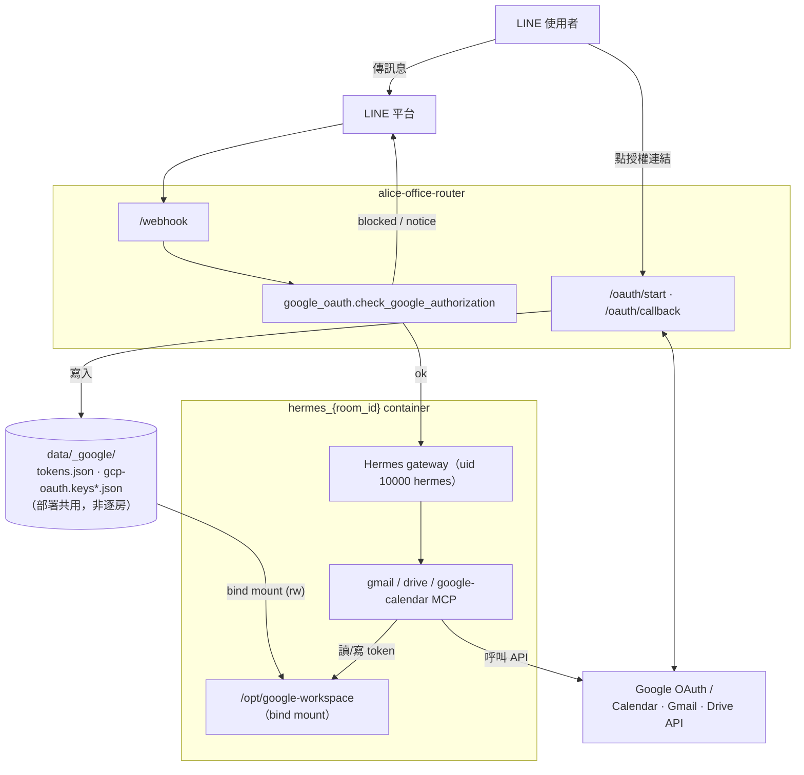
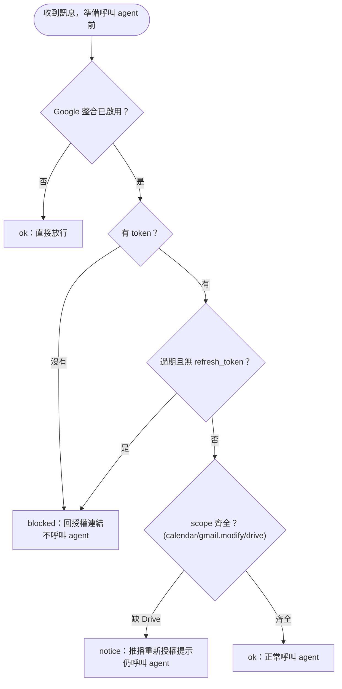

# google-workspace-pack 整合摘要（2026-07-11）

來源：`/Users/mary/Downloads/google-workspace-pack`（Calendar / Gmail / Drive MCP + Flask OAuth server + oauth_gate Hermes plugin，原為單機 host 安裝設計）。

## 架構決策（與 pack 原設計的差異）

| pack 原設計 | 本 repo 整合後 | 原因 |
|---|---|---|
| `oauth_gate` Hermes plugin（`pre_gateway_dispatch` hook） | Router 端 gate（`google_oauth.check_google_authorization`，在 `_process_and_reply` 進 agent 前攔截） | router→agent 走 `api_server` platform（`/v1/chat/completions`），實測完全不經過 `pre_gateway_dispatch` hook，plugin 形式永遠不會觸發 |
| 獨立 Flask oauth server（port 5000） | FastAPI routes `/oauth/start`、`/oauth/callback`（併入 router app） | router 本來就是公開 HTTPS 端點，不需多養一個服務 |
| `git clone nousresearch/google-calendar-mcp` + build | npm `@cocal/google-calendar-mcp@2.6.2` 烤進 image `/opt/node_modules`，template 只做薄註冊 | pack 指的 GitHub repo 不存在（404）；`@cocal` 是實際上游 |
| token key = LINE user id（大寫 U 開頭） | `account_key = room_id.lower()`（tokens.json / oauth / manifest 一致） | `@cocal` 驗證 GOOGLE_ACCOUNT_MODE 只接受 `^[a-z0-9_-]{1,64}$` |
| 路徑全靠 `~`（`~/.config/google-calendar-mcp` 等） | 每個房間自己的 `data/<room_id>/google/` 掛載到該房間容器的 `/opt/google-workspace`，所有路徑用 manifest env 明確指定 | 容器內 gateway 與 MCP 子進程以 uid 10000（`hermes`）執行，`/root`（700）不可達；且 gateway 設 `XDG_CONFIG_HOME=/opt/data/.config`，「預設路徑」會被悄悄改到 per-room 目錄 |

> **2026-07-11 更新**：Google 憑證/token 最初實作成部署層共用的 `data/_google/`（見下方
> 各節與架構圖，保留原始記錄）；後改為逐房隔離——每個房間的 `data/<room_id>/google/`
> 各自一份 `tokens.json` 跟 GCP 憑證副本，容器只掛自己的目錄。`data/_google/` 現在
> 只是部署層的一次性種子來源（`container_manager.ensure_google_seed` 在房間第一次
> 接觸 Google OAuth 時 write-once 複製過去），不再是任何房間的 container 直接掛載的
> 對象。改動原因：舊設計下任何房間的 agent 都能讀到其他房間的 refresh token，逐房隔離
> 後房間之間互不可見，砍掉一個房間資料夾也會連帶清空該房間的 Google 授權。詳見
> `alice_office_router.google_oauth`、`container_manager.py` 的 docstring，以及 README
> 「Google Workspace 整合」一節。

## 驗證依據：為何 `pre_gateway_dispatch` 不會觸發

**1. 官方文件**（`nousresearch/hermes-agent` main branch，`website/docs/user-guide/features/hooks.md`）：

> Fires once per incoming `MessageEvent` **in the gateway**, after the internal-event guard but before auth/pairing and agent dispatch. This is the interception point for **gateway-level message-flow policies**... that don't fit cleanly into any single platform adapter.

明確定位為「gateway 訊息分派流程」的攔截點，只有走 gateway dispatch 的訊息會經過。

**2. 上游 source code**（`gateway/run.py`，同一份 main branch）：

- 唯一觸發點在 `_handle_message()` 內（`gateway/run.py:8905` 附近）
- `_handle_message` 的唯一入口，是各訊息平台 adapter 接線時掛上的 handler：
  ```python
  adapter.set_message_handler(self._handle_message)   # telegram/discord/line 等走這條
  ```
- `gateway/platforms/api_server.py`（`/v1/chat/completions` 的實作）**整份檔案 grep `message_handler`／`invoke_hook`／`pre_gateway_dispatch` 皆為零命中**。其處理鏈是：
  ```
  _handle_chat_completions() → self._run_agent() → self._create_agent() → AIAgent 直接執行
  ```
  自建 `AIAgent` 跑完直接回 HTTP response，全程不進 `_handle_message`。

**3. 實跑 image 比對**：對 `alice-hermes-agent:v3`（本專案實際建置的 image）執行同樣的 grep，`pre_gateway_dispatch` 只出現在 `gateway/run.py:8095` 附近（`_handle_message` 內）與 plugin 框架定義處；`platforms/api_server.py` 同樣零引用。行號雖與上游 main 略有差異（版本快照不同），但呼叫鏈與上游一致，證實這不是上游即將修的臨時缺陷，而是 `api_server` platform 從設計上就不掛 gateway 的訊息分派 hook。

## 架構圖

> 下圖是原始（共用 `data/_google/`）設計，保留作歷史記錄——見上方 2026-07-11 更新，
> 現況是逐房隔離的 `data/<room_id>/google/`，README「Google Workspace 整合」有最新圖。



## 訊息授權判斷流程



## 檔案落點

- `src/alice_office_router/google_oauth.py` — OAuth routes + gate（沿用 pack 語意：無 token → 擋下＋授權連結；缺 Drive scope → 通知但放行；完整 → 放行）
- `src/hermes/mcp/gmail/`、`src/hermes/mcp/drive/` — pack 的 server.py 原樣 + token_manager.py 改為 env 指定路徑；manifest `requires_google_oauth: true`（未設定 Google 時不 seed）
- `src/hermes/mcp/google-calendar/` — 薄註冊 manifest（`command: google-calendar-mcp`）
- `src/hermes/runtime/pyproject.toml` — 加 `mcp`/`httpx`/`requests`（`/opt/tools/.venv`）
- `scripts/google_reauth.py` — 本機瀏覽器一次性授權腳本
- Settings：`GOOGLE_OAUTH_PUBLIC_URL`、`GOOGLE_OAUTH_GATE`；憑證種子放 `data/_google/`（gitignored，部署層放一次），逐房副本在 `data/<room_id>/google/`（見上方 2026-07-11 更新）

## 驗證結果（全部通過）

- `ruff` / `mypy --strict` / `pytest`（112 tests，含新增 23 個）
- image `alice-hermes-agent:v3` build + smoke test
- Docker E2E：無 token → gate 擋下、容器不建立；`/oauth/start` 302 帶正確參數、錯誤路徑 400；寫入 token 後 → 容器建立、`/opt/google-workspace` 掛載正確、四個 MCP（gmail/drive/google-calendar/secretary）全部 `✓ enabled`、以 uid 10000 實測 calendar 讀到 token、gmail stdio tools/list 回 8 個工具、agent 回覆 200

## Agent 如何透過 MCP 操作 Calendar / Gmail / Drive

前面談的是「怎麼拿到 token」；這節談 token 拿到之後，agent 實際上怎麼呼叫這些工具。

### 1. 從 manifest 到可被 agent 呼叫的工具，中間隔了幾層

```
mcp.manifest.yaml（repo template）
  └─ _ensure_mcp_seed：房間第一次建立時，複製一份到 data/<room_id>/mcp/<name>/（write-once）
       └─ _load_mcp_manifest：讀該份 seed，把 {room_id}／{account_key} 替換掉
            └─ _format_mcp_section：寫進 data/<room_id>/config.yaml 的 mcp_servers.<name> 區塊
                 └─ Hermes gateway 開機讀 config.yaml，把每個 mcp_servers entry 當一個
                    子行程（stdio transport）spawn 起來，並註冊進 toolsets（mcp-gmail、
                    mcp-drive、mcp-google-calendar）
                      └─ agent 的 LLM 在對話中決定呼叫某個 tool → gateway 透過 stdio
                         MCP protocol（JSON-RPC over stdin/stdout）呼叫該子行程
```

`config.yaml` 裡實際長出來的 `mcp_servers.gmail` 大致是（`_format_mcp_section`，
`container_manager.py:331-375`）：

```yaml
mcp_servers:
  gmail:
    command: /opt/tools/.venv/bin/python3
    args:
      - /opt/data/mcp/gmail/server.py
    env:
      GOOGLE_ACCOUNT_MODE: "<lowercase room id>"
      GOOGLE_TOKENS_PATH: /opt/google-workspace/tokens.json
      GOOGLE_WEB_CREDS_PATH: /opt/google-workspace/gcp-oauth.keys.json
      GOOGLE_INSTALLED_CREDS_PATH: /opt/google-workspace/gcp-oauth.keys.installed.json
toolsets: [mcp-gmail, mcp-drive, mcp-google-calendar, ...]
```

這份檔案只在房間第一次建立時寫一次，之後房間可以自己改（例如關掉某個 MCP），
repo 樣板更新不會回頭覆蓋既有房間。

### 2. 三個 MCP 的實作方式不一樣

| MCP | 型態 | 執行方式 | 工具數 |
|---|---|---|---|
| `gmail/` | pack 附的 Python 原始碼，`mcp` SDK 手寫 stdio server | `/opt/tools/.venv/bin/python3 server.py` | 8 |
| `drive/` | 同上 | 同上 | 9 |
| `google-calendar/` | 上游 npm 套件 `@cocal/google-calendar-mcp@2.6.2`，thin registration（這個 repo 裡沒有原始碼，只有 manifest） | image 內建執行檔 `google-calendar-mcp`（`/opt/node_modules/.bin`，已在 PATH） | 由套件自己定義，未在本 repo 列舉 |

`gmail/server.py`、`drive/server.py` 都是同一套骨架（`mcp.server.Server` + `stdio_server`）：

```python
app = Server("gmail-mcp")

@app.list_tools()
async def list_tools() -> list[Tool]: ...

@app.call_tool()
async def call_tool(name: str, arguments: dict) -> list[TextContent]:
    try:
        result = await _dispatch(name, arguments)
        return [TextContent(type="text", text=json.dumps(result, ...))]
    except Exception as e:
        return [TextContent(type="text", text=f"Error: {e}")]
```

`list_tools()` 回傳的 schema 就是 agent 看到的工具介面；`call_tool()` 收到 agent 的呼叫後
分派到 `_dispatch()`，執行完把結果序列化成 JSON 字串包進 `TextContent` 回給 agent——
注意例外是被 **捕捉後包成文字訊息回傳**，不是往上丟，所以工具呼叫失敗不會讓 MCP 子行程掛掉，
agent 會看到一段 `Error: ...` 的文字，可以自己決定要不要重試或告知使用者。

### 3. Gmail 提供的 8 個工具（`gmail/server.py:65-156`）

| 工具 | 功能 | 底層 Gmail API |
|---|---|---|
| `gmail_list_messages` | 列出最近郵件（可指定 label，預設 INBOX） | `GET /users/me/messages` + 逐封 `GET .../messages/{id}` 補 metadata |
| `gmail_search_messages` | 用 Gmail 搜尋語法查詢（如 `from:bob subject:meeting`） | 同上，帶 `q` 參數 |
| `gmail_read_message` | 讀單封信全文（含 body） | `GET .../messages/{id}?format=full`，遞迴解析 multipart 取 `text/plain` |
| `gmail_send_message` | 寄新信 | 組 MIME → base64url → `POST .../messages/send` |
| `gmail_reply_message` | 回覆現有討論串 | 先 `GET` 原信取 `Message-ID`/`References`，補上 `In-Reply-To` 後送出，帶 `threadId` |
| `gmail_trash_message` | 移到垃圾桶 | `POST .../messages/{id}/trash` |
| `gmail_mark_read` | 標記已讀/未讀 | `POST .../messages/{id}/modify`（增減 `UNREAD` label） |
| `gmail_get_profile` | 取得帳號 email、信件總數等 | `GET /users/me/profile` |

### 4. Drive 提供的 9 個工具（`drive/server.py`）

| 工具 | 功能 |
|---|---|
| `drive_list_files` | 列出檔案 |
| `drive_search_files` | 搜尋檔案 |
| `drive_get_file_content` | 取檔案內容（含 Google Docs/Sheets 匯出） |
| `drive_get_file_info` | 取檔案 metadata |
| `drive_create_document` | 建立 Google Docs 文件 |
| `drive_create_folder` | 建立資料夾 |
| `drive_share_file` | 分享權限設定 |
| `drive_move_file` | 移動檔案 |
| `drive_delete_file` | 刪除檔案 |
| `drive_get_storage_quota` | 查詢空間用量 |

分別打 Drive v3（`/drive/v3`）、Docs v1（`/docs/v1`）、Sheets v4（`/sheets/v4`）、
Drive upload（`/upload/drive/v3`）四個 Google API base URL。

### 5. 每次呼叫背後怎麼拿 access token（gmail/drive 共用同一份 `token_manager.py` 原始碼，但各房間各自一份 tokens.json）

```python
def gmail_request(method, path, **kwargs) -> dict:
    token = get_access_token()          # 每次呼叫都會檢查，非快取整個 process 生命週期
    headers = {"Authorization": f"Bearer {token}", ...}
    ...
```

`get_access_token()`（`token_manager.py:71-117`）：

1. 用 `GOOGLE_ACCOUNT_MODE`（= account_key）從這個房間自己的 `tokens.json` 撈出 token
   （字典裡實務上只會有一筆，因為這份檔案不再跨房間共用）。
2. 若 5 分鐘內會過期，就用 `refresh_token` 換新的 `access_token`，先試 Web 憑證
   （`gcp-oauth.keys.json`），失敗再試 Installed 憑證（`gcp-oauth.keys.installed.json`）
   ——這兩份都是該房間自己 `data/<room_id>/google/` 底下的副本。
3. 換到新 token 後**直接改寫 `/opt/google-workspace/tokens.json`**（`save_all_tokens`）——
   跟 router 的 `google_oauth.py` 讀寫的是同一份房間專屬檔案、同一個 key，所以 MCP 換的
   新 token 下次 router 判斷 gate 狀態時也看得到，不需要額外同步。
4. 若沒有 `refresh_token`，直接丟例外——會被 `call_tool` 捕捉，agent 看到的是一段
   `Error: No refresh token for account '...'`，使用者需要重新走一次 `/oauth/start`。

`google-calendar` MCP（npm 套件）走自己的 refresh 邏輯，但透過
`GOOGLE_CALENDAR_MCP_TOKEN_PATH` 指到同一份 `tokens.json`、用同一個 `account_key`，
所以同一個房間內的三個 MCP 及 router 讀寫的是同一份檔案，靠檔案系統本身序列化，
沒有額外的鎖或協調機制；不同房間之間則完全是各自獨立的檔案，互不影響。

### 6. 每個房間各自一份 MCP 子行程，資料也逐房隔離

每個 `hermes_<room_id>` container 都會各自 spawn 一份 `gmail`/`drive`/`google-calendar`
子行程（stdio，房間之間不共用行程），也都各自掛載**自己的** `data/<room_id>/google/`
到 `/opt/google-workspace`——行程隔離、資料也隔離，不同房間的 container 讀不到彼此的
`tokens.json`。`GOOGLE_ACCOUNT_MODE` 這個 env 仍然保留（給 `@cocal/google-calendar-mcp`
的 lowercase 驗證用，也是 `tokens.json` 字典內部的 key），但已經不是「從共用檔案裡挑出
自己那筆」的用途了。

## 尚未驗證／上線前待辦

1. **真實 Google 授權流程**（需要瀏覽器＋真實 LINE 使用者）：`.env` 的 `GOOGLE_OAUTH_PUBLIC_URL` 目前是 E2E 用的 `http://localhost:8000`，要換成公開網域，並把 `{url}/oauth/callback` 加進 GCP Web client 的 Authorized redirect URIs
2. `.env` 已改 `HERMES_IMAGE=alice-hermes-agent:v3`
3. Linux 部署時每個房間的 `data/<room_id>/google/` 都需可被 uid 10000 讀寫，新房間建立時
   要記得補（macOS Docker Desktop 不用管）
4. 已存在的房間不會回溯取得 Google MCP（write-once seeding）；gate 一開啟，所有訊息都會被授權檢查擋下直到完成授權（pack 原語意）
5. 風險觀察點：calendar MCP 用 installed client 去 refresh web client 發的 token（pack 原設計即如此），若 refresh 失敗，gmail/drive 的 token_manager 會維持 tokens.json 新鮮度
