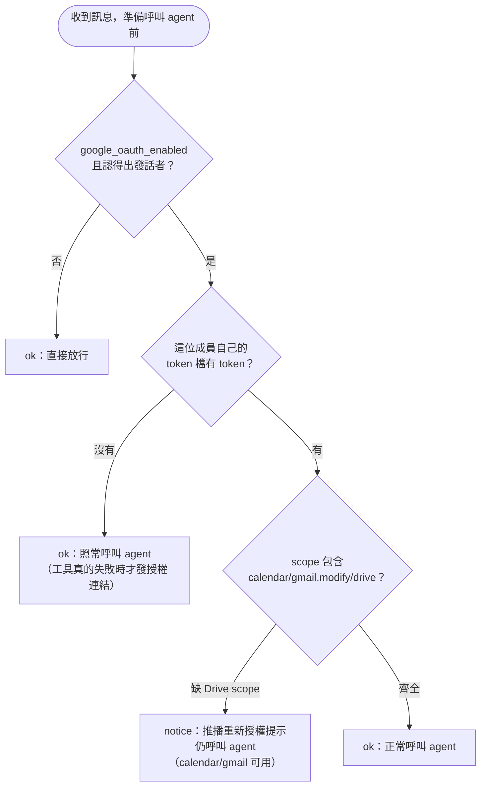

# Google Workspace 整合設定

這份文件是 README「[Google Workspace 整合](../README.md#google-workspace-整合)」
搬出來的操作步驟：GCP Console 設定、憑證檔案放置、環境變數、訊息授權判斷流程、
容易忽略的坑。**完整架構決策**（為何 oauth gate 是 router 邏輯而非 Hermes plugin、
為何原本獨立的 Flask OAuth server 併進了 router、憑證掛載路徑與 seed 時序的取捨、
agent 實際如何透過 MCP 操作 Calendar／Gmail／Drive）見
`docs/google-workspace-integration-summary.md`。

## GCP Console 設定摘要

1. 建立/選擇 GCP 專案 → 啟用三個 API：**Google Calendar API**、**Gmail API**、
   **Google Drive API**。
2. 設定 OAuth 同意畫面（Consent screen）。
3. 建立**兩個** OAuth 用戶端 ID（兩者用途不同，缺一不可）：
   - **Web application**：Authorized redirect URIs 加入
     `{PUBLIC_BASE_URL}/oauth/callback`（LINE 使用者瀏覽器走的授權流程用，
     router 的 `/oauth/start` `/oauth/callback` 兩個路由靠它）。
   - **Desktop app（Installed）**：`@cocal/google-calendar-mcp` 跟
     `scripts/google_reauth.py` 用它識別身份，走 localhost redirect，不需要在
     GCP Console 額外設定 redirect URI。

## 檔案放置

兩份 credentials JSON 只需下載**一次**，放到部署層的種子來源（**不進版控**，`data/`
本身已在 `.gitignore`）：

```
data/_google/gcp-oauth.keys.json            ← Web application client（種子來源，只放一次）
data/_google/gcp-oauth.keys.installed.json  ← Desktop (Installed) client（種子來源，只放一次）
```

之後每個房間會在自己第一次接觸 Google OAuth 時（seed 時序細節見
`docs/google-workspace-integration-summary.md`），由
`room_seed.ensure_google_seed` 自動從這裡複製一份到
`data/<room_id>/google/`——**不需要、也不應該**手動幫每個房間各放一次：

```
data/<room_id>/google/gcp-oauth.keys.json            ← 這個房間自己的副本（write-once）
data/<room_id>/google/gcp-oauth.keys.installed.json  ← 這個房間自己的副本（write-once）
data/<room_id>/google/tokens.json                    ← 執行期自動產生，一條相對 symlink
data/<room_id>/google/members/<member_key>.json      ← 每位授權過的成員各一份，執行期自動產生
```

`tokens.json` 不是一般檔案，是 router 每輪開始前才換指向的相對 symlink（指到
`members/<member_key>.json`，`member_key` 是這一輪發話者的帳號 key），因為群組裡
每個人要用自己的 Google 帳號。同樣不用手動放，細節與換檔機制見
`docs/env-data-paths.md`「`data/<room_id>/google/`」一節。

> **Linux host 部署注意**：container 內的 MCP process 以 `hermes`（uid 10000）
> 執行，且 token refresh 會**寫回** `tokens.json`，所以每個房間的
> `data/<room_id>/google/` 都必須讓 uid 10000 可讀＋可寫（例如
> `chown -R 10000 data/<room_id>/google` 或 `chmod 777 data/<room_id>/google`，
> 新房間建立時記得補跑）。macOS 的 Docker Desktop 透過檔案共享層自動處理權限對映，
> 不需要手動調。

## 環境變數

| 變數 | 說明 |
|------|------|
| `PUBLIC_BASE_URL` | 這個 router 的公開 HTTPS base URL（不含結尾斜線），全站共用（檔案下載連結也用它）。2026-09-17 由 `GOOGLE_OAUTH_PUBLIC_URL` 改名而來。Google 整合的開關是「它已設 **且** Web application 憑證檔存在」；任一缺＝整個 Google 整合停用：oauth 路由回 400、新房間不 seed 這三個 MCP、訊息也不會被攔。 |

`Settings.google_oauth_enabled`（`config.py`）同時檢查
`PUBLIC_BASE_URL` 非空**且** `data/_google/gcp-oauth.keys.json` 存在，兩者缺一都視為停用。

## 訊息授權判斷流程

**2026-09-18 起不再擋訊息**：`blocked` 狀態與 `GOOGLE_OAUTH_GATE` 開關都已刪除，
沒授權的訊息照常進 agent，授權連結改由「Google 工具真的回報沒 token」時才發
（延遲授權＋逐人授權，完整設計見
[`google-auth-per-member-plan.md`](google-auth-per-member-plan.md)）。

`check_google_authorization` 每則要進 agent 的訊息都會跑一次，只剩 `ok`／`notice`
兩種結果——它管的只是「要不要主動提醒缺 Drive scope」，不負責發授權連結：



真正發連結的是另一條路：agent 呼叫 Google 工具、工具回報沒有可用 token時，agent
依 system prompt／MCP 錯誤文字的指示在回覆裡貼一行固定字串
`google-auth://request`；router 在送出回覆前（`auth_links.publish_auth_links`）把
它換成**這一輪發話者自己**的連結：

```
{PUBLIC_BASE_URL}/oauth/start?user_id=<room_id>&member=<member_key>
```

`user_id` 固定是房間 id（原始大小寫），`member` 是這一輪發話者的帳號 key
（1:1＝房間自己的 `account_key`；群組＝`sender_id` 的 `account_key`）——`/oauth/start`
會把兩者一起存進 `_pending`，`/oauth/callback` 換到 token 後就知道要寫進哪個
房間的哪個成員檔（`members/<member_key>.json`），並觸發 router 自動把觸發連結的
那則訊息重跑一次、推播答案。完整時序見 `docs/sequence-diagrams.md` §5、
`docs/google-auth-per-member-plan.md` §3.3／§3.4。

## lowercase 帳號 key（容易忽略、務必注意）

`@cocal/google-calendar-mcp` 驗證 `GOOGLE_ACCOUNT_MODE` 必須符合
`/^[a-z0-9_-]{1,64}$/`（只准小寫），但 LINE room id 開頭是大寫 `U`/`C`/`R`。
因此整個 Google 整合統一用 **`room_id.lower()`** 當帳號 key（見
`alice_office_router.google_tokens.account_key`）：每個成員檔**內層**的 key、
`/oauth/callback` 存 token、`check_google_authorization`、三個 MCP manifest 的
`{account_key}` 佔位符，全部都是同一個 lowercase key，不能有任何一處漏掉轉換，
否則會出現「明明授權過但還是說沒授權」這種對不起來的情況。這跟「哪個成員檔」
（`member_key`，見上方「訊息授權判斷流程」）是兩個不同維度的 key，不要混——
`member_key` 決定挑哪一個檔案，`account_key(room_id)` 決定那個檔案**裡面**用哪個
key 存取 token。

**跟上面不同的另一件事：`room_id` 本身（原始大小寫）決定資料夾位置，絕對不能被
lowercase 污染。** `data/<room_id>/google/` 這個路徑用的是原始 `room_id`（跟
`data/<room_id>/mcp`、`plugins` 同一個變數），只有寫進 `tokens.json`**裡面**的
key 才轉小寫。`google_oauth._pending`（`/oauth/start` 到 `/oauth/callback` 之間
暫存 state 的字典）刻意存原始 `room_id`、不是 `account_key`，就是為了讓
`oauth_callback` 能正確找回這個房間的資料夾——如果哪裡不小心把 lowercase 過的
key 當成 `room_id` 傳給 `Settings.room_google_dir()`，在 Linux（case-sensitive
檔案系統）上會靜靜地建出另一個空資料夾，跟這個房間真正的 container 掛載的資料夾
對不上。

## 影響既有房間

- **改 Google 相關設定要重建房間 container**：`_build_volume_config` 只在
  container **建立**當下決定要不要掛這個房間的 `google/` 資料夾——先前用停用狀態
  建立的房間，之後補上 `PUBLIC_BASE_URL` 跟 credentials 也不會自動補掛，
  需要 `docker rm -f hermes_<room_id>` 重建。
- **write-once 對 Google MCP 一樣適用**：`gmail`／`drive`／`google-calendar` 三個
  manifest 都有 `requires_google_oauth: true`，`ensure_mcp_seed` 只在
  `Settings.google_oauth_enabled` 為真時才會 seed 它們——在停用狀態下建立的房間，
  即使之後啟用了 Google 整合，也不會回頭幫它補 seed，一樣要重建房間。
- **`rm -rf data/<room_id>` 會把這個房間所有成員的 Google 授權一併清空**：因為
  `members/` 跟該房間自己的憑證副本都在這個資料夾底下，這是刻意的設計（逐房隔離的
  完整理由見 `docs/google-workspace-integration-summary.md`），不是遺漏。詳見
  README「疑難排解」的「完整重置一個房間」小節。
- **改版前（2026-09-18 之前）建立的房間，`gmail`／`drive` 的 `token_manager.py`
  是舊版**：write-once seed 不會自動更新，舊版的錯誤文字不含
  `google-auth://request` marker，agent 判斷起來沒有新版直接（但 system prompt
  那條規則已經立即生效，多數情況還是能正常發出連結）。要讓既有房間拿到跟新房間
  一致的行為，見 `docs/troubleshooting.md`「Google 授權相關」節的複製＋重建指令；
  `src/hermes/skill/alice/runtime-env/SKILL.md` 同樣要 rebuild image 才會到既有房間。

## 本機開發：一次性授權

有瀏覽器的開發機可以跳過走 LINE 授權，直接用腳本產生 token：

```bash
uv run python scripts/google_reauth.py U_LOCAL_TEST
# 群組房間、或想指定哪個成員：
uv run python scripts/google_reauth.py C_LOCAL_GROUP --member u_local_member_a
```

會存進 `data/U_LOCAL_TEST/google/members/<member_key>.json`（`room_id` 保留原始
大小寫當資料夾名，成員檔內層 dict 的 key 才轉小寫；`--member` 不給時預設等於房間
自己的 `account_key`，等同 1:1 房間原本的行為），並把 `--credentials` 指到的
Desktop 憑證複製一份到同一個資料夾，讓這個房間的 container 掛載後找得到。這支
腳本只負責寫成員檔，不會動 `tokens.json` 的 symlink 指向——要讓這個成員的 token
真的生效，得等他在 LINE 裡發話（`select_member_tokens` 才會把 symlink 換過去），
或本機測試時比照 `docs/testing-paths.md` 用 `scripts/test_webhook.py --sender-id`
送一則模擬訊息觸發換檔。詳細用法／路徑覆寫見 `scripts/google_reauth.py --help`。
