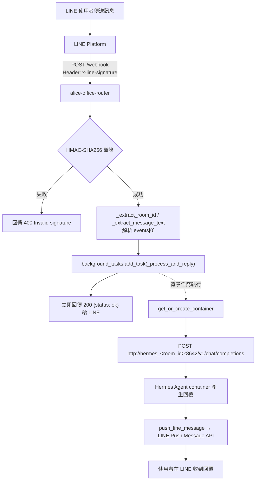
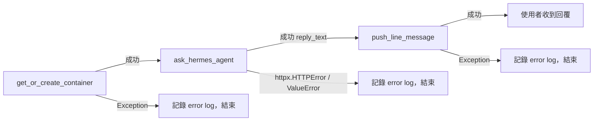
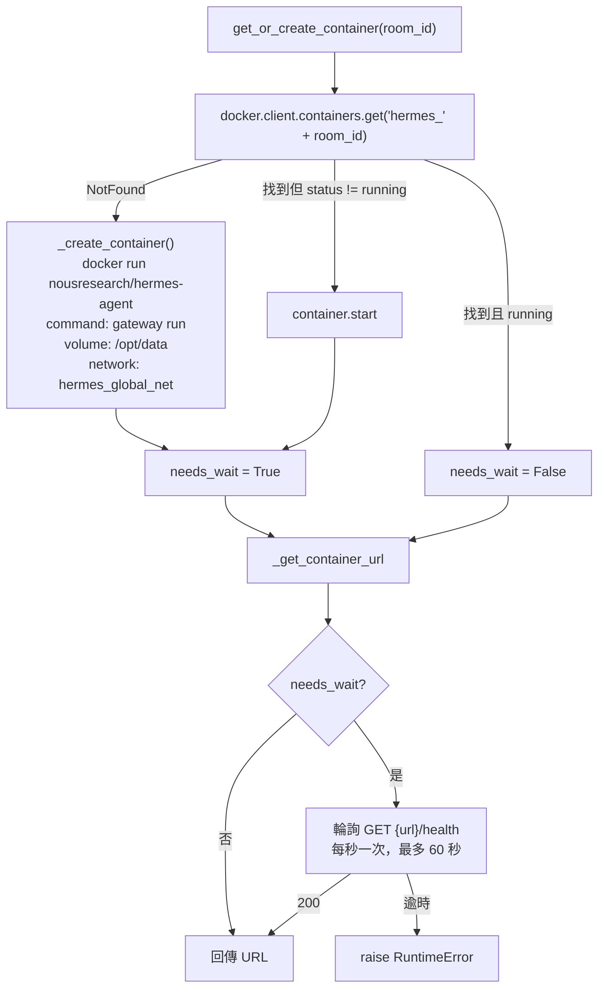

# LINE Router 與 Hermes Agent Container 的訊息流程

說明一則 LINE 訊息從使用者發出，到 `alice-office-router` 接收、轉交給該聊天室專屬的
Hermes Agent container、agent 產生回覆，最後推播回 LINE 使用者的完整路徑。內容依據目前
實作（`src/alice_office_router/`）整理，非設計文件。

相關文件：`docs/hermes-agent-real-integration.md`（架構決策由來）、
`docs/hermes-agent-line-gateway-comparison.md`（為何不用 Hermes 內建 LINE gateway）。

## 角色總覽

| 角色 | 對應程式碼 | 職責 |
|---|---|---|
| LINE Platform | — | 使用者訊息的來源；接收 webhook 回傳、接收 Push API 呼叫 |
| Router（`alice-office-router`） | `router.py`、`main.py` | 驗簽、解析事件、管理 container 生命週期、串接 Hermes、push 回覆。**唯一**持有 LINE 憑證的元件 |
| Hermes Agent container | `container_manager.py` 建立、`nousresearch/hermes-agent` image | 每個聊天室一個，透過內建 `api_server` platform（OpenAI-compatible）純粹「收文字、吐文字」，完全不碰 LINE |
| Docker Engine | `container_manager.py` | 依 `room_id` 動態建立/啟動/重用 container |

Router 與 Hermes container 之間**只有一種**溝通協定：HTTP，`POST /v1/chat/completions`。
Hermes container 沒有、也不需要對外開放的 port（`ROUTER_IN_DOCKER=True` 時只掛在 Docker
內部網路 `hermes_global_net` 上，由 router 用 container name 直接連線）。

## 整體流程



## 詳細步驟

### 1. LINE Platform → Router：接收與驗簽

- Endpoint：`POST /webhook`（`router.py:114`）。
- Router 先讀取 raw body 與 `x-line-signature` header，呼叫
  `verify_line_signature()`（`line_verify.py`）：用 `LINE_CHANNEL_SECRET` 對 raw body 算
  HMAC-SHA256，base64 編碼後與 header 值做**常數時間比對**（`hmac.compare_digest`）。
- 驗簽失敗 → 直接 `raise HTTPException(400)`，不處理、不記錄成功事件，符合
  CLAUDE.md「驗簽失敗必須回傳 400，不可靜默忽略」的要求。
- 驗簽通過才 `await request.json()` 解析 body。

### 2. 解析事件，抽出 room_id 與文字

- `_extract_room_id()`：只看 `events[0].source`，依 `source.type`（`user` / `group` /
  `room`）動態取出對應的 `{type}Id` 欄位（例如 `userId`、`groupId`、`roomId`）作為
  `room_id`——這個值後續同時是 container 名稱的一部分、資料目錄名稱、Hermes session id、
  LINE push 的目標 `to`。
- `_extract_message_text()`：只處理 `type == "message"` 且 `message.type == "text"`
  的事件；其他事件類型（貼圖、圖片、follow、postback…）目前**不會**觸發任何 Hermes
  互動，文字為 `None` 時直接略過、不建立背景任務。
- 目前只處理 `events` 陣列中的**第一個**事件；一次 webhook 帶多個事件時，其餘事件不會被處理。

### 3. 立即回 200，實際處理丟到背景任務

```python
background_tasks.add_task(_process_and_reply, room_id, text, settings)
return {"status": "ok"}
```

這是整個架構的關鍵設計：router 一驗完簽、解析完 room_id/text，**不等待** Hermes 或
Docker，馬上回 200 給 LINE。真正跟 container 對話、拿回覆、push 回去，全部發生在
FastAPI 的 `BackgroundTasks` 裡，在 response 送出「之後」才執行。

原因：`get_or_create_container` 在冷啟動時要 `docker run` 一個全新 container 並輪詢
`/health` 最多 60 秒，遠超過 LINE 平台對 webhook response 的等待時間；若同步等待，LINE
會判定逾時並重送 webhook，導致重複建立 container / 重複觸發 agent。

### 4. `_process_and_reply`：三個獨立步驟

`router.py:82`，每一步各自 `try/except`、失敗只記 log 不 raise（因為此時已經沒有
HTTP response 可以回傳錯誤給任何人了）：



任一步失敗，使用者這則訊息就**收不到回覆、也不會重試**——因為 LINE 端早已收到 200，
不會觸發平台層級的自動重送。

### 5. `get_or_create_container`：取得該房間的 Hermes container

`container_manager.py:220`，用模組層級的 `threading.Lock` 避免同房間併發請求造成重複建立：



- Container 命名規則：`hermes_{room_id}`，一個聊天室對應一個 container，彼此用
  Docker 做硬隔離；資料掛載在各自的 `/opt/data`（host 端 `HOST_DATA_DIR/{room_id}`）。
- 新建 container 時不傳任何 `LINE_*` 憑證，只傳 `API_SERVER_KEY`、
  `API_SERVER_HOST=0.0.0.0`、`LLM_API_KEY`（`_build_container_env`）——Hermes
  container 完全不知道自己在跟哪個 LINE 帳號互動，也無法自行呼叫 LINE API。
- 首次建立或從 stopped 重啟時才需要輪詢 `/health`；已在 running 狀態的既有 container
  直接回傳 URL，不需等待。
- URL 依 `ROUTER_IN_DOCKER` 決定：router 在 Docker 內時用 container name 走內部 DNS
  （`http://hermes_<room_id>:8642`）；router 跑在 host（本機開發）時改讀動態發布的
  host port（`http://localhost:<port>`）。

### 6. `ask_hermes_agent`：Router → Hermes container

`hermes_client.py:12`，呼叫 Hermes 內建的 OpenAI-compatible `api_server` platform：

```
POST {base_url}/v1/chat/completions
Headers:
  Authorization: Bearer {HERMES_API_SERVER_KEY}
  X-Hermes-Session-Id: {room_id}
Body:
  {"messages": [{"role": "user", "content": "<使用者訊息文字>"}]}
```

- `X-Hermes-Session-Id: room_id` 是同一聊天室對話記憶延續的關鍵：同房間下一次訊息帶
  同一個 session id，Hermes 內部才能接續前後文；不同房間的 session 也因為根本是不同
  container，天生互相隔離。
- 逾時設定 120 秒（`_REQUEST_TIMEOUT_SECONDS`）。
- 回應解析：取 `choices[0].message.content` 當作回覆文字；若 `choices` 為空或
  `content` 不是非空字串，`raise ValueError`（視為 Hermes 沒有給出可用回覆）。

### 7. Hermes Agent container 內部

Container 收到請求後由 `api_server` platform 轉交給同進程內的 agent（skills、
記憶、LLM 呼叫都在 container 內部完成，router 對這段黑盒不可見），产生純文字回覆，
以標準 OpenAI chat completion 格式回傳。

### 8. `push_line_message`：Router → LINE Platform

`line_client.py:16`，用 `line-bot-sdk` 的 `AsyncMessagingApi.push_message()` 呼叫
LINE Push Message API：

```python
PushMessageRequest(to=room_id, messages=[TextMessage(text=reply_text)])
```

- `to` 直接沿用步驟 2 抽出的 `room_id`（LINE 的 userId/groupId/roomId），所以推播對象
  一定跟原訊息來源一致。
- 用的是 **Push API**（非 webhook 同步回覆的 Reply API），因為回覆是在背景任務裡、
  webhook 早就已經回應過了，reply token 這時已經失效，只能用 push。
- 失敗（例如 `ApiException`）同樣只記 log，不會重試。

## 完整時序圖

```mermaid
sequenceDiagram
    participant U as LINE 使用者
    participant LP as LINE Platform
    participant R as alice-office-router
    participant D as Docker Engine
    participant H as Hermes Agent container<br/>(hermes_&lt;room_id&gt;)

    U->>LP: 傳送訊息
    LP->>R: POST /webhook (x-line-signature)
    R->>R: verify_line_signature()
    alt 簽章無效
        R-->>LP: 400 Invalid signature
    else 簽章有效
        R->>R: 解析 events，取出 room_id / text
        R->>R: background_tasks.add_task(_process_and_reply)
        R-->>LP: 200 {"status":"ok"}（立即回傳，不等待下面流程）
        Note over R,H: 以下發生在背景任務中
        R->>D: get_or_create_container(room_id)
        alt container 不存在或已停止
            D->>H: docker run / start（gateway run）
            loop 輪詢，最多 60 秒
                R->>H: GET /health
            end
            H-->>R: 200（ready）
        end
        D-->>R: container URL
        R->>H: POST /v1/chat/completions<br/>Bearer HERMES_API_SERVER_KEY<br/>X-Hermes-Session-Id: room_id
        H-->>R: {"choices":[{"message":{"content": reply}}]}
        R->>LP: Push Message API（to=room_id, text=reply）
        LP->>U: 推播回覆訊息
    end
```

## 錯誤處理總表

| 階段 | 失敗條件 | 行為 |
|---|---|---|
| 驗簽 | HMAC 比對不符 / 缺 header | `HTTPException(400)`，webhook 直接失敗，不進背景任務 |
| 解析 room_id | `events` 為空、`source` 缺欄位 | `HTTPException(400)` |
| 解析文字 | 非 `message`/`text` 事件 | 靜默略過（回 200，但不建立背景任務） |
| `get_or_create_container` | Docker API 錯誤、`/health` 60 秒逾時 | log error，流程中止，使用者收不到回覆 |
| `ask_hermes_agent` | HTTP 錯誤、回應無 `choices`/`content` | log error，流程中止 |
| `push_line_message` | LINE API 拒絕（例如無效 `to`） | log error，agent 已產生的回覆遺失 |

因為 webhook 已提早回 200，上述背景任務中的任何失敗**都不會**讓 LINE 平台重試，也不會
讓使用者看到任何錯誤訊息——只能從 router 的 log 觀察到。

## 關鍵設計要點小結

- **職責切分**：LINE 憑證與所有進出（驗簽、收 webhook、push）只在 router；Hermes
  container 是純被動的「大腦」，透過 `api_server` 收文字吐文字，彼此用 HTTP 溝通。
- **隔離單位是 room_id**：一個聊天室 = 一個 container = 一份獨立資料目錄，靠 Docker
  做硬隔離，而非 Hermes 內部的邏輯 session 區分。
- **先回應、後處理**：webhook handler 對 LINE 的回應與實際的 agent 互動解耦，靠
  `BackgroundTasks` 避免 container 冷啟動拖垮 webhook 的回應時間。
- **對話記憶靠 header 傳遞**：沒有額外的 session 儲存層，`room_id` 本身透過
  `X-Hermes-Session-Id` 直接沿用作 Hermes 的 session id。
