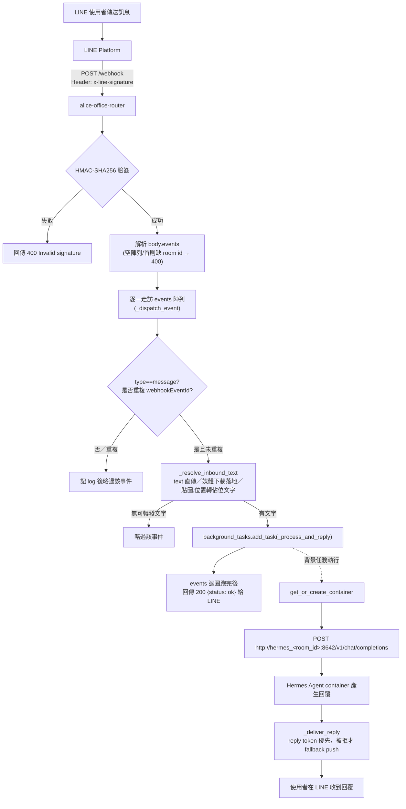
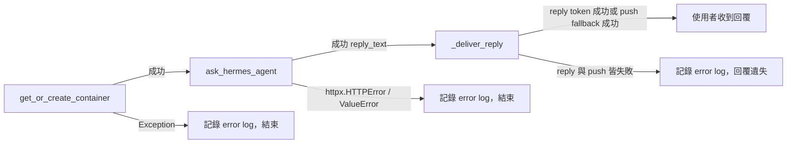
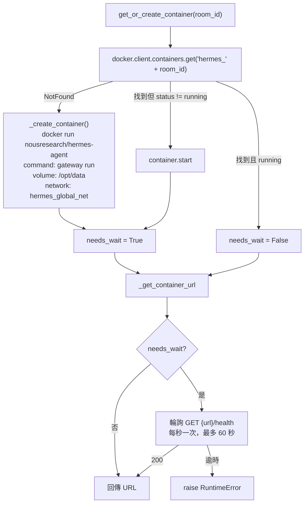
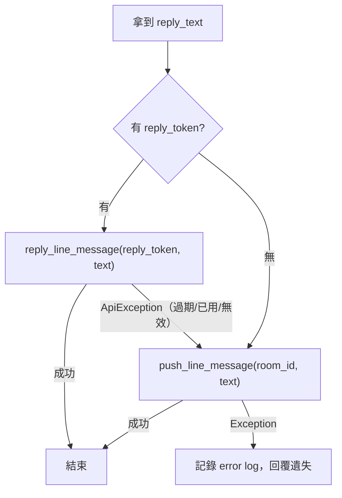
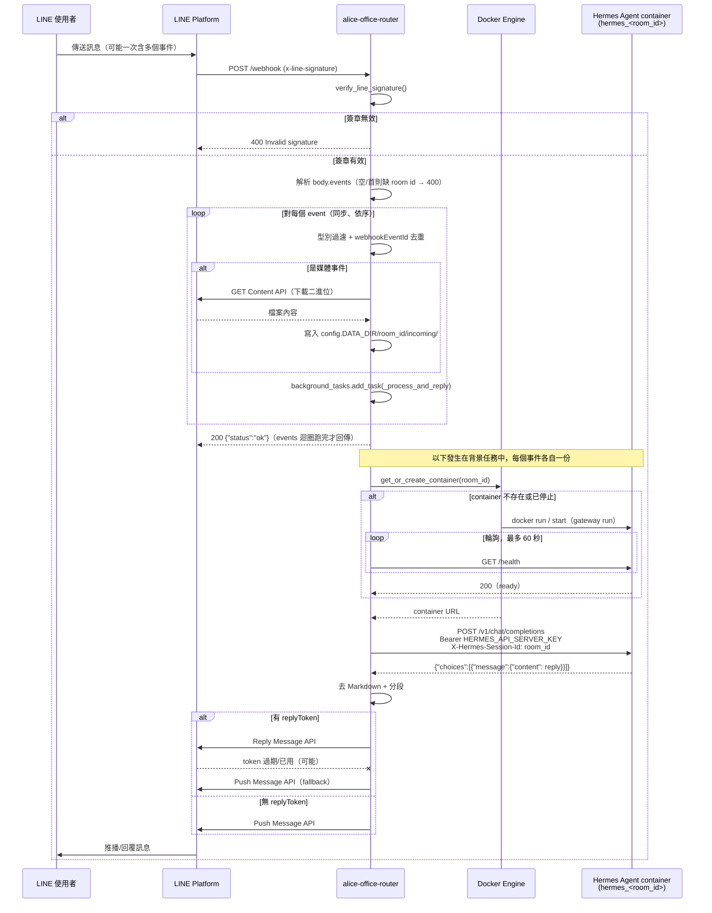

# LINE Router 與 Hermes Agent Container 的訊息流程

說明一則（或一批）LINE 訊息從使用者發出，到 `alice-office-router` 接收、逐一解析與去重、轉交給
對應聊天室的 Hermes Agent container、agent 產生回覆，最後送回 LINE 使用者的完整路徑。內容依據目前
實作（`src/alice_office_router/`）整理，非設計文件。

相關文件：`docs/hermes-agent-real-integration.md`（架構決策由來）、
`docs/hermes-agent-line-gateway-comparison.md`（為何不用 Hermes 內建 LINE gateway、對照表）。

> **2026-07-12 後的位置變動**：本文寫作時的 `router.py` 已拆成 `channels/line.py`
> （LINE adapter）與 `channels/pipeline.py`（管道無關的處理管線）。流程本身不變；
> 函式的新舊位置對照見 `docs/channel-interface.md`「程式碼位置對照」一節。

## 角色總覽

| 角色 | 對應程式碼 | 職責 |
|---|---|---|
| LINE Platform | — | 使用者訊息的來源；接收 webhook 回傳、接收 Reply/Push Message API 呼叫 |
| Router（`alice-office-router`） | `router.py`、`line_client.py`、`line_format.py`、`line_dedup.py`、`main.py` | 驗簽、去重、逐一解析每個事件（含下載媒體）、管理 container 生命週期、串接 Hermes、組裝回覆並送回 LINE（Reply token 優先、Push 為 fallback）。**唯一**持有 LINE 憑證的元件 |
| Hermes Agent container | `container_manager.py` 建立、`nousresearch/hermes-agent` image | 每個聊天室一個，透過內建 `api_server` platform（OpenAI-compatible）純粹「收文字、吐文字」，完全不碰 LINE；使用者傳送的媒體檔案透過共用 volume 落地，由 container 內agent 自己的工具讀取 |
| Docker Engine | `container_manager.py` | 依 `room_id` 動態建立/啟動/重用 container |

Router 與 Hermes container 之間**只有一種**溝通協定：HTTP，`POST /v1/chat/completions`。
Hermes container 沒有、也不需要對外開放的 port（`ROUTER_IN_DOCKER=True` 時只掛在 Docker
內部網路 `hermes_global_net` 上，由 router 用 container name 直接連線）。

## 整體流程



> 注意：媒體下載（呼叫 LINE Content API）發生在上圖的 `_resolve_inbound_text` 這一步，這是在
> webhook handler 裡**同步 await**、而不是背景任務——細節見下方步驟 3 與「已知行為」。

## 詳細步驟

### 1. LINE Platform → Router：接收與驗簽

- Endpoint：`POST /webhook`（`router.py::line_webhook`）。
- Router 先讀取 raw body 與 `x-line-signature` header，呼叫
  `verify_line_signature()`（`line_verify.py`）：用 `LINE_CHANNEL_SECRET` 對 raw body 算
  HMAC-SHA256，base64 編碼後與 header 值做**常數時間比對**（`hmac.compare_digest`）。
- 驗簽失敗 → 直接 `raise HTTPException(400)`，不處理、不記錄成功事件，符合
  CLAUDE.md「驗簽失敗必須回傳 400，不可靜默忽略」的要求。
- 驗簽通過才 `await request.json()` 解析 body。
- `events` 為空陣列（或缺欄位）時直接回 `{"status": "ok"}`——這是 LINE webhook 驗證 ping 的
  正常情境，不算錯誤。
- `_extract_room_id(body)`：只驗證**第一個**事件的 `source` 能不能解出 room id，作為信封層級
  （envelope-level）的快速檢查——首則事件格式異常就整包 400，用來擋掉明顯畸形的請求；不代表
  只處理第一個事件（見下一步）。

### 2. 逐一走訪 events 陣列，分派每個事件（`_dispatch_event`）

`router.py::_dispatch_event`，對 `events` 陣列裡的**每一個**元素各自執行（不再像早期版本
只看 `events[0]`）：

1. 型別不是 `message` 的事件（`follow`、`postback`、`unsend`…）直接跳過。
2. 用 `webhookEventId` 查 `EventDeduplicator`（`line_dedup.py`）：LINE 的 webhook 是
   at-least-once 語意，同一個 event 可能因為 router 回應太慢而被重送；命中就記 log 後跳過，
   避免同一則訊息被回覆兩次。
3. 解析 `source` 取得 `room_id`（`user`/`group`/`room` 三種 source type 動態取
   `{type}Id` 欄位）；解不出來就記 log 後跳過。
4. 呼叫 `_resolve_inbound_text()`（下一步）把事件內容轉成要送給 agent 的文字；拿不到文字
   （非支援類型、或媒體下載失敗）就跳過，不建立背景任務。
5. 取出 `replyToken`（可能不存在或已為空字串），連同 `room_id`、文字一起排入
   `background_tasks.add_task(_process_and_reply, ...)`。

單一事件在任何一步被跳過都只影響它自己，不會中斷同一批 webhook 裡其他事件的處理，也不影響
最終回傳給 LINE 的 200。

### 3. `_resolve_inbound_text`：把單一事件轉成要送給 agent 的文字

`router.py::_resolve_inbound_text`，依 `message.type` 分流：

| 訊息類型 | 處理方式 |
|---|---|
| `text` | 直接使用 `message.text` |
| `image` / `audio` / `video` / `file` | 呼叫 `_download_and_note_media()` → `line_client.py::download_line_content()` 用 LINE Content API（`AsyncMessagingApiBlob.get_message_content`）下載二進位內容，寫進 `config.DATA_DIR/<room_id>/incoming/`（container 內對應 `CONTAINER_DATA_DIR/incoming/`，即 `/opt/data/incoming/`），回傳一則文字通知 agent 檔案路徑；下載失敗（`ApiException`）記 log 後回傳 `None`（該事件視為無文字可轉發） |
| `sticker` | 轉成 `[使用者傳送了貼圖：<keywords>]` 佔位文字 |
| `location` | 轉成 `[使用者傳送了位置：<title> <address>]` 佔位文字 |
| 其他／未知類型 | 記一行 log 後回傳 `None` |

**重點**：這一步（尤其是媒體下載）是在 webhook handler 內被 `await`、**同步**執行的，不是背景
任務——只有下一步的「container 互動 + 呼叫 Hermes + 送回 LINE」才丟進背景任務。也就是說，若一次
webhook 帶大量媒體事件，router 回 200 給 LINE 的時間會被下載耗時拉長；純文字/貼圖/位置事件則幾乎
不影響回應時間。

### 4. 排入背景任務，最終回 200

```python
for event in events:
    await _dispatch_event(event, background_tasks, settings)
return {"status": "ok"}
```

`events` 陣列裡每個事件依序解析、去重、（視情況）下載媒體、排入背景任務，全部跑完後才統一回
一次 `{"status": "ok"}`。真正跟 container 對話、拿回覆、送回 LINE，全部發生在 FastAPI 的
`BackgroundTasks` 裡，在 response 送出「之後」才執行。

原因：`get_or_create_container` 在冷啟動時要 `docker run` 一個全新 container 並輪詢
`/health` 最多 60 秒，遠超過 LINE 平台對 webhook response 的等待時間；若同步等待，LINE
會判定逾時並重送 webhook。

### 5. `_process_and_reply`：三個獨立步驟

`router.py::_process_and_reply`，每一步各自 `try/except`、失敗只記 log 不 raise（因為此時已經
沒有 HTTP response 可以回傳錯誤給任何人了）：



任一步失敗，使用者這則訊息就**收不到回覆、也不會重試**——因為 LINE 端早已收到 200，
不會觸發平台層級的自動重送。

### 6. `get_or_create_container`：取得該房間的 Hermes container

`container_manager.py::get_or_create_container`，用模組層級的 `threading.Lock` 避免同房間
併發請求造成重複建立：



- Container 命名規則：`hermes_{room_id}`，一個聊天室對應一個 container，彼此用
  Docker 做硬隔離；資料掛載在各自的 `/opt/data`（host 端 `HOST_DATA_DIR/{room_id}`），使用者
  傳送的媒體檔案也落在同一個掛載下的 `incoming/` 子目錄。
- 新建 container 時不傳任何 `LINE_*` 憑證，只傳 `API_SERVER_KEY`、`API_SERVER_HOST=0.0.0.0`，
  若 `LLM_API_KEY` 有設定才會一併傳入（`_build_container_env`）——Hermes container 完全不知道
  自己在跟哪個 LINE 帳號互動，也無法自行呼叫 LINE API。
- 首次建立時也會呼叫 `_ensure_config_yaml()`，若房間目錄下還沒有 `config.yaml` 且
  `LLM_BASE_URL`/`LLM_MODEL` 已設定，就寫入預設的 provider 設定，讓新房間不需要人工介入即可開始
  回答問題。
- 首次建立或從 stopped 重啟時才需要輪詢 `/health`；已在 running 狀態的既有 container
  直接回傳 URL，不需等待。
- URL 依 `ROUTER_IN_DOCKER` 決定：router 在 Docker 內時用 container name 走內部 DNS
  （`http://hermes_<room_id>:8642`）；router 跑在 host（本機開發）時改讀動態發布的
  host port（`http://localhost:<port>`）。

### 7. `ask_hermes_agent`：Router → Hermes container

`hermes_client.py::ask_hermes_agent`，呼叫 Hermes 內建的 OpenAI-compatible `api_server` platform：

```
POST {base_url}/v1/chat/completions
Headers:
  Authorization: Bearer {HERMES_API_SERVER_KEY}
  X-Hermes-Session-Id: {room_id}
Body:
  {"messages": [{"role": "user", "content": "<待轉發的文字（原始文字／媒體通知／佔位文字）>"}]}
```

- `X-Hermes-Session-Id: room_id` 是同一聊天室對話記憶延續的關鍵：同房間下一次訊息帶
  同一個 session id，Hermes 內部才能接續前後文；不同房間的 session 也因為根本是不同
  container，天生互相隔離。
- 逾時設定 120 秒（`_REQUEST_TIMEOUT_SECONDS`）。
- 回應解析：取 `choices[0].message.content` 當作回覆文字；若 `choices` 為空或
  `content` 不是非空字串，`raise ValueError`（視為 Hermes 沒有給出可用回覆）。

### 8. Hermes Agent container 內部

Container 收到請求後由 `api_server` platform 轉交給同進程內的 agent（skills、記憶、LLM
呼叫都在 container 內部完成，router 對這段黑盒不可見）。若這則訊息是媒體通知文字，agent 會
自己用檔案/視覺/語音工具去讀 `_download_and_note_media()` 寫入的路徑；router 端完全不解析
媒體內容。最終產生純文字回覆，以標準 OpenAI chat completion 格式回傳。

### 9. `_deliver_reply`：送回 LINE，reply token 優先、Push 為 fallback

`router.py::_deliver_reply`：



- Reply token 免費、單次、觸發事件後約 60 秒內有效；由於呼叫 Hermes agent 可能耗時遠超過
  60 秒，router **不做本地 TTL 預判**，直接嘗試 reply，讓 LINE 自己的拒絕（過期/已用/無效）
  驅動 fallback，比自行猜測時效更準確。
- Push fallback 用 `line-bot-sdk` 的 `AsyncMessagingApi.push_message()`，目標 `to` 直接沿用
  第 2 步解析出的 `room_id`。
- 送出前，`line_client.py::_build_text_messages()` 會先用 `line_format.py` 去除 Markdown
  （`strip_markdown_preserving_urls`，保留連結可點擊）並依 LINE 單則 bubble 上限智慧分段
  （`split_for_line`，最多 5 則/次）。
- reply 與 push 都失敗（例如 `to` 無效）時只記 error log，不會重試。

## 完整時序圖



## 錯誤處理總表

| 階段 | 失敗條件 | 行為 |
|---|---|---|
| 驗簽 | HMAC 比對不符 / 缺 header | `HTTPException(400)`，webhook 直接失敗，不處理任何事件 |
| envelope 檢查 | `events` 非陣列/為空、首則事件缺 `source`/room id | 空陣列回 200；首則格式異常 → `HTTPException(400)` |
| 單一事件過濾 | 非 `message` 型別、重複 `webhookEventId`、`source` 解不出 room id | 該事件靜默略過（記 log），不影響其他事件、仍回 200 |
| 媒體下載 | LINE Content API 拒絕（`ApiException`） | 記 error log，該事件視為無文字可轉發，不建立背景任務 |
| `get_or_create_container` | Docker API 錯誤、`/health` 60 秒逾時 | log error，該事件流程中止，使用者收不到回覆 |
| `ask_hermes_agent` | HTTP 錯誤、回應無 `choices`/`content` | log error，流程中止 |
| `_deliver_reply`（reply token） | `ApiException`（過期/已用/無效） | 記 info log，自動 fallback 到 push，不視為錯誤 |
| `_deliver_reply`（push fallback） | 任何 `Exception`（例如無效 `to`） | log error，agent 已產生的回覆遺失 |

因為 webhook 已提早回 200，背景任務（第 5 步之後）中的任何失敗**都不會**讓 LINE 平台重試，也
不會讓使用者看到任何錯誤訊息——只能從 router 的 log 觀察到。

## 關鍵設計要點小結

- **職責切分**：LINE 憑證與所有進出（驗簽、收 webhook、reply/push）只在 router；Hermes
  container 是純被動的「大腦」，透過 `api_server` 收文字吐文字，彼此用 HTTP 溝通。
- **隔離單位是 room_id**：一個聊天室 = 一個 container = 一份獨立資料目錄（含媒體 `incoming/`
  子目錄），靠 Docker 做硬隔離，而非 Hermes 內部的邏輯 session 區分。
- **全部事件都處理，不再只看 `events[0]`**：`_dispatch_event` 逐一走訪整個 `events` 陣列，
  單一事件失敗不影響其他事件。
- **媒體下載同步、agent 互動與送出回覆非同步**：`_resolve_inbound_text`（含媒體下載）在
  webhook handler 內被 `await`；真正耗時的「container 冷啟動 → 問 Hermes → 送回 LINE」才丟進
  `BackgroundTasks`，避免拖垮 webhook 回應時間的同時，也不必為了非同步下載媒體額外設計佇列。
- **Reply 優先、Push 為 fallback**：不做本地 TTL 預判，直接嘗試 reply token，交給 LINE 的
  拒絕回應驅動 fallback。
- **Webhook 去重**：LINE at-least-once 語意下，`EventDeduplicator` 用 `webhookEventId`
  防止同一事件被回覆兩次；per-process in-memory，不跨多個 worker/replica 共享。
- **對話記憶靠 header 傳遞**：沒有額外的 session 儲存層，`room_id` 本身透過
  `X-Hermes-Session-Id` 直接沿用作 Hermes 的 session id。
