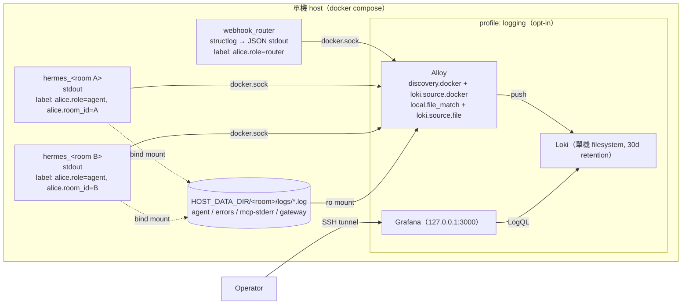

# 集中式 Log 系統設計

> 狀態：**Phase 1／1b／2／3 已實作；Phase 4（dashboard 與告警）為選配、尚未做**（2026-09-14；同日增補 §5.7 對話紀錄與 §5.8 匯出，
> 因為這套系統除了除錯，還要拿來看使用者問答、餵給 Claude Code 分析；同日再依 Hermes 文件與實測
> 把對話內容改為以 `state.db` 為唯一來源，router 只記 turn envelope）。實作分五個階段，見 §8；每個階段完成後回來
> 更新本文的「狀態」與 §8 的勾選框。實作 Alloy／Loki 設定前**先查官方文件**（用
> Context7 或 WebFetch），本文的設定片段只是骨架，不是可直接複製的最終版本。

## 1. 目標與範圍

**目標**：一個 operator 在一個地方就能查到整套系統的 log——router 應用程式的 log、
每個 `hermes_<room_id>` 容器的 stdout、以及 Hermes gateway 寫在
`data/<room_id>/logs/` 底下的檔案 log——而且能用 `room_id` 把同一個房間橫跨三種來源
的紀錄串在一起看。

這套系統要服務**三種用途**，設計上分成兩種資料類別（§5.7 說明為什麼要分）：

| 用途 | 資料類別 | 主要介面 |
|---|---|---|
| 除錯：訊息沒回、容器起不來、MCP 失敗 | 診斷 log（router JSON、容器 stdout、`logs/*.log`） | Grafana 用 `room_id`／`request_id` 查 |
| 看使用者問了什麼、agent 回了什麼、用了什麼工具 | Hermes 的 `data/<room_id>/state.db`（唯一事實來源）＋ router 的 turn envelope | `scripts/conversations.py show/search`；一次性用 `hermes sessions export --format html` |
| 之後餵給 Claude Code 分析、改善使用者體驗 | 同上 | `scripts/conversations.py export --format md` 產出可 `@file` 的逐輪對話 |

**範圍內**

- Router 改成結構化（JSON）log，每一行自帶 `room_key`／`request_id`／`event_id`。
- Router 對每則進站訊息寫一筆 turn envelope（結果狀態、送達與否、耗時、session id），
  **不複製對話文字**——對話內容以 Hermes 的 `state.db` 為唯一事實來源（§5.7）。
- 一支跨房間 CLI（`scripts/conversations.py`）讀 `state.db` 與 envelope，供查看、全文搜尋、
  匯出成 Claude Code 可直接讀的格式。
- Hermes 容器建立時帶上可被收集器辨識的 Docker label，並限制 stdout log 大小。
- 一組可選（opt-in）的收集／儲存／查詢堆疊，跟 router 同一台主機、同一個
  `docker compose` 管理。
- 保留策略、隱私邊界、常用查詢。

**範圍外（本次不做）**

- Traces／metrics（OpenTelemetry）——見 §7。
- 告警——Grafana 內建可以做，但先不配置規則。
- 多主機／多 tenant——目前部署是單機（`docs/troubleshooting.md` §4），設計保留延伸空間
  但不預先實作。
- 改動 Hermes gateway 自己的 log 行為——那是上游 `nousresearch/hermes-agent` 的事，
  我們只「收」不「改」。

## 2. 現況與問題

| 層 | 現況 | 問題 |
|---|---|---|
| Router 應用 | `main.py:13` 一行 `logging.basicConfig(level=logging.INFO)`，純文字，等級寫死 | 沒有 `LOG_LEVEL` 可調；room／request 只是 f-string 塞進訊息文字，無法結構化過濾；uvicorn access log 跟應用 log 兩種格式混在同一個 stdout |
| Router 容器 | `docker-compose.yml` 沒有 `logging:` 區塊，用 Docker 預設 `json-file` | 預設 `json-file` **不輪替**，log 檔無限成長 |
| Hermes 容器 stdout | `container_manager.py` 的 `containers.run(...)` 沒帶 `labels=`、沒帶 `log_config=` | 收集器無法從 metadata 得知這是哪個房間；stdout 同樣無限成長 |
| Hermes 檔案 log | gateway 自己寫 `data/<room_id>/logs/{agent,errors,mcp-stderr,gateway,container-boot}.log`，經 bind mount 已在 host 上 | 已集中在檔案系統，但沒有查詢介面，只能逐房間 `tail`／`grep` |
| 查詢 | `docker compose logs webhook_router`、`docker logs hermes_<id>`、逐檔 `grep` | 三種來源三套指令，無法用一個 `room_id` 串起來；沒有時間範圍／等級過濾 |

`docs/troubleshooting.md` §4 當初刻意選擇「先不建集中式 log」，理由是規模還小。本設計
不推翻那個判斷的前提（單機、小規模），而是在**不增加必要維運負擔**的條件下補上缺口：
第一、二階段（應用端結構化＋label＋輪替）零基礎設施成本，就算永遠不上第三階段也值得；
第三階段（Loki 堆疊）做成 opt-in profile，客戶部署可以不開。

## 3. 方案比較與選擇

這套系統的形狀是「單機 Docker Compose，一個服務用 docker.sock 動態生 sibling 容器」，
所以關鍵需求是**新容器在執行期冒出來要自動被收到**，而不是靠事先寫死的服務清單。
2026 年主流選項（詳細研究見本文末尾來源）：

| 方案 | 動態容器發現 | 儲存／查詢 | 單機資源 | 維運 | 判斷 |
|---|---|---|---|---|---|
| **Loki + Alloy + Grafana** | Alloy `discovery.docker` 輪詢 Docker API，label 直接變 Loki label | Loki 只索引 label；Grafana LogQL | 約 2–4 GB RAM | 三個容器，一份 compose | **採用** |
| Loki Docker log driver plugin | 每個容器 `--log-driver=loki` 直推 | 同上 | 最低 | 每台主機要裝 plugin；官方自己建議優先用 Alloy，plugin 有 daemon deadlock 風險 | 不採用 |
| Vector | `docker_logs` source 監聽 Docker 事件，自動帶所有 label | 沒有 UI，要另接 Loki／OpenSearch | 低 | 單一 binary | 備選：若之後不想跑 Alloy 可換，pipeline 語意同構 |
| Fluent Bit | `fluentd` driver 或 tail json-file | 沒有 UI | 最低 | label 補齊要自己接 Docker API | 不採用 |
| OpenTelemetry Collector | `docker_observer` + `receiver_creator` | 沒有 UI | 中 | 設定繁瑣；Python OTel **Logs SDK 官方仍標 Development** | 不採用（見 §7 保留為 traces 路線） |
| ELK／OpenSearch | Filebeat autodiscover | 全文索引，Kibana 最完整 | 8 GB+ RAM 起跳 | JVM 調校 | 不採用：對單 operator、單機規模過重 |
| 純 Docker（`journald` driver） | 不需要 | `journalctl CONTAINER_NAME=…` | 零 | 零 | 不夠：無跨容器查詢／保留策略／檔案 log |

**選 Loki + Alloy + Grafana 的理由**：

1. `discovery.docker` 天生解決動態容器問題，router 端只要在建容器時加 label，不用改
   容器生命週期邏輯。
2. Loki 只索引 label 不做全文索引，資源量級是 ELK 的四分之一以下，適合跟 router 同機。
3. Alloy 同時能 tail 檔案（`loki.source.file`），一個收集器就把 stdout 和
   `data/<room_id>/logs/*.log` 兩種來源都收齊，用相同的 `room_id` label 打上去。
4. Promtail 已於 2026-03 EOL，Alloy 是官方繼任者，不會馬上再遷一次。
5. Grafana 給單一 operator 一個現成 UI，不用自己拼查詢工具。

## 4. 目標架構



**三條資料流**，全部收斂到同一組 Loki label：

| 來源 | 收集方式 | `service` | `room_id` 來自 | `source` |
|---|---|---|---|---|
| Router stdout（JSON） | `loki.source.docker`，Docker label relabel | `router` | log 行內 `room_key` 欄位（不是 label，查詢時 `\| json`） | `docker` |
| Hermes 容器 stdout | 同上 | `agent` | Docker label `alice.room_id` | `docker` |
| `data/<room_id>/logs/*.log` | `loki.source.file`，從路徑正規抽取 | `agent` | 路徑 `/rooms/<room_id>/logs/` | `file`，另加 `file=agent\|errors\|mcp-stderr\|gateway\|container-boot` |
| turn envelope `conversation_turn` | 走 router stdout 那條流（同一行 JSON），**另外**由 router 自己寫 `data/_conversations/<room_id>.jsonl` | `router` | 行內 `room_key` | `docker`；JSONL 檔不經 Alloy（§5.7） |
| 對話內容 | **不進 Loki**。留在 `data/<room_id>/state.db`，用 `scripts/conversations.py` 讀（§5.8） | — | — | — |

Router 的 `room_key` 刻意**不**當 Loki label 而是留在 JSON 行內：一個 webhook request
可能含多個 event、不同房間，router 這條流的 label 是「容器」層級的，房間只能在行內。
查詢時用 `{service="router"} | json | room_key="<id>"` 即可，Loki 對 JSON 行的欄位過濾
效率足夠。

## 5. 設計細節

### 5.1 應用端：結構化 log

**套件**：`structlog`（加進 `pyproject.toml` dependencies）。理由：它的
`ProcessorFormatter` 能把 stdlib logger（含 uvicorn、httpx、docker SDK 的 logger）
統一導進同一個 JSON 渲染器，現有 11 個 `logging.getLogger(__name__)` 呼叫**不用改**；
`contextvars` 整合讓 request-scoped 欄位自動併進每一行，不用每個 `logger.info` 都帶參數。

**新模組** `src/alice_office_router/logging_setup.py`（路由表：這是「環境變數與輸出格式」
的改動理由，獨立成一個模組，`main.py` 只呼叫 `configure_logging(settings)`）：

- 讀 `Settings.LOG_LEVEL`（預設 `INFO`）與 `Settings.LOG_FORMAT`（`json` | `console`，
  預設 `json`；本機開發在 `.env` 設 `console` 得到彩色可讀輸出）。
- 用 `logging.config.dictConfig` 一次設定 root、`uvicorn`、`uvicorn.error`、
  `uvicorn.access` 三個 logger 都走同一個 `ProcessorFormatter`，取代 `basicConfig`。
- **關掉 uvicorn 預設 access log**（`uvicorn.access` 設 `propagate=False` 且不掛 handler，
  或啟動時 `--no-access-log`），改由 §5.1 的 middleware 記一行結構化 access log，避免兩種
  格式並存。
- 固定欄位：`ts`（ISO 8601 UTC）、`level`、`logger`、`event`（訊息）、
  `exc_info`（有例外時，渲染成字串）。

**Request-scoped 欄位**（`structlog.contextvars`）與綁定點：

| 欄位 | 值 | 綁定位置 |
|---|---|---|
| `request_id` | 每個 HTTP request 產生一個 `uuid4` hex | ASGI middleware（`main.py` 掛在 app 上），request 開始 `clear_contextvars()` + `bind_contextvars(request_id=…)` |
| `channel` | `line` / `api` | 各 adapter 進入點（`LineAdapter._handle_webhook` 等） |
| `event_id` | LINE `webhookEventId`（`adapter.py:136` 已取出） | `LineAdapter._dispatch_event`，每個 event 進入時 bind，離開時 unbind |
| `room_key` | `InboundMessage.room_key` | `core.process_inbound` 開頭 bind（`bound_contextvars` context manager，離開自動還原） |
| `container` | `hermes_<room_id>` | `container_manager.get_or_create_container` 內部 |
| `duration_ms` | 對 Hermes agent HTTP 呼叫耗時 | `hermes_client.py` 呼叫完成那一行 log 的 `extra`／kwargs |

背景任務（群組訊息的 `_schedule_group_message`、join greeting）從 request 分出去時
contextvars 會被 `asyncio.create_task` 自動複製，所以 `request_id` 仍會跟過去；但要在
task 內重新 bind `room_key`（task 可能比 request 活得久）。

**Access log 一行**：`event="http_request"`、`method`、`path`、`status`、`duration_ms`。
LINE webhook 的 body 不記錄（見 §6）。

**規則**：`logger.info(f"... room [{room_id}] ...")` 這種把識別子塞進訊息文字的寫法，
在新程式碼中改成 `logger.info("Creating container", extra={"room_id": …})` 或直接依賴
已 bind 的 contextvars。既有的 f-string 寫法**不強制回頭改**（它們還是會出現在 JSON 的
`event` 欄位，只是不可結構化過濾），改到那個函式時順手改即可。

### 5.2 容器端：label 與輪替

`container_manager.py` 的 `containers.run(...)` 加兩個參數（這是 docker SDK 唯一允許的
檔案，符合路由表）：

```python
labels={
    "alice.role": "agent",
    "alice.room_id": room_id,
    "alice.channel": channel,   # InboundMessage.channel；Phase 1 先固定 "line"
},
log_config=LogConfig(type="json-file", config={"max-size": "10m", "max-file": "3"}),
```

`docker-compose.yml` 的 `webhook_router` 加：

```yaml
labels:
  alice.role: router
logging:
  driver: json-file
  options: { max-size: "10m", max-file: "3" }
```

保留 `json-file` 而不是換 `local`／`journald` driver 的理由：Alloy 的
`loki.source.docker` 走 Docker API 讀 log，只要 driver 支援 `docker logs` 讀回就能用；
`json-file` 是最不意外的選擇，`docker logs` 除錯路徑（`docs/troubleshooting.md`）完全不
變。每容器上限 30 MB，數十個房間也在百 MB 量級。

**label 命名**：前綴 `alice.`，key 用 `.` 分隔、value 純字串。Alloy relabel 時 Docker
label 的 `.` 會變成 `_`（`__meta_docker_container_label_alice_room_id`），命名時避免同時
出現 `.` 和 `_` 造成歧義。

### 5.3 收集端：Alloy

單一 Alloy 容器，兩條 pipeline 匯到同一個 `loki.write`。骨架（**實作時對照
`grafana.com/docs/alloy/latest/reference/components/` 逐一核對參數名**）：

```alloy
// ---- pipeline 1：所有帶 alice.role label 的容器 stdout ----
discovery.docker "alice" {
  host = "unix:///var/run/docker.sock"
  filter { name = "label"  values = ["alice.role"] }
}
discovery.relabel "alice_containers" {
  targets = discovery.docker.alice.targets
  rule { source_labels = ["__meta_docker_container_label_alice_role"]     target_label = "service" }
  rule { source_labels = ["__meta_docker_container_label_alice_room_id"]  target_label = "room_id" }
  rule { source_labels = ["__meta_docker_container_name"]  regex = "/(.*)"  target_label = "container" }
  rule { target_label = "source"  replacement = "docker" }
}
loki.source.docker "alice" {
  host       = "unix:///var/run/docker.sock"
  targets    = discovery.relabel.alice_containers.output
  forward_to = [loki.write.local.receiver]
}

// ---- pipeline 2：每房間的檔案 log（HOST_DATA_DIR 以 ro 掛到 /rooms）----
local.file_match "room_logs" {
  path_targets = [{ "__path__" = "/rooms/*/logs/*.log" }]
}
discovery.relabel "room_logs" {
  targets = local.file_match.room_logs.targets
  rule { source_labels = ["__path__"]  regex = "/rooms/([^/]+)/logs/[^/]+\\.log"  replacement = "$1"  target_label = "room_id" }
  rule { source_labels = ["__path__"]  regex = "/rooms/[^/]+/logs/([^/]+)\\.log"  replacement = "$1"  target_label = "file" }
  rule { target_label = "service"  replacement = "agent" }
  rule { target_label = "source"   replacement = "file" }
}
loki.source.file "room_logs" {
  targets    = discovery.relabel.room_logs.output
  forward_to = [loki.write.local.receiver]
}

loki.write "local" {
  endpoint { url = "http://loki:3100/loki/api/v1/push" }
}
```

注意：

- `/rooms/*/logs/*.log` 會掃到 `data/_google/`？不會——那目錄沒有 `logs/` 子目錄；但
  之後若在 `data/` 下新增非房間目錄，要確認不會誤 match。
- `local.file_match` 預設每 5 秒重新掃 glob，新房間建立後檔案出現即自動納入。
- Alloy 需要一個 volume 存 positions（`/var/lib/alloy/data`），否則重啟會重讀整份檔案。
- Alloy 也會收到它自己、Loki、Grafana 的 stdout 嗎？不會——`filter` 只選帶 `alice.role`
  label 的容器；若想連堆疊自身也收，給它們 `alice.role=infra` label 即可
  （Phase 3 選了「收」，見 §8）。

**Phase 3 實作對上面骨架的三處偏離**（實際檔案以 `deploy/logging/alloy/config.alloy`
與 `deploy/logging/loki/config.yaml` 為準）：

1. 兩條 pipeline 不直接 `forward_to` 給 `loki.write`，中間都經過同一個
   `loki.process "shape_labels"`。原因是 label 集要收斂到 §5.4 那六個，而收斂動作
   有兩件，放在同一個元件裡比散在兩條 pipeline 好維護。
2. 那個 process 的第一個 stage 是 `stage.label_drop { values = ["filename"] }`——
   `loki.source.file` 會自動貼一個 `filename`（完整路徑）label，跟 `room_id` + `file`
   完全重複，不丟掉就違反 §5.4 的守則。
3. Loki 那端要加 `limits_config.discover_service_name: []`。Loki 3.x 預設會照
   `service`／`app`／`container`… 的順序自己推導出一個 `service_name` label，抄的正是
   我們 relabel 出來的 `service`，等於白白多一份基數。（`discover_log_levels` 維持
   預設 `true`：它產的 `detected_level` 是 structured metadata 不是 index label，
   不影響基數，還讓 hermes 那份純文字檔案 log 也能按等級篩。）

### 5.4 儲存與查詢：Loki、Grafana

- Loki 單一 binary（`-target=all`）、`auth_enabled: false`、`tsdb` + filesystem 儲存、
  compactor 開 `retention_enabled: true`、`retention_period: 720h`（30 天）。Loki
  **不對 host 開 port**，只在 compose 內部網路被 Alloy 與 Grafana 存取。
- Grafana：`ports: "127.0.0.1:3000:3000"`（只綁 localhost，operator 用 SSH tunnel），
  `GF_SECURITY_ADMIN_PASSWORD` 由 compose 從 `.env` 做變數替換（新變數
  `GRAFANA_ADMIN_PASSWORD`，同步進 `.env.example`）。**這個變數不進 `Settings`**——
  router 從頭到尾不讀它，加進 `Settings` 只會讓「沒啟用 log 堆疊」的部署被迫填一個
  用不到的值。compose 用 `${GRAFANA_ADMIN_PASSWORD:?...}` 讓沒設時直接失敗，而不是
  靜默起一個 `admin/admin` 的 Grafana。`provisioning/datasources/loki.yaml`
  自動接好資料來源。
- 資料 volume：`loki-data`、`grafana-data`、`alloy-data` 三個 named volume。
- **Label cardinality 守則**：Loki label 只放 `service`、`room_id`、`container`、`source`、
  `file`、`level`（若從 JSON 抽出）。`request_id`、`event_id`、`sender_id` 一律留在行內，
  絕不 relabel 成 label。

**常用查詢**（寫進 `docs/troubleshooting.md` 的 log 地圖）：

```logql
# 一個房間橫跨三種來源的全部紀錄
# ⚠️ 實作時發現原案寫的 `{a} or ({b} | json | ...)` 不是合法 LogQL——`or` 只能接在
# label filter 後面，不能聯集兩個 stream selector（parse error: unexpected type for
# left leg of binary operation (or)）。正確形狀是先用 =~ 選 service 再過濾：
{service=~"router|agent"} | json | room_key="U1234" or room_id="U1234"

# 只要該房間 agent 的兩種來源（最快，不解 JSON）
{room_id="U1234"}

# 某次 webhook 的完整路徑
{service="router"} | json | request_id="abc123"

# 所有房間的 agent error
{service="agent", file="errors.log"}

# router 的 5xx 與例外（level 已經是 label，不必再 | json）
{service="router", level="error"}

# 某房間每一輪的結果狀態與耗時（對話內容不在 Loki，用 scripts/conversations.py 看，見 §5.8）
{service="router"} | json | event="conversation_turn" | room_key="U1234"

# 全部房間裡 agent 失敗的那一輪（envelope 含 session_id，可對回 state.db）
{service="router"} | json | event="conversation_turn" | outcome="agent_failed"
```

### 5.5 部署：opt-in profile

- 新目錄 `deploy/logging/`：`docker-compose.logging.yml`、`alloy/config.alloy`、
  `loki/config.yaml`、`grafana/provisioning/datasources/loki.yaml`。
- 啟用方式：`docker compose -f docker-compose.yml -f deploy/logging/docker-compose.logging.yml up -d`，
  或在主 compose 用 `profiles: [logging]`。
- `scripts/deploy_host.sh` 加 `--with-logging` 旗標（預設不開，維持客戶部署最小化，
  符合 delivery model：外部客戶 cloud／on-prem 各自部署）。
- Alloy 容器掛載：`/var/run/docker.sock:ro`、`${HOST_DATA_DIR}:/rooms:ro`。
  `HOST_DATA_DIR` 在 compose 裡已經是 `${PWD}/data`，兩處要一致。

### 5.6 開發模式（`ROUTER_IN_DOCKER=false`）

Router 直接跑在 host 上，`LOG_FORMAT=console` 看終端機即可；Alloy 的 pipeline 1 收不到
host process 的 stdout，這是接受的限制（開發時不需要集中查詢）。若真要在 dev 也進
Loki，可另加 `loki.source.api` 讓 router 走 HTTP push——**不做**，除非有需求。

### 5.7 對話紀錄：以 Hermes 的 `state.db` 為唯一事實來源

**結論：router 不複製對話內容。** 2026-09-14 實測與官方文件確認，Hermes 已經把每個房間
的完整對話存在 `data/<room_id>/state.db`（SQLite，WAL 模式，官方明言「支援多個讀者＋一個
寫者」、「state.db 對所有 session 都是 authoritative」），內容比 router 看得到的多得多：

| `state.db` 已有的 | router 端根本拿不到的 |
|---|---|
| `messages`：`role`（user／assistant／tool）、`content`、`tool_calls`（JSON）、`tool_name`、tool 回傳內容、`reasoning`、`finish_reason`、`timestamp` | agent 為什麼這樣回（`reasoning`）、呼叫了哪些工具、工具回了什麼 |
| `sessions`：`id`＝router 送的 session id（`line_<room>` 或 `line_<room>#<epoch>`）、`source=api_server`、`model`、token 四類、`estimated_cost_usd`、`api_call_count`、`title` | 每一輪的 token／成本／API 呼叫次數 |
| `messages_fts` / `messages_fts_trigram`：全文檢索（含 CJK trigram） | — |
| `session_model_usage`：依 model 拆的用量 | — |

router 若再寫一份 `inbound_text`／`reply_texts`，只是 `state.db` 的劣化子集，還多一個
要對齊的來源。所以本節的設計改成：**對話內容一律讀 `state.db`；router 只記 Hermes
不知道的事**。

**三條讀取路徑**（都實測過，依用途選）：

| 路徑 | 怎麼用 | 適合 |
|---|---|---|
| A. host 直接讀 SQLite（唯讀） | `sqlite3 -readonly data/<room_id>/state.db`；WAL 允許併行讀 | 跨房間查詢、匯出給 Claude Code、寫分析腳本。不用 `docker exec`、不用每房間的 key |
| B. api_server HTTP | `GET /api/sessions`、`GET /api/sessions/{id}/messages`，Bearer 用 router 已有的 `HERMES_API_SERVER_KEY`，port 就是 router 已經連的那個 | router 內建的即時檢視頁（若之後要做 §5.8 選項 B）；schema 由 Hermes 版本化，不用綁 SQLite 欄位 |
| C. `docker exec hermes_<id> hermes sessions export --session-id <id> --format md\|html\|jsonl\|trace` | `md` 出 front-matter＋逐則訊息＋tool call JSON；`html` 是單檔自含的可瀏覽 transcript；`trace` 是 Claude Code 格式 JSONL（HF Agent Trace Viewer 用） | 單一房間、一次性、給人看。另有 `hermes insights --days N`（token／成本／工具使用統計）與 `hermes logs --session <id>` |

**不採用**：每容器一個 `hermes dashboard`（綁 127.0.0.1、要 auth、數十個房間就數十個
dashboard，無法跨房間看）；Grafana 掛 SQLite datasource（N 個 db 檔，硬湊）。

**router 仍要記的「turn envelope」**：Hermes 只看到有進到 agent 的那些訊息，以下只有
router 知道，仍用 §5.7 原本的機制（一個發出點、Loki＋`data/_conversations/<room_id>.jsonl`）
記錄，但**不含回覆文字**：

| 欄位 | 說明 |
|---|---|
| `schema_version`, `ts`, `request_id`, `event_id`, `channel`, `room_key` | 同前 |
| `session_id` | 這一輪送給 Hermes 的 session id（含 epoch）——**對回 `state.db.sessions.id` 的 join key** |
| `outcome` | `replied` / `observed` / `reset` / `blocked` / `agent_failed` / `silence`；後五種在 `state.db` 裡**沒有對應紀錄**，這是 envelope 存在的主因 |
| `inbound_text` | 只在 `outcome != replied` 時填（進了 agent 的文字 `state.db` 已有；沒進的只有這裡有） |
| `is_group`, `addressed`, `sender_id`, `sender_name` | 群組脈絡，Hermes 只看到合併後的 prompt |
| `gate_status`, `rotated`, `agent_duration_ms`, `prompt_tokens`, `error` | 同前 |
| `delivered` | adapter 送回 LINE 是否成功——**改由 adapter 在送完後發出 envelope**，而不是 core；core 只組好 envelope 回傳給 adapter（`process_inbound` 回傳型別從 `list[str]` 變成含 texts 與 envelope 的 dataclass） |

`process_inbound` 拆成 `_route` + 薄包裝的做法不變；只是發出點移到 adapter，讓
`delivered` 能一次寫進去而不是事後補一行 error log。

### 5.8 查看對話與餵給 Claude Code

**第一步（建議先做）：repo 內一支跨房間 CLI** `scripts/conversations.py`，走路徑 A
讀 `data/*/state.db`（唯讀），再用 `session_id` 左接 `data/_conversations/*.jsonl` 的
envelope：

```
uv run python scripts/conversations.py rooms                       # 每房間：session 數、最後活動、token、成本
uv run python scripts/conversations.py show <room_id> [--session <id>] [--with-tools] [--with-reasoning]
uv run python scripts/conversations.py search "<關鍵字>" [--room <id>]  # 走 messages_fts_trigram，跨房間
uv run python scripts/conversations.py export --room <id> --since 7d --format md|jsonl --out <dir>
uv run python scripts/conversations.py stats --since 30d           # outcome 分布、agent_failed 率、p95 耗時、blocked 後回流
```

- `show`／`export` 預設只輸出 user／assistant 訊息與 envelope 的 outcome／耗時；
  `--with-tools` 才加 tool call 與工具回傳，`--with-reasoning` 才加 `reasoning`。
  這是給 Claude Code 讀的預設形狀：先看對話本身，需要追工具行為再開。
- `export --format md` 一個房間一個檔，逐輪：時間、使用者、agent 回覆、outcome、
  耗時、（可選）工具。直接 `@file` 進 Claude Code。
- `sender_id` 匯出時預設短 hash，`--raw` 才保留。
- `stats` 只用 envelope 就能算（outcome 全在 router），交叉 `state.db` 可再加
  每輪 token／成本。

**第二步（可選）：router 內建唯讀檢視頁** `/admin/conversations`，走路徑 B 或 A，
`ADMIN_TOKEN` 保護、只綁 localhost 或走 SSH tunnel。適合不想開終端機、想點來點去看
的情境。要做再做，第一步的 CLI 已經涵蓋分析需求。

**一次性需求**用路徑 C：`hermes sessions export --format html` 出一個自含的 HTML 直接
用瀏覽器開，是最快「給人看」的方式；寫進 `docs/troubleshooting.md` 的速查表。

**Schema 耦合風險**：路徑 A 綁 `state.db` schema（目前 version 20；官方文件已到 23，
欄位只加不減）。`scripts/conversations.py` 開頭檢查 `schema_version`，超出測過的範圍就
警告而不是靜默錯讀；若某版真的破壞相容，退到路徑 B。

## 6. 安全與隱私

- **對話內容只存在 Hermes 的 `state.db`**（§5.7），router 不複製；envelope 只在訊息沒進
  agent 時才含文字。`state.db` 還含 `system_prompt`、`reasoning`、工具回傳（例如 Drive
  檔案清單），所以匯出給 Claude Code 時預設**不帶**工具與 reasoning，`sender_id` 預設
  hash（§5.8）。**保留期**、**誰能讀 `data/`**、匯出檔放哪裡，要寫進客戶部署說明。
  客戶合約若禁止保留對話，用 Hermes 自己的 `hermes sessions prune` 與 `config.yaml`
  處理，不是 router 的事；envelope 用 `CONVERSATION_LOG_ENABLED=false` 關掉。
- **診斷 log** 的 INFO 等級不重複記錄訊息本文（對話紀錄已經有了，不要在幾十萬行 debug
  裡再散一份）；不記錄 LINE access token 與 webhook 原始 body。
- **存取面**：Loki 無 auth，因此不對 host 開 port；Grafana 只綁 `127.0.0.1`。
  多人存取時再考慮 reverse proxy + auth。
- **docker.sock**：Alloy 需要讀 socket（等同 root）。router 本身已經掛 socket，
  Alloy 用 `:ro` 掛載並限制在同一台主機，不增加新的信任邊界。
- 房間隔離：Loki 是單 tenant，operator 能看所有房間——這符合「operator 是部署者」的
  角色；房間間彼此看不到，因為使用者從不接觸 Grafana。

## 7. 非目標與未來延伸

- **Traces**：目前 router → Hermes api_server 的呼叫無法把 `request_id` 傳進 Hermes 的
  log（上游不會把任意 header 寫進 log），跨容器只能靠 `room_id` + 時間對齊。若之後上游
  支援 OTel，再引入 OpenTelemetry Collector 走 traces；logs 仍留在 Loki（Alloy 本身就是
  OTel Collector 發行版，可以直接加 pipeline）。
- **告警**：Grafana alerting 可對 `{file="errors.log"}` 速率設規則，通知走 webhook／
  email。先不配置。
- **多主機**：Loki 改 object storage（S3）＋每台主機一個 Alloy，設計不用改。
- **Vector 替換**：若 Alloy 有問題，Vector `docker_logs` + `file` source 是同構替代，
  label 語意相同。

## 8. 實作階段（給實作 agent）

每一階段獨立可 commit、可各自驗收；前兩階段不依賴任何新基礎設施。

### Phase 1：Router 結構化 log — [x]（2026-09-14 實作）

- [x] `pyproject.toml` 加 `structlog`；`uv sync`。
- [x] 新增 `src/alice_office_router/logging_setup.py`：`configure_logging(settings)`，
      `dictConfig` + `ProcessorFormatter`，`json`／`console` 兩種 renderer。
- [x] `Settings` 加 `LOG_LEVEL: str = "INFO"`、`LOG_FORMAT: Literal["json", "console"] = "json"`；
      同 commit 更新 `.env.example` **與 `docker-compose.yml` environment 清單**
      （少加進 compose 會在容器模式靜默用預設值）。
- [x] `main.py` 移除 `basicConfig`，改呼叫 `configure_logging`；加 ASGI middleware
      產生 `request_id`、記 access log；uvicorn access log 關閉。
- [x] 綁定點：`LineAdapter._dispatch_event`（`event_id`、`channel`）、
      `core.process_inbound`（`room_key`）、`container_manager.get_or_create_container`
      （`container`）、`hermes_client`（`duration_ms`）。API channel adapter 比照。
      背景任務（`_process_and_reply`、入群問候 `_greet_group`）在 task 內重新 bind
      `room_key`，因為 request 的 context 在 task 執行前就已經解除。
- [x] 測試：`tests/test_logging_setup.py`——捕捉 handler 輸出驗證 JSON 行含
      `request_id` 與 `room_key`；驗證 `LOG_LEVEL=DEBUG` 生效；驗證 console 模式不炸。
- [x] 驗收：`LOG_FORMAT=console` 本機可讀、`LOG_FORMAT=json` 每行可被 `json.loads`
      解析（本機用 TestClient 打一個 404 實測）。容器模式的
      `docker compose logs webhook_router | jq .` 待下次部署時順手確認。

### Phase 1b：turn envelope 與對話 CLI — [x]（2026-09-14 實作）

- [x] `Settings` 加 `CONVERSATION_LOG_ENABLED: bool = True`、
      `conversations_dir` property（`DATA_DIR / "_conversations"`）與
      `room_conversation_log(room_id)` method；`.env.example` 與 compose env 清單同步。
- [x] 新模組 `src/alice_office_router/conversation_log.py`：`TurnEnvelope` pydantic model
      （§5.7 欄位）、`record_turn(envelope, config)`。
      **偏離本文原案**：本文原本寫「`alice.conversation` logger 的 FileHandler 在
      `logging_setup.configure_logging` 內掛上」，實作改成 `record_turn` 自己
      `open(..., "a")` 寫那一行，`logging_setup` 完全不動。理由：單一 handler 要依
      `room_key` 換檔就得在 handler 裡存可變狀態（多房間交錯時會寫錯檔），每房間一個
      handler 又會累積開啟中的檔案描述子；一次 append 一行不值得這個代價，而且檔案格式
      因此與 log 設定完全解耦。Loki 那條路仍走 `alice.conversation` logger 發
      `conversation_turn` 事件，與原案相同。
- [x] `core.process_inbound` 拆成 `_route` + 薄包裝，回傳含 `texts` 與 envelope 草稿的
      `InboundResult`；`_ask_agent`／`_ask_group_agent` 改回傳 `AgentTurn` dataclass，
      帶回 `session_id`／`duration_ms`／`prompt_tokens`／`rotated`／`error`／outcome
      （`silence` 與 `agent_failed` 因此不再共用「回 None」）。各 adapter 送完訊息後填
      `delivered` 並呼叫 `record_turn`；LINE 的 `_deliver_reply` 改回傳 bool，
      `_deliver_texts` 回傳 `bool | None`（沒東西可送＝None）。LINE 背景任務多收一個
      `event_id` 參數並重新 bind，envelope 才拿得到它。
- [x] `scripts/conversations.py`（§5.8 五個子命令），唯讀開 `data/*/state.db`
      （`file:...?mode=ro` URI），開頭檢查 `schema_version`；envelope 用 `session_id` 左接。
      預設不含 tools／reasoning，`sender_id` 預設 hash。
      **偏離本文原案**：SQLite 讀取邏輯抽成 `src/alice_office_router/conversation_store.py`
      （純讀、無 docker、不依賴 Settings），腳本只負責 argparse 與列印，這樣測試可以直接
      打模組。實作時另外發現兩件事，都寫進該模組的註解：
      (a) envelope 是「這一輪結束時」蓋章的，最近時間的 join 必須有容忍上限
      （`NEAREST_TOLERANCE_SECONDS = 300`），否則一個房間只要有一筆 envelope，
      每則訊息都會被貼上它；
      (b) Hermes 的 context compaction 會把被壓縮的訊息「再插一次」
      （`compacted=1, active=0`），同一則訊息因此在 `messages` 裡出現多次——所有查詢都用
      `MIN(id) GROUP BY (session_id, role, timestamp, tool_name)` 去重；
      (c) fts5 trigram 對 1-2 字的詞（中文很常見）永遠不會 match，這種長度改走 LIKE。
      `show`／`export` 另外把 `observed`／`reset`／`blocked` 這三種「state.db 裡沒有」的
      turn 由 envelope 補上（`agent_failed`／`silence` 有進到 Hermes，不補，否則會重複）。
- [x] 測試：`tests/test_conversation_log.py`（15 個）——六種 outcome 各一筆，JSONL 行可被
      `TurnEnvelope.model_validate_json` 讀回；`CONVERSATION_LOG_ENABLED=false` 時不建檔、
      但仍發 `conversation_turn` log 事件。
      `tests/test_conversation_store.py`（20 個，取代原案的 `test_conversations_script.py`
      檔名）——用手工建的迷你 `state.db` fixture（sessions＋messages＋fts5 trigram）驗證
      `show`／`search`（中文詞）／`export md`／`export jsonl`／`stats`／sender hash；
      `tests/test_core.py` 既有測試只改回傳型別、行為不變，另加 9 個 envelope 測試涵蓋
      六種 outcome；adapter 測試加 6 個涵蓋 `delivered` 的 True／False／None。
- [x] `docs/troubleshooting.md` 速查表加：`scripts/conversations.py` 五個常用指令、
      `hermes sessions export --format html`、`hermes insights`、`hermes logs --session`。
- [x] `.gitignore` 確認 `data/` 已排除（已確認：第 37 行）。
- [x] 驗收：對本機真實的 `data/line_Uc0edf…/state.db`（唯讀）跑過 `rooms`／`show`／
      `search`／`export md`／`stats` 五個子命令；期間 host 模式的 router 實際收到 LINE
      訊息並寫出 envelope，`request_id`／`event_id`／`outcome=agent_failed`／
      `agent_duration_ms` 都正確落檔。

### Phase 2：容器 label 與 log 輪替 — [x]（2026-09-14 實作）

- [x] `container_manager.py` `containers.run` 加 `labels=` 與 `log_config=`
      （`docker.types.LogConfig`）。`alice.channel` 由 room key 的前綴推導
      （`_channel_of`，認得的前綴才用，其餘一律 `line`）。
- [x] `docker-compose.yml` 加 `labels` 與 `logging` 區塊。
- [x] `tests/test_container_manager.py` 補 assert：`labels["alice.room_id"] == room_id`、
      `log_config` 型別與 `max-size`。
- [x] 註記：既有房間的容器**不會**自動獲得 label（label 是建立時屬性），需要
      `docker rm hermes_<id>` 讓 router 重建；寫進 `docs/troubleshooting.md` §2.4
      與 §3 速查表。
- [x] 驗收：`docker inspect hermes_<id> | jq '.[0].Config.Labels, .[0].HostConfig.LogConfig'`
      ——本機只跑到 mock 層（測試斷言傳給 `containers.run` 的參數），真的 inspect
      要等下次部署重建房間容器後執行。

### Phase 3：Loki 堆疊 — [x]（2026-09-14 實作）

- [x] `deploy/logging/` 四個檔案（§5.5）。版本全部 pin 死：`grafana/alloy:v1.19.2`、
      `grafana/loki:3.7.7`、`grafana/grafana:13.2.1`（2026-09-14 當下的 stable）。
      三個服務都掛 `alice.role=infra` label ＋ `json-file` 10m×3 上限，所以堆疊自己的
      stdout 也會被 pipeline 1 收進去（`{service="infra"}`），堆疊壞掉時查得到原因。
- [x] `.env.example` 加 `GRAFANA_ADMIN_PASSWORD`。**偏離本文原案**：原案寫「`Settings`／
      `.env.example` 都加」，實作只加 `.env.example`——router 不讀這個變數，加進
      `Settings` 會強迫沒啟用堆疊的部署也填一個用不到的值（理由見 §5.4）。
- [x] `scripts/deploy_host.sh --with-logging`：只是多疊一個 `-f`（`COMPOSE_FILES`
      陣列），預設路徑一個字都沒變，所以帶不帶旗標重跑都冪等。旗標會先檢查 `.env`
      裡 `GRAFANA_ADMIN_PASSWORD` 非空，免得走到 compose 才用一個難讀的錯誤爆掉。
- [x] 文件：本文改狀態；`docs/troubleshooting.md` §1 加 Grafana 列與「集中式查詢
      （選配）」小節（含全部 LogQL）、§3 速查表加三列、§4 由「展望」改寫成「什麼時候
      該打開」；`README.md` 部署段加「選配：集中式 log（Loki）」＋環境變數表一列；
      `docs/architecture-c4.md` Level 2 加 logging profile 子圖（用 `c4-architecture`
      skill，四張圖都通過 `validate.sh`）；`docs/env-data-paths.md` 加
      「第三個看到 `HOST_DATA_DIR` 的人：Alloy 的 `/rooms`」整節。
- [x] 驗收（本機實測，Docker Desktop / macOS）：三個服務起來後——
      `docker compose -f docker-compose.yml -f deploy/logging/docker-compose.logging.yml
      config` 通過；`docker logs alloy` 零 `level=error`；Loki 的 `/labels` 剛好是
      設計允許的六個 `container / file / level / room_id / service / source`；
      `room_id` 值含真實房間 `line_Uc0edf…`；`file` 值＝`agent.log`／`errors.log`／
      `gateway.log`／`gateway-exit-diag.log`／`container-boot.log`／`mcp-stderr.log`；
      `{service="agent", file="agent.log"}` 回 373 行、`{room_id="line_Uc0edf…"}`
      回 529 行（同時含 `source=docker` 與 `source=file` 兩種來源，這正是「一個
      room_id 串起三種來源」的證明）；Grafana `/api/health` 回 `database: ok`
      （13.2.1），provisioning 出來的 Loki datasource `readOnly=true, isDefault=true`，
      §5.4 全部查詢都用 Grafana 的 datasource proxy 跑過。
      **兩個沒能在本機證明的**（見 §9）：router 這條流在本機是 host 模式
      （`ROUTER_IN_DOCKER=false`）跑的，沒有容器也就沒有 label，pipeline 1 收不到它
      ——改用一個帶 `alice.role=router` label 的拋棄式容器印 JSON 行，證明了
      `service="router"` relabel 與 `loki.process` 的 `level` 抽取都正確
      （`{service="router", level="error"}` 查得到），但真正的 router stdout 要等
      容器化部署才算驗完；「新房間不重啟 Alloy 就被收到」只證明了容器那半邊
      （拋棄式容器在 15 秒內被 `discovery.docker` 撿到），檔案那半邊沒證
      （不想為了測試在 `data/` 底下造假房間）。

### Phase 4（可選）：Dashboard 與告警 — [ ]

- [ ] `deploy/logging/grafana/provisioning/dashboards/` 一個 overview：每房間 log 速率、
      error 速率、router p95 `duration_ms`。
- [ ] `errors.log` 速率告警規則。

## 9. 風險與未決事項

| 項目 | 說明 | 處理 |
|---|---|---|
| Hermes 檔案 log 的輪替行為 | 不確定 gateway 是否自行輪替 `agent.log`；若不輪替，30 天保留只管 Loki 這份，原檔仍會長大 | Phase 3 實測：本機唯一房間跑了一天的 `agent.log` 是 60 KB，其餘五個檔案都 ≤ 4 KB，量級上短期不急；仍未觀察到 gateway 自行輪替。真的變大時在 host 加 `logrotate`（copytruncate），Alloy tail 對 copytruncate 相容 |
| structlog 與 `line-bot-sdk`／`docker` SDK 的 logger 噪音 | 統一導進 JSON 後，第三方 DEBUG log 可能很吵 | `dictConfig` 對 `docker`、`urllib3`、`httpx` 設 `WARNING` |
| 既有房間容器沒 label | 見 Phase 2 | 文件化重建步驟；不做自動遷移。（本機這顆房間容器是 Phase 2 之後重建的，已帶 label，pipeline 1 因此實測有收到它的 stdout） |
| `HOST_DATA_DIR` 與 Alloy 掛載路徑不一致 | compose 裡是 `${PWD}/data`，operator 若改路徑要同步兩處 | 已處理：Alloy 掛載寫成 `${HOST_DATA_DIR:-${PWD}/data}`，跟 router 吃同一個變數；`docs/env-data-paths.md` 專節說明症狀（只有 `source="file"` 查不到）與驗證指令 |
| Loki 磁碟用量 | 數十房間、30 天，估計數百 MB 到數 GB | Phase 3 量過：單一房間約 530 行、再加三個 infra 容器的 stdout，`/loki` 共 704 KB。維持原估計 |
| 堆疊的 RAM 成本 | §3 表格原本估「約 2–4 GB RAM」 | 實測遠低於此：`docker stats --no-stream` 顯示 Alloy 65–69 MB、Loki 107–157 MB、Grafana 310–353 MB，**合計約 480–580 MB**。原估計是照 Loki 官方對「有查詢負載的生產叢集」的建議抄的，對單機、單 operator、偶爾查一次的用法過度保守——`docs/troubleshooting.md` §4 用實測值 |
| Loki 的 ring 在筆電休眠後會短暫不健康 | 本機實測出現過 `at least 1 healthy replica required`（compactor／scheduler），因為 `kvstore: inmemory` 的心跳被主機睡眠打斷 | 會自己恢復，正式部署（不休眠的主機）不會遇到；若在筆電上長開，休眠期間推進去的行有機會查不到，重啟 Loki 即可 |
| Grafana 自己的 stdout 會被收進 Loki | 三個 infra 容器都有 `alice.role` label，Grafana 開機的 migration log 一次就是一兩千行 | 接受：它有 30 天保留與 label 隔離（`{service="infra"}`），要靜音就把 compose 的 `alice.role: infra` 拿掉，代價是堆疊自己壞掉時查不到 |

## 來源

- Grafana Alloy `loki.source.docker`：https://grafana.com/docs/alloy/latest/reference/components/loki/loki.source.docker/
- Grafana Alloy `discovery.docker`：https://grafana.com/docs/alloy/latest/reference/components/discovery/discovery.docker/
- Promtail EOL 與遷移：https://grafana.com/docs/alloy/latest/set-up/migrate/from-promtail/
- Loki Docker driver plugin（官方建議優先用 Alloy）：https://grafana.com/docs/loki/latest/send-data/docker-driver/
- Vector `docker_logs`：https://vector.dev/docs/reference/configuration/sources/docker_logs/
- OpenTelemetry Python（Logs 標示 Development）：https://opentelemetry.io/docs/languages/python/
- Docker `json-file` driver：https://docs.docker.com/engine/logging/drivers/json-file/
- Docker dual logging：https://docs.docker.com/engine/logging/dual-logging/
- Docker SDK for Python `containers.run`（`labels`、`log_config`）：https://docker-py.readthedocs.io/en/stable/containers.html
- structlog 與 stdlib 整合：https://www.structlog.org/en/stable/standard-library.html
- Hermes sessions（state.db 為 authoritative）：https://github.com/nousresearch/hermes-agent/blob/main/website/docs/user-guide/sessions.md
- Hermes session storage schema：https://github.com/nousresearch/hermes-agent/blob/main/website/docs/developer-guide/session-storage.md
- Hermes api_server（`/api/sessions`、`/api/sessions/{id}/messages`、session 標頭）：https://github.com/nousresearch/hermes-agent/blob/main/website/docs/user-guide/features/api-server.md
- Hermes CLI（`sessions export`／`insights`／`logs`）：https://github.com/nousresearch/hermes-agent/blob/main/website/docs/reference/cli-commands.md
