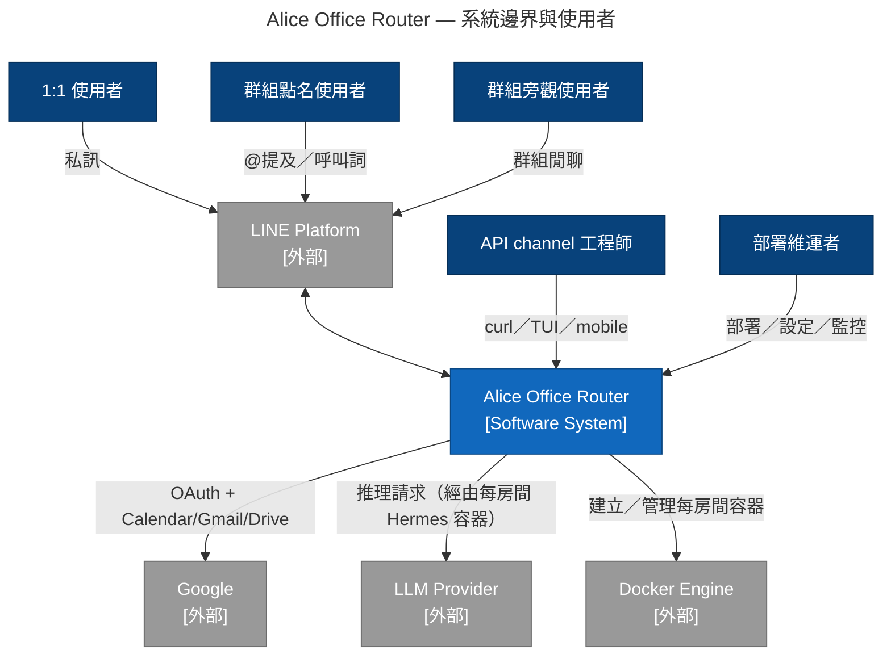
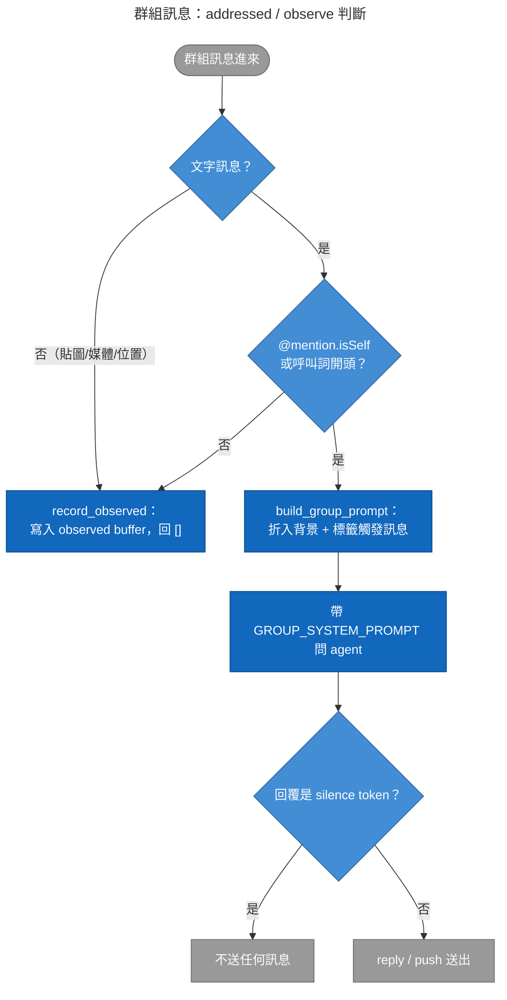

# PRD — Alice Office Router

## 0. 文件資訊

- **狀態**：反映現有實作（非提案）。這份 PRD 是把已經做出來的行為用 PRD 格式記錄下來，
  給後續要加新 feature 的人一個比對基準——不是待審核的規劃文件。
- **對應版本**：commit `dc4019f`（docs: document group call-word settings for
  deployers）附近，2026-09-14。
- **範圍**：`src/alice_office_router/` 整個 router 服務；不含 `src/hermes/` 底下
  MCP／plugin 工具本身的功能規格（那些是 Hermes agent 的能力，見 AGENTS.md 路由表）。
- 行為異動時（尤其是群組判斷邏輯、session 輪替門檻、gate 三態）請同步更新本文件，
  否則本文件會跟程式碼一起腐朽。

## 1. 背景與問題陳述

企業或個人使用者已經高度依賴 LINE 溝通，不想為了用 AI 助理再多裝一個 app、多記一套
介面。同時，服務提供者只有一個 LINE OA（Official Account）帳號，卻要同時服務多個
互不相關的使用者／團隊——每個人的對話記憶、工具存取、檔案，彼此都不能看到對方的。

Hermes Agent 提供了完整的 AI agent 框架，但它原生的多租戶模型是「一個 profile ＝
一份共用大腦」，多個使用者共用同一 profile 時只靠 allowlist／session 做邏輯區分，
不是硬隔離（詳見 `docs/hermes-agent-line-gateway-comparison.md`）。這跟「單一 LINE
帳號、每個聊天室都要像有自己專屬 agent」的需求不相容。

Alice Office Router 要解決的問題：**在單一 LINE OA 背後，動態建立並路由到多個彼此
隔離的 Hermes Agent 執行個體**，讓每個聊天室（1:1 或群組）的使用者感受上完全像在用
「自己部署的」Hermes agent——同時保留 channel-free 的核心設計，讓未來加入其他通訊
平台或 first-party client（TUI／mobile）時，不需要重寫 gate／容器管理／agent 呼叫
這些共用邏輯。

## 2. 目標與非目標

### 目標

- 任何 LINE 使用者只要加官方帳號好友即可開始使用，不需額外安裝或註冊。
- 每個聊天室（1:1 或群組）的資料、對話記憶、工具彼此完全隔離。
- 群組聊天中，多人共用一個聊天室，但 bot 只在被合理點名時才回覆，同時仍理解群組
  對話脈絡（不是每則訊息都要重新解釋前因後果）。
- 用 router 自管的 session 衛生機制，在對話累積過長或太久沒用時自動維持 Hermes
  context 品質，不需人工介入清理。
- 提供 first-party API channel，讓工程測試與未來 TUI／mobile client 共用同一套
  gate → 容器 → agent 管線，不必另外重做一份。
- Google Workspace（Calendar／Gmail／Drive）可選整合，逐房授權、逐房隔離。

### 非目標（V1 刻意不做，非需求缺陷）

- 不支援 LINE 以外的通訊平台——架構上已預留 channel adapter 擴充點
  （`channels.enabled_adapters`），但目前只有 LINE 落地。
- 不做 agent 主動產生的圖片／語音／影片訊息送回 LINE（outbound media）。
- 不做互動按鈕／快速回覆選單（postback、quick reply）。
- 不做多 worker／多副本水平擴展——webhook 去重、OAuth pending state、
  session／group 狀態檔 I/O 全部假設 single-worker 部署，沒有跨行程鎖。
- 不做集中式可觀測性平台（metrics／tracing）；目前只有結構化 log。

## 3. 使用者角色（Persona）

| Persona | 情境描述 | 目標 | 系統怎麼服務它 |
|---|---|---|---|
| **1:1 聊天的個人使用者** | 私訊 LINE 官方帳號，把它當自己的助理用 | 每則訊息都想要被理解、被回覆，且助理記得之前聊過什麼 | 每則訊息都轉發進該房間專屬容器並回覆；對話記憶靠 session id 延續 |
| **群組聊天裡會點名／主動找 bot 的使用者** | 在群組裡 @這個帳號或用呼叫詞開頭，要它幫忙 | 得到針對自己請求的回覆，且回覆要能理解群組剛才在聊什麼 | 觸發 addressed 路徑：折入群組背景脈絡後問 agent，正常回覆 |
| **群組聊天裡只是旁觀、被動提供 context 的使用者** | 跟其他人在群組閒聊，沒有找 bot | 不希望 bot 隨意插話，但如果之後有人點名 bot，希望 bot 知道剛才聊了什麼 | 訊息不觸發 agent、不回覆；被記入該房間的 observed buffer 當背景 |
| **透過 API channel 做開發測試的工程師** | 用 curl／TUI／未來的 mobile client 直接打 `POST /webhooks/api/messages` | 不想背 LINE 的簽章／reply token／切段限制，只想同步拿到 agent 原始 markdown 除錯 | 走跟 LINE 完全相同的 gate → 容器 → agent 管線，同步回傳未加工的回覆 |
| **部署維運者** | 建置、部署、維護整個 router + Hermes image；管理 `.env`、GCP OAuth 設定 | 服務要能穩定跑、房間要能自動建立、出問題時要能追 log／debug | `container_manager.py` 自動化容器生命週期；`scripts/debug_room.py` 提供診斷快照；fail-fast 的 Settings 驗證 |

## 4. 功能需求

### FR-01　1:1 訊息問答

身為 1:1 使用者，我傳的每一則訊息都要被理解並回覆，就像在用自己的助理。

- 1:1 訊息的 `InboundMessage.addressed` 恆為 `True`、`is_group` 恆為 `False`，每則
  text 訊息都轉發到該房間專屬容器並回覆。
- 首次建立聊天室容器需 30–60 秒（`docker run` + `/health` 輪詢，最多 60 秒逾時）；
  之後容器常駐，後續訊息秒級回覆。
- 對話記憶延續：同房間下一則訊息帶同一個 session id（`room_key` 或輪替後的
  `room_key#N`），Hermes 據此接續上下文。
- 每則 1:1 訊息都附一段 ephemeral system message（`group_context.DIRECT_SYSTEM_PROMPT`，
  與群組的 `GROUP_SYSTEM_PROMPT` 放在一起），由部署層統一規範回覆形狀：回覆精簡、重點
  在前（LINE 聊天視窗不適合長篇 markdown 表格）；大型任務（解整份試卷、翻譯長文件、
  多步驟研究）先交付第一段再問「要不要繼續」，每輪以兩分鐘內回完為目標；回答檔案內容
  前要用工具重新讀檔（檔案內容不在 agent 記憶裡）；不確定就問、不編造。它不寫進房間的
  `config.yaml`，所以改這段文字不需要動既有房間、重啟即生效。
- agent 的人設（自我認知、語氣、行為原則）則由每個房間的 `data/<room_id>/SOUL.md`
  決定——Hermes 自己 prompt 疊層裡優先度最高的一層，跟上述 ephemeral system message
  是不同分工：`SOUL.md` 管「是誰、什麼態度」，`*_SYSTEM_PROMPT` 管「回覆形狀」，兩邊
  刻意不重複規則。房間第一次建立時由 `room_seed.ensure_soul_seed` 從
  `src/hermes/SOUL.md` write-once 複製，定位為「企業級個人助理」、繁體中文、會在
  合適時機主動舉例提示能幫上什麼，但同時明講能力不僅限於此；之後永不覆蓋，可
  逐房間編輯後 `docker restart` 生效。
- **同一房間一次只跑一輪**：一則訊息還在跑 agent 時，同房間的下一則訊息會排隊等待
  （process-local 的 per-room `asyncio.Lock`，FIFO、不設上限、不丟訊息），輪到它才照
  原本流程處理。Hermes 每個房間只有一個 session，兩輪並行會互相拖慢並讓回覆交錯。
  等待會記一筆 `room_turn_queued`（含 `waited_ms`）log。不同房間彼此不受影響；群組的
  未點名訊息走 observe 捷徑，不等這把鎖（背景脈絡照常累積）。單 worker 部署才成立，
  多 worker 需要換成共用鎖。
- 對應：`core.process_inbound`、`core._route`／`core._take_turn`、`core._ask_agent`、
  `container_manager.get_or_create_container`。

### FR-02　群組訊息的 addressed／observe 判斷與行為差異

身為服務提供者，我需要 bot 在群組裡只回覆真正找它的訊息，其餘訊息不回覆但仍要理解
上下文，這樣使用者才不會覺得 bot 隨意插話或答非所問。

- 群組訊息只有在 **@提及 bot**（LINE `mention.mentionees[].isSelf == true`；
  `type == "all"` 的 @All 不算）或以設定的 **呼叫詞**（`GROUP_TRIGGER_PREFIXES`，
  逗號分隔，空＝只靠 @mention）開頭時，才視為「點名」（addressed）。比對是單純的
  大小寫敏感前綴比對、不看字詞邊界（例如呼叫詞「小幫手」會讓「小幫手們早」也被當
  成點名），部署時須挑成員平常聊天不會用到的詞（見 `docs/group-chat-design.md`／
  `.env.example`）。至少要設一個呼叫詞才能服務 LINE 桌面版使用者，因為桌面版無法
  @ 官方帳號。
- 群組裡任何**非文字訊息**（貼圖／媒體／位置）一律視為未點名，只會被 observe，
  不會觸發 addressed 路徑。
- 未點名的群組訊息不會呼叫 agent、不回覆，只記入該房間的 observed buffer
  （`data/<room_id>/group_state/observed.jsonl`，上限
  `GROUP_OBSERVED_MAX_MESSAGES`，預設 50，超過丟最舊）。
- 被點名時，會把 buffer 折入帶 `[名稱|ID]` 標籤的背景脈絡，連同這次點名訊息一起
  組成 prompt，附加一段 ephemeral system message（`GROUP_SYSTEM_PROMPT`）說明多人
  身份規則後問 agent。發話者名稱與訊息文字中的 `[`／`]`／`|`／換行會先被轉成全形
  或空白（`group_context._sanitize`），避免有人用訊息內容偽造 `[名稱|ID]` 標籤來
  冒充其他發話者身份（identity spoofing／prompt injection）。
- agent 判斷這則點名其實不需要回應時，可輸出 silence token
  （`[SILENT]`／`SILENT`／`NO_REPLY`／`NO REPLY`，大小寫不敏感），router 會過濾掉、
  不送出任何訊息。
- 只有 agent **成功回覆**（含 silence）後才清空已折入的 observed 記錄（依 timestamp
  cutoff，不是位置），agent／容器失敗時 buffer 保留，避免脈絡遺失。
- 對應：`channels/line/adapter.py::_is_addressed`、
  `channels/line/events.py::mention_is_self`、`group_context.py`、
  `core.py::_ask_group_agent`。

### FR-03　bot 被拉進群組的自我介紹

身為新群組成員，我希望 bot 被加入時就說明怎麼跟它互動，不用自己去猜。

- 收到 LINE `join` event 時，用該事件的 reply token 直接回一則固定的繁中自我介紹
  （說明 @提及或呼叫詞才會回覆、其餘訊息安靜聽著當背景），**不經過 agent**，不消耗
  一次 LLM 呼叫。
- `join` event 一樣走 `webhookEventId` 去重。
- `leave`／`memberLeft` 不處理（無 reply token 可用）；`memberJoined`（既有群組有新
  成員加入，非 bot 自己被邀請）目前不發問候，避免過度打擾（見範圍外章節）。
- 對應：`channels/line/adapter.py::_schedule_join_greeting`、`_GROUP_JOIN_GREETING`。

### FR-04　session 手動重置指令

身為使用者，我想要能主動叫 bot「忘掉之前聊的，重新開始」。

- 精確比對（去除頭尾空白後）`/new`、`/reset`、`新對話` 三者之一；群組需先加呼叫詞
  前綴（如「小幫手 /new」），或 `@bot /new` 中的自我 @mention 會先被 adapter 剝除，
  等效於直接輸入 `/new`。
- 命中後：立即輪替到新的 session epoch（**不帶任何交接摘要**，乾淨重來）、清空該
  房間的 group observed buffer（避免舊背景漏進新 epoch）、回傳固定確認文案——
  完全不呼叫 agent、不做 Google OAuth 檢查。
- 對應：`session_hygiene.check_reset_command` / `reset_session`、
  `core.process_inbound`。

### FR-05　session 閒置／token 門檻自動輪替＋交接摘要

身為部署維運者，我不希望房間的 context 隨時間無限成長導致 agent 品質劣化，但也不
希望使用者感受到「突然失憶」。

- router 自己追蹤每個房間的「session epoch」（`data/<room_id>/router_state/
  session.json`），兩個獨立門檻（各自可用非正值關閉）：
  - **閒置**：距上次進 agent 的訊息超過 `SESSION_IDLE_RESET_MINUTES`
    （預設 1440 分＝1 天）；
  - **Token 水位**：上一輪回應回報的 `prompt_tokens` 超過
    `SESSION_ROTATE_PROMPT_TOKENS`（預設 120000）。
- 任一命中，下一則要進 agent 的訊息會在送進 agent 前**同步**輪替（epoch+1，換一個
  全新 Hermes session），輪替本身在 `begin_turn` 單一同步呼叫內完成，避免併發訊息
  被退役 session 回答。
- 輪替時會對「剛退役」的 session 多打一次交接請求，取得 ≤300 字摘要，以帶界定符的
  區塊注入新 epoch 的**第一則 user 訊息**（不是 system message——Hermes api_server
  的 request-level system message 不落地，下一則就看不到）；交接請求失敗則新 epoch
  乾淨開始。
- 舊逐字稿保留在舊 session id 下可稽核，不主動刪除。
- 對應：`session_hygiene.py`（`begin_turn` / `complete_turn` / `build_turn_text`）、
  `core._generate_handoff`；完整機制見 `docs/session-hygiene.md`。

### FR-06　Google OAuth 三態 gate（ok / notice / blocked）

身為使用者，如果我要助理操作我的 Google 服務，我需要先授權；已經授權的部分不該被
反覆打斷。

> **2026-09-18 起**：`blocked` 狀態與 `GOOGLE_OAUTH_GATE` 開關已移除，未授權的訊息
> 照常進 agent；本節其餘文字待 [`google-auth-per-member-plan.md`](google-auth-per-member-plan.md)
> step 6 一併改寫。

- 只有部署方設定 `PUBLIC_BASE_URL` 且放好 Web application 憑證時才啟用
  （`Settings.google_oauth_enabled`）。
- Gate 啟用時，每則訊息進 agent 前先跑 `check_google_authorization`，三態：
  - **blocked**：沒有 token，或 access token 過期且無 refresh token → 只回授權
    連結，不呼叫 agent；同時在背景建立房間目錄與容器（暖機），授權後的下一則不再
    吃冷啟動。取捨：任何傳過一則訊息的房間（含從未授權的）都會擁有一個常駐容器，
    gate 不再是容器數量的上限——容器的資源上限／閒置回收是待辦；
  - **notice**：有 token 但缺 Drive scope → 照常呼叫 agent，並多推播一則重新授權
    提示（calendar／gmail 仍可用）；
  - **ok**：scope 齊全 → 正常呼叫 agent。
- 每個房間各自一份 `tokens.json` 與 GCP 憑證副本（`data/<room_id>/google/`），逐房
  隔離、互不可見；砍掉房間資料夾即清空該房間的 Google 授權。
- 對應：`google_oauth.py::check_google_authorization`；架構決策見
  `docs/google-workspace-integration-summary.md`。

### FR-07　多媒體訊息處理方式

身為使用者，我想傳圖片／語音／影片／檔案給助理，讓它幫我讀內容。

- `image`／`audio`／`video`／`file`：用 LINE Content API 下載二進位內容，寫進該
  房間 volume 的 `incoming/` 子目錄，送一則文字通知 agent 檔案路徑（container 內
  對應 `/opt/data/incoming/`），由 container 內**真正的 Hermes agent** 用自己的
  vision／STT／檔案工具處理——router 本身不解析媒體內容。
- `sticker`／`location`：轉成中文佔位文字（如「[使用者傳送了貼圖：...]」）。
- 其他／未知類型：記一行 log 後略過，不建立背景任務。
- 反方向（agent 產出的檔案交回給使用者）見 FR-12。
- 對應：`channels/line/events.py::resolve_inbound_text`。

### FR-08　長文分段與 Markdown 去除

身為使用者，我在 LINE 收到的回覆要能正常閱讀，不能有一堆 `**`、`#` 這類渲染不出來
的符號，也不能因為太長而送失敗。

- Agent 回的 Markdown 會先去除 LINE 無法渲染的語法（拆 code fence、去粗斜體，保留
  連結可點擊：`[label](url)` 改寫成 `label (url)`，bullet 換成 `•`）。
- 依 LINE 單則 bubble 5000 字上限，以 4500 字為軟上限智慧分段（優先在段落／行／
  空白斷開），最多 5 則／次，還裝不下就在最後一塊以 `…` 截斷。
- 只有 LINE channel 走這道處理；API channel 回傳原始 Markdown，不做任何加工
  （渲染交給呼叫端自己）。
- 對應：`channels/line/format.py`。

### FR-09　Webhook 去重

身為使用者，我不希望因為 LINE 平台重送同一個事件而收到重複的回覆。

- LINE webhook 是 at-least-once 語意，可能重送同一個 event（router 回應太慢時）。
- 用 `webhookEventId` 做 in-memory 去重（上限 1000，滿了淘汰最舊 10%），避免同一則
  訊息被回覆兩次。`join` 事件也走同一套去重。
- Process-local，不跨 worker／replica 共享（見非功能需求）。
- 對應：`channels/line/dedup.py::EventDeduplicator`。

### FR-10　Per-room container 隔離

身為服務提供者，我需要每個聊天室的資料與工具彼此完全隔離，不能有任何洩漏。

- 每個房間（`room_key`；LINE 為 `line_<native id>`，API channel 為 `api_<slug>`）
  對應一個獨立 Docker container（`hermes_<room_key>`）與獨立資料目錄
  （`data/<room_key>/`），容器之間完全無法互相存取。
- 收到未知 `room_key` 的訊息時，背景任務自動 `docker run` 建立新 container，無需
  人工介入；首次建立或從 stopped 重啟時輪詢 `/health` 最多 60 秒。
- Write-once seed（`config.yaml`、`mcp/`、`plugins/`、Google 憑證副本）只在房間
  第一次建立時寫一次，之後永不覆蓋——房間可以自由編輯自己的副本，改 repo 樣板只
  影響之後新建立的房間。
- 對應：`container_manager.py`（docker SDK 只允許在此檔案 import，見 AGENTS.md
  路由表）。

### FR-11　API channel（first-party）

身為工程師，我需要一個不經 LINE、直接可以打的通道做開發測試與除錯。

- 只有設定 `API_CHANNEL_TOKEN` 才會掛載 `POST /webhooks/api/messages`，否則該
  路徑回 `404`（「未啟用」＝「不在 `enabled_adapters` 清單裡」，不是散落的 if 旗標）。
- Bearer token 驗證（常數時間比對），`room_key` 白名單只接受
  `line_<既有 LINE 房間原生 id>`（除錯用）或 `api_<slug>`（此通道自己的房間）兩種
  形狀。
- 走跟 LINE 完全相同的 gate → 容器 → agent 管線（`core.process_inbound`），但同步
  在 HTTP response 回傳 agent 原始 Markdown，不做剝除／切塊，不需要 reply
  token／dedup。
- 目前只接受純文字 `text` 欄位，不支援媒體上傳，也不支援模擬群組
  （`is_group`／`addressed`／`sender_*` 目前恆為預設值，等同 1:1 訊息）。
- 對應：`channels/api.py`。

### FR-12　agent 產出的檔案以下載連結交付

身為使用者，我請助理把資料整理成一份檔案之後，要能真的把那個檔案拿到手，而不是看到
一段打不開的路徑。

- LINE 的出站訊息型別裡**沒有檔案**（只有 text／sticker／image／video／audio／
  location／imagemap／template／flex），所以檔案一律以下載連結交付。
- agent 呼叫 `share_file` 工具（`local-tools` plugin），工具把檔案複製到
  `$HERMES_HOME/outbox/<token>/<檔名>` 並回傳佔位字串 `outbox://<token>`；agent 把它
  原樣、單獨一行貼進回覆（規則由每回合的 system prompt 下達，既有房間立即生效）。
- router 在送出前（`core._take_turn` → `file_links.publish_file_links`）驗證那個目錄裡
  恰好一個一般檔（`O_NOFOLLOW` + `fstat`、大小 ≤ `FILE_LINK_MAX_BYTES`，預設 50 MB）、
  複製到房間 mount 之外的 `data/_files/<room_id>/<token>/`、刪掉 outbox 那份、順手清掉
  該房間過期的連結，最後把佔位字串換成 `{PUBLIC_BASE_URL}/files/<room_id>/<token>`。
- `GET /files/{room_id}/{token}` 只從 `_files/` 出檔，永遠 `Content-Disposition:
  attachment` + `X-Content-Type-Options: nosniff`；room_id／token 格式錯、查無此檔、
  非一般檔、超過 `FILE_LINK_TTL_HOURS`（預設 24 小時）一律回同一種 `404`。
- 權限模型是**能力型連結**：token 256 bit 猜不到，誰拿到連結誰能下載，TTL 限制暴露
  窗口——與 LINE 原生傳檔同級（收到的人本來就能轉傳）。以身份驗證限制只有房間成員能
  開是 Phase 2。
- `PUBLIC_BASE_URL` 留空＝停用：佔位字串換成一句「此部署未設定檔案下載連結」，容器端
  不知情、行為不變。
- 對應：`file_links.py`、`src/hermes/plugin/local-tools/`（`share_file`）、
  [`docs/file-share-design.md`](file-share-design.md)。

## 5. 非功能需求

### 隔離性／安全性

- 每個房間 Docker container + 獨立 volume 硬隔離，容器間讀不到彼此資料（含 Google
  token、使用者上傳的媒體檔案）。
- docker SDK 只允許在 `container_manager.py` import（架構規則，見 AGENTS.md 路由
  表），其餘模組只透過它包好的函式操作容器。
- LINE webhook 必驗簽（HMAC-SHA256 + `hmac.compare_digest` 常數時間比對），失敗回
  `400`，不可靜默忽略。
- API channel Bearer token 同樣常數時間比對。
- `LINE_CHANNEL_SECRET`／`LINE_CHANNEL_ACCESS_TOKEN`／`HERMES_API_SERVER_KEY` 只存
  `.env`，不進版控；Hermes container 完全不持有 LINE 憑證，只能透過
  `HERMES_API_SERVER_KEY` 被動應答。
- Google credentials／tokens 逐房隔離，`rm -rf data/<room_id>` 即清空該房間授權，
  不影響其他房間。

### 可靠性

- Reply token 優先、過期／被拒自動 fallback 到 Push，不做本地 TTL 預判——交給
  LINE 自己的拒絕驅動 fallback，比本地猜測時效更準確。
- Webhook 事件去重防止重複回覆。
- 容器編排／agent 呼叫任一步失敗只記 log，不會讓 webhook response 變成非 200
  （避免觸發 LINE 對整包重送）。
- Session／group 狀態檔的 I/O 錯誤永不炸掉一輪對話（`OSError` 被吞、log 後回
  `False`；每個呼叫端各自明確降級，例如輪替失敗時寧可維持舊 epoch 也不留下沒
  記錄的輪替）。
- 缺檔／損毀的狀態檔一律在讀取邊界正規化為安全預設值（`load_state`／
  `peek_observed` 容忍壞行、記 warning、不炸整個 pipeline）。

### 效能

- 新房間容器冷啟動 30–60 秒（s6 supervision + skill sync），`/health` 輪詢間隔
  1 秒、最多 60 秒逾時。gate `blocked` 時冷啟動在背景進行，不佔授權提示的回覆時間。
- 對 Hermes agent 的單次請求走 SSE streaming，以「靜默多久」而非「總共多久」判定 agent
  是否還活著：靜默上限預設 120 秒（`HERMES_IDLE_TIMEOUT_SECONDS`），絕對上限預設 3600 秒
  （`HERMES_REQUEST_TIMEOUT_SECONDS`，正常不會踩到）；任一條逾時都回覆固定提示而非靜默。
- Webhook 回 200 前只做同步部分（驗簽＋媒體下載＋事件解析＋排入背景任務），真正
  呼叫 agent（含容器冷啟動）在 `BackgroundTasks` 裡跑，不阻塞 LINE 對回應時間的
  期待。
- 群組成員名稱查詢有 15 分鐘 TTL cache（上限 2048 筆），避免每則訊息都打一次 LINE
  Profile API。

### 可觀測性

- 目前僅結構化 log（`logger.error`／`warning`／`info`），沒有 metrics／tracing
  平台。
- `scripts/debug_room.py` 提供單一房間的診斷快照（container 狀態、docker logs、
  各 log 檔 tail、關鍵檔案存在性）。
- 背景任務裡的錯誤只能從 router 自己的 log 觀察到，使用者端無感知（不會收到任何
  錯誤訊息，也不會被重試）。

## 6. 系統邊界與外部依賴

| 系統 | 用途 | 協定 |
|---|---|---|
| **LINE Platform** | Webhook 接收訊息、Reply／Push Message API 回覆、Content API 下載媒體、group/room member profile API 取顯示名稱 | HTTPS，HMAC-SHA256 簽章驗證 |
| **Google** | OAuth 2.0 授權、Calendar／Gmail／Drive API | HTTPS，OAuth 2.0 |
| **LLM Provider** | 供每個房間的 Hermes agent 推理用的 OpenAI 相容端點 | HTTPS，寫入每房間 `config.yaml`，router 本身不直接呼叫 |
| **Docker Engine** | 動態建立／啟動／查詢每個房間的 Hermes container | docker SDK（僅 `container_manager.py` 可用）經 `/var/run/docker.sock` |
| **Hermes Agent（每房間一個 container）** | 實際的 AI agent 大腦，透過內建 `api_server` platform 被動回答 | HTTP，`POST /v1/chat/completions` |

見 `docs/architecture-c4.md` 取得完整 C4 三層圖（含房間內部行程放大圖）。

## 7. 範圍外／已知限制／Phase 2

### 架構上刻意不做（設計決策，非缺陷）

- **沒有 OutboundMessage 抽象**：`core.process_inbound` 只回 `list[str]`；等到真的
  有通道需要結構化回覆（按鈕、卡片）再加，現在抽象是憑空猜需求。
- **Dedup 邏輯不上提到 core**：重送是 LINE 的通道特性，不該逼其他 channel（如 API
  channel）扛這個包袱。
- **沒有動態 channel 發現**：`enabled_adapters` 是 hardcode 的 list，通道數量是個
  位數，動態發現是自找的複雜度。
- **不支援多 worker／水平擴展**：webhook 去重、OAuth pending state、session／
  group 狀態檔 I/O 全部假設 single-worker，沒有跨行程鎖。
- **不是每則群組訊息都問 agent 讓它自己判斷要不要回**：改用 mention-gating（比照
  Hermes 官方 Telegram adapter），降低 LLM 成本與誤插話風險；silence token 已提供
  「被點名但不必回」的彈性。

### 尚未實作（Phase 2 / V2 候選，明確不是目前功能）

| 項目 | 說明 |
|---|---|
| Outbound media（image/video/audio message） | Agent 主動產生的圖片／語音／影片以 LINE 原生的 image/video/audio message 送回（縮圖預覽、可在聊天視窗內播放）。**檔案本身已有出路**（FR-12：`share_file` + `GET /files/…` 下載連結），缺的只是把圖片改用 image message 而非連結呈現 |
| Slow-LLM postback 按鈕 | Quick reply／postback event 處理 |
| 引用回覆偵測 | 使用者「回覆」bot 訊息視同點名，需簿記 `sentMessages[].id` 對 `quotedMessageId` |
| 自動以 OA displayName 當呼叫詞 | 目前呼叫詞須手動設定 `GROUP_TRIGGER_PREFIXES` |
| `memberJoined` 問候 | 既有群組有新成員加入（非 bot 自己被邀請）時發問候，V1 刻意不做以免過度打擾 |
| 群組名稱入 prompt | Group summary 目前不納入群組 prompt |
| 觀測 Hermes 自己的 session rotation | 讀回應的 `X-Hermes-Session-Id` header，目前靠把門檻壓在遠低於 Hermes 內建 compression 觸發點來迴避 |
| 清除舊 epoch session | 目前刻意不用 `DELETE /api/sessions`，逐字稿留著可稽核 |
| Jobs REST API | 部署版 Hermes image 的 `/api/jobs` 未開啟（`/v1/capabilities` 回報 `jobs_admin: false`） |

### 已知限制（現況接受的取捨）

- 交接摘要 non-persisted：帶著摘要的那個 turn 若失敗，摘要就丟了，新 epoch 乾淨
  續行。
- 輪替 turn 還在等 handoff／agent 時搶進來的訊息，會落在新 session 但**沒帶到**
  摘要（晚一步、跟著輪替 turn 一起進場）。
- API channel 目前無法模擬群組訊息（`is_group`／`addressed`／`sender_*` 恆為預設
  值），僅能用 LINE 端到端驗證群組行為。
- LINE 桌面版無法 @ 官方帳號，部署時需至少設定一個呼叫詞（`GROUP_TRIGGER_PREFIXES`），否則桌面版使用者在
  群組裡無法點名 bot。
- `source.userId` 理論上可能缺席（極舊 PC-only 帳號），已有 fallback（顯示
  「成員」），但這種情況下無法真正辨識身份。

## 8. 成功指標（建議，非既有規範）

> repo 目前**沒有**正式定義過的 SLA／KPI。以下是根據現有實作行為列出的建議指標，
> 供後續討論使用，不代表已經有人承諾或監控這些數字。

| 指標 | 建議目標 | 說明 |
|---|---|---|
| 群組回覆精準度 | 「不該回卻回」（false positive）發生率趨近 0 | 需人工抽樣檢核，目前無自動化量測 |
| Container 冷啟動時間 | p95 < 60 秒 | `/health` 輪詢本身就是 60 秒硬上限，超過即建置失敗 |
| Webhook 回 200 時間 | p95 < 1 秒（純文字／貼圖／位置事件） | 媒體事件因同步下載會更長，需另外量測 |
| 回覆送達率 | reply + push 皆失敗的比例趨近 0 | 目前只能從 log 的 error entries 回推，無主動告警 |
| Session 輪替後的交接連貫度 | 人工抽樣檢核首則回覆是否接得上脈絡 | 主觀指標，暫無量化方式 |

## 9. 參考文件

- [`docs/architecture-c4.md`](architecture-c4.md) — 系統架構（C4 三層）
- [`docs/channels-walkthrough.md`](channels-walkthrough.md) — channel adapter 設計與訊息路徑逐檔導讀
- [`docs/line-hermes-message-flow.md`](line-hermes-message-flow.md) — 訊息流程實作細節
- [`docs/session-hygiene.md`](session-hygiene.md) — session epoch 輪替與交接摘要機制
- [`docs/group-chat-design.md`](group-chat-design.md) — 群組聊天 addressed／observe 設計
- [`docs/google-workspace-integration-summary.md`](google-workspace-integration-summary.md) — Google OAuth 整合架構決策
- [`docs/hermes-agent-line-gateway-comparison.md`](hermes-agent-line-gateway-comparison.md) — 為何不用 Hermes 內建 LINE gateway、Phase 2 缺口清單
- [`docs/router-hermes-agent-protocol.md`](router-hermes-agent-protocol.md) — router ↔ container HTTP 協定
- [`docs/file-share-design.md`](file-share-design.md) — agent 產出的檔案怎麼交給使用者（FR-12）
- [`docs/env-data-paths.md`](env-data-paths.md) — 環境變數與路徑
- [`docs/testing-paths.md`](testing-paths.md) — 端到端測試方式
- [`docs/troubleshooting.md`](troubleshooting.md) — 運行期 debug
