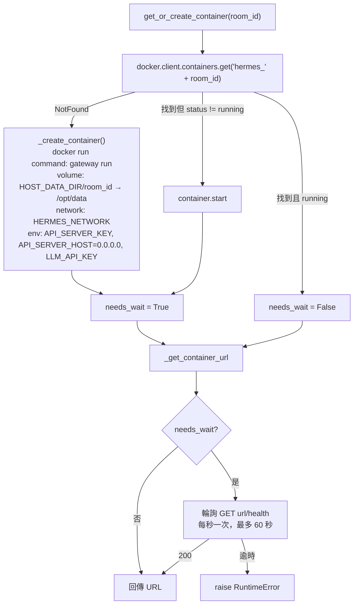
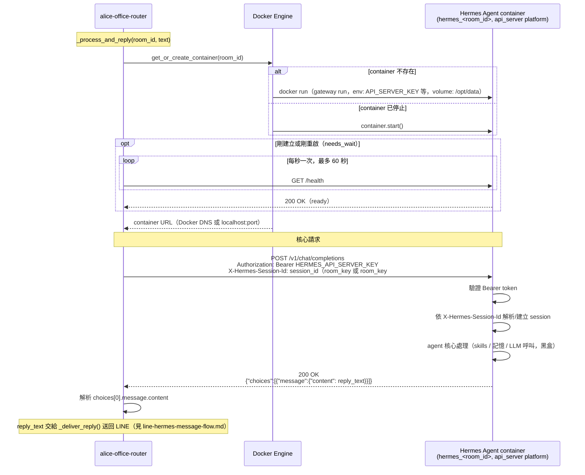

# Router ↔ Hermes Agent Container 通訊協定

聚焦說明：`alice-office-router` 怎麼把訊息送進某個聊天室專屬的 Hermes Agent
container，以及 container 內的 Hermes Agent 怎麼收、怎麼回。內容依現行實作整理
（`core.py`、`container_manager.py`、`hermes_client.py`），非設計文件。

範圍**不含** LINE Platform 端的簽章驗證、webhook 事件解析與 Push 回覆——那部分見
`docs/line-hermes-message-flow.md`；為何整體架構選擇這種 router-issued
`api_server` 呼叫而非 Hermes 內建 LINE adapter，見
`docs/hermes-agent-line-gateway-comparison.md`。

## 一句話總結

Router 與 Hermes container 之間**只有一種**溝通管道：HTTP，`POST
/v1/chat/completions`（Hermes 內建的 OpenAI-compatible `api_server`
platform）。純文字進、純文字出；container 完全不知道 LINE 的存在，也拿不到任何
LINE 憑證。

## 前置步驟：Router 怎麼找到 container 的位址

在能發 request 之前，router 得先知道要打去哪個 URL。這一步由
`get_or_create_container(room_id, config)` 負責（`container_manager.py:226`），
用模組層級的 `threading.Lock` 避免同房間併發請求造成重複建立：



要點：

- **命名規則**：container 名稱固定為 `hermes_{room_id}`，一個聊天室對應一個
  container，用 Docker 做硬隔離（`container_manager.py:248`）。
- **URL 解析**（`_get_container_url()`，`container_manager.py:148-178`）：
  - `ROUTER_IN_DOCKER=True`（正式部署）時，router 跟 Hermes container 在同一個
    Docker network 上，直接用 container name 當 hostname：
    `http://hermes_{room_id}:{HERMES_INTERNAL_PORT}`。
  - `ROUTER_IN_DOCKER=False`（本機 macOS 開發）時，router 跑在 host 上，改讀
    container 啟動時動態發布的 host port：`http://localhost:{host_port}`。
- **環境變數**（`_build_container_env()`，`container_manager.py:54-74`）：只給
  `API_SERVER_KEY`、`API_SERVER_HOST=0.0.0.0`、（若有設定）`LLM_API_KEY`。**不傳
  任何 `LINE_*` 憑證**——container 無法自行對 LINE API 做任何呼叫。
- **啟動指令是 `gateway run`**：只啟用 Hermes 內建的 `api_server` platform，不
  啟用內建的 LINE adapter（Hermes 原生支援 20 種 platform adapter，這裡刻意只開
  一種）。
- 首次建立或從 stopped 重啟時才需要輪詢 `/health`（真實 Hermes image 要跑完 s6
  supervision、skill sync、gateway startup，比先前的 mock 慢很多）；已在
  running 的既有 container 直接回傳 URL，不必等待。

## 核心請求：`ask_hermes_agent()`

`hermes_client.py:12`，拿到 base URL 後直接呼叫：

```
POST {base_url}/v1/chat/completions
Headers:
  Authorization: Bearer {HERMES_API_SERVER_KEY}
  X-Hermes-Session-Id: {session_id}
Body:
  {"messages": [{"role": "user", "content": "<使用者訊息文字>"}]}
```

- **`X-Hermes-Session-Id: session_id`**：讓同一聊天室的對話在 Hermes 端維持 session
  連續性；不同房間天生是不同 container，互不相通。session id **不再固定等於
  `room_key`**：router 依房間目前的 session epoch 推導（`session_hygiene.session_id_for`）
  ——epoch 0 送裸 `room_key`（與既有 session 相容），epoch N>0 送 `room_key#N`。換一個
  新值 = Hermes 靜默開全新 session，是本 repo 控制 context 成長的手段，完整規則見
  `docs/session-hygiene.md`。
- **`Authorization: Bearer`**：跟容器建立時注入的 `API_SERVER_KEY` 比對，是
  router↔container 唯一的驗證機制。
- **Timeout 120 秒**（`_REQUEST_TIMEOUT_SECONDS`），比 LINE webhook 本身的等待
  時間長得多——這也是為什麼整段呼叫必須在 `BackgroundTasks` 裡進行，而不是同步
  等待再回應 LINE。
- **回應解析**：`ask_hermes_agent` 回傳 `AgentReply{text, prompt_tokens}`。`text` 取
  `choices[0].message.content`；`choices` 為空或 `content` 不是非空字串時 `raise
  ValueError`，視為 Hermes 沒給出可用回覆。`prompt_tokens` 取自回應的 `usage.prompt_tokens`
  （缺 `usage` 或回報 <=0 → 正規化為 `None`，0 是 server「沒統計」的預設），供 session
  輪替的 token 水位判斷用（累計語意警語見 `docs/session-hygiene.md`）。

### 媒體訊息不走這條 API body

圖片/語音/影片/檔案**不會**編碼進 `/v1/chat/completions` 的 request body（Hermes
`api_server` 本身也只吃 `image_url`/inline base64 圖片，不吃 file/audio/video
part）。Router 改用「共享檔案落地」策略（`channels/line/events.py::_download_and_note_media()`）：

1. Router 用 LINE Content API 把二進位下載下來，寫進
   `config.DATA_DIR/{room_id}/incoming/{filename}`。
2. 該路徑透過 Docker volume mount 對應到 container 內的
   `{CONTAINER_DATA_DIR}/incoming/{filename}`（即 `/opt/data/incoming/...`）。
3. Router 只送一則文字通知作為 `/v1/chat/completions` 的 `content`，例如：
   `[使用者傳送了一個 image 檔案，已存放於 /opt/data/incoming/xxx.jpg，請視需要
   用你的工具讀取並回覆。]`
4. Container 內真正的 Hermes agent 用自己的 vision/STT/檔案工具讀那個路徑，
   router 不試圖解讀媒體內容本身。

## Hermes Agent 端怎麼收

Container 內由 `api_server` platform（`gateway run` 啟動的唯一介面）接手：

1. 比對 `Authorization: Bearer` 是否等於自己的 `API_SERVER_KEY`。
2. 依 `X-Hermes-Session-Id` 找回（或新建）對應的 session，維持對話上下文。
3. 把 `messages[-1].content` 當使用者輸入交給同進程內的 agent 核心（skills、
   記憶、LLM 呼叫都在 container 內部完成，對 router 而言是黑盒）。
4. 產生回覆後，包成標準 OpenAI chat completion 格式回傳：
   `{"choices": [{"message": {"content": "<回覆文字>"}}]}`。

Hermes agent 完全不知道自己在跟 LINE 互動——它看到的只是「api_server 收到一則
帶 session id 的文字訊息」，跟 LINE 的耦合、驗簽、Push/Reply 全部由 router 在這
一層之外處理完畢。

## 時序圖



## 錯誤處理（這一段涉及的部分）

| 階段 | 失敗條件 | 行為 |
|---|---|---|
| `get_or_create_container` | Docker API 錯誤 | log error，`_process_and_reply` 中止，使用者收不到回覆 |
| `get_or_create_container` | `/health` 60 秒內未回 200 | `raise RuntimeError`，同上中止 |
| `ask_hermes_agent` | HTTP 錯誤（非 2xx、連線失敗、逾時） | `httpx.HTTPError`，log error，中止 |
| `ask_hermes_agent` | 回應無 `choices` 或 `content` 為空 | `raise ValueError`，log error，中止 |

`core.py::_ask_agent()` 對這兩步各自 `try/except`，失敗只記 log 不
往外拋——此時 LINE webhook 早已回過 200，沒有 HTTP response 可以再回錯誤給任何
人，只能從 router 的 log 觀察到。

## 關鍵設計要點

- **單一協定**：router↔container 只有 `/v1/chat/completions` 這一條路，沒有
  其他 API 或直接的 IPC。
- **隔離靠 container，不靠協定**：協定本身（Bearer + session header）很單純，
  真正的房間隔離來自「一個 room_id 一個 Docker container」這個更外層的設計。
- **container 對 LINE 零知情**：不傳憑證、不傳 LINE 專屬欄位，agent 收到的只是
  「文字 + session id」，出站媒體、回覆分段、Markdown 清理等 LINE 專屬邏輯全部
  留在 router 端處理。
- **媒體走檔案系統、不走 API body**：避免疊床架屋改用 base64 多模態，也繞開了
  `api_server` 本身不支援 file/audio/video content part 的限制。
