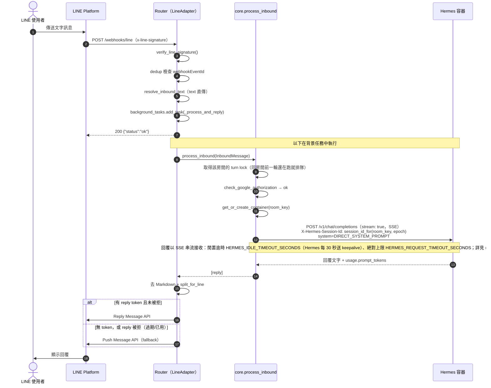
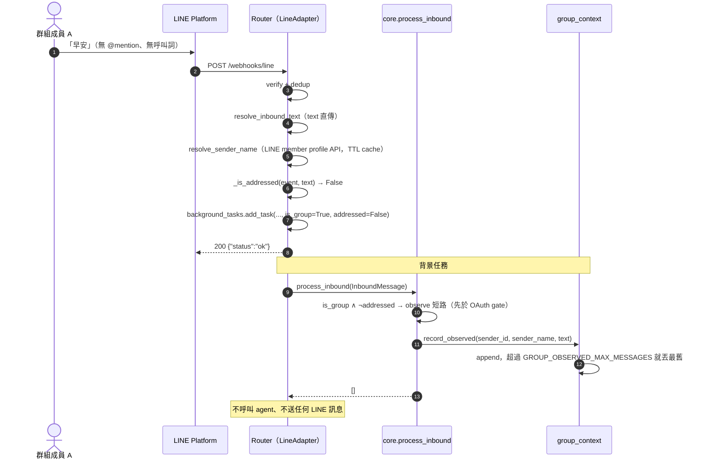
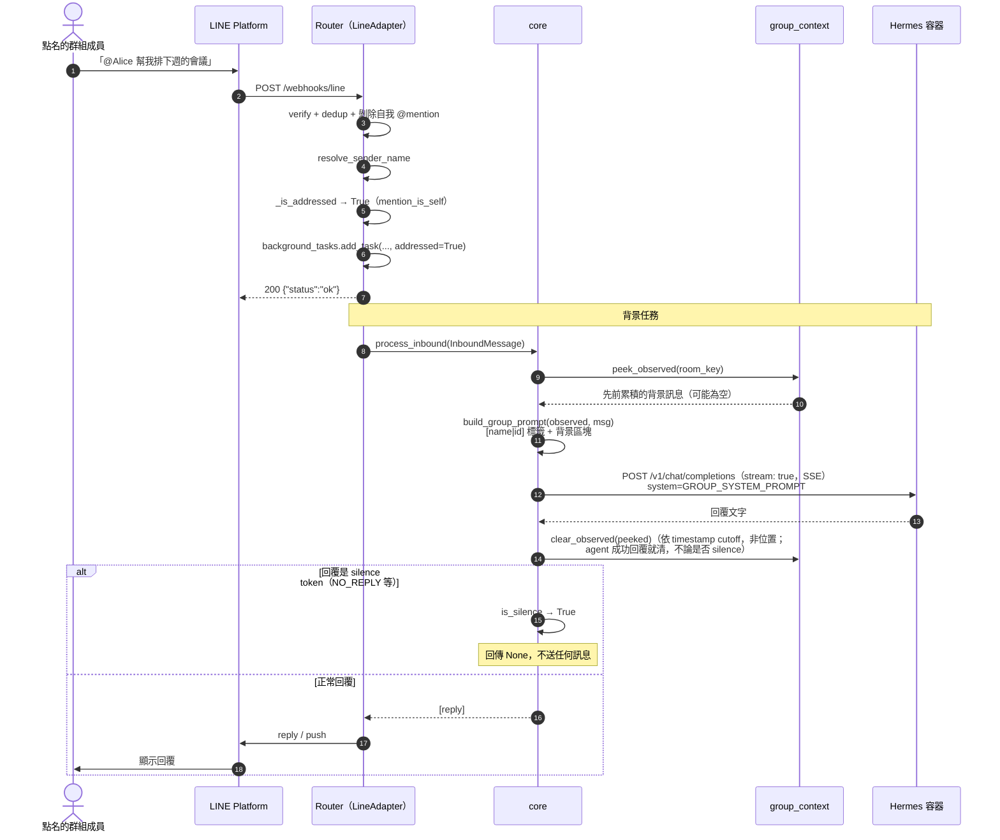
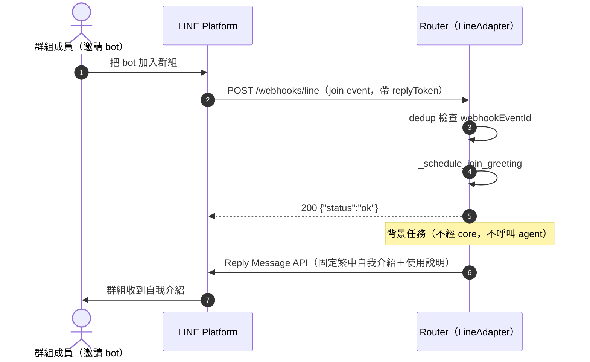
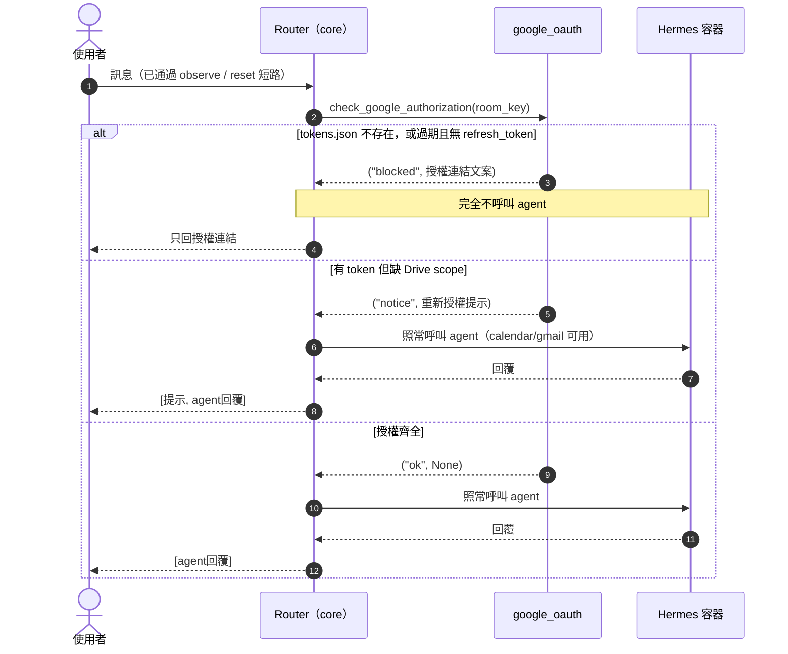
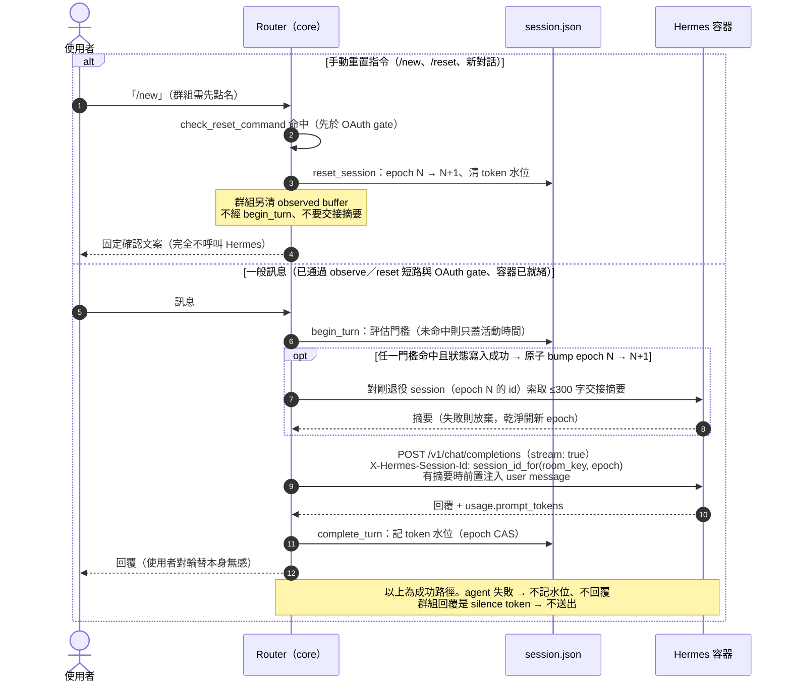
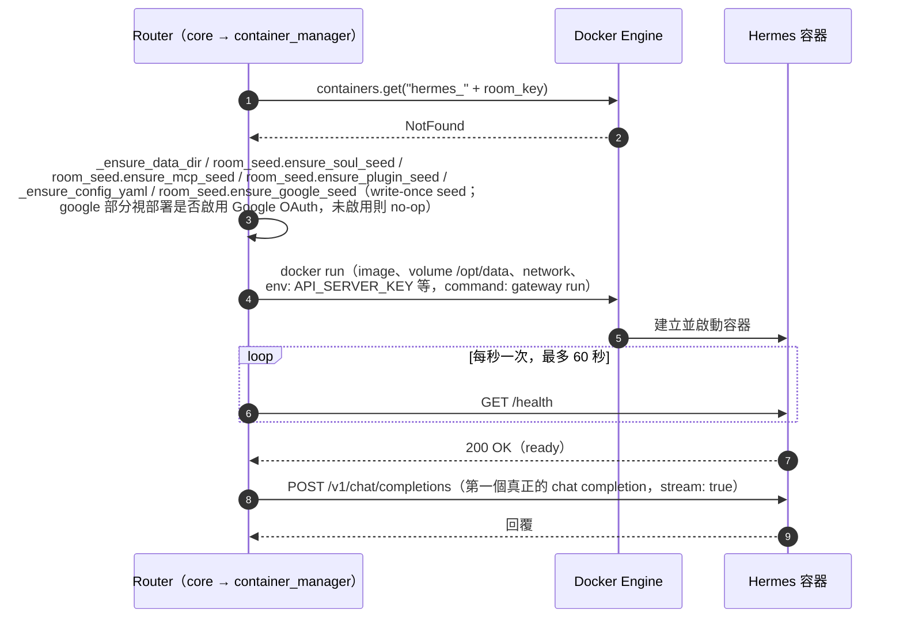
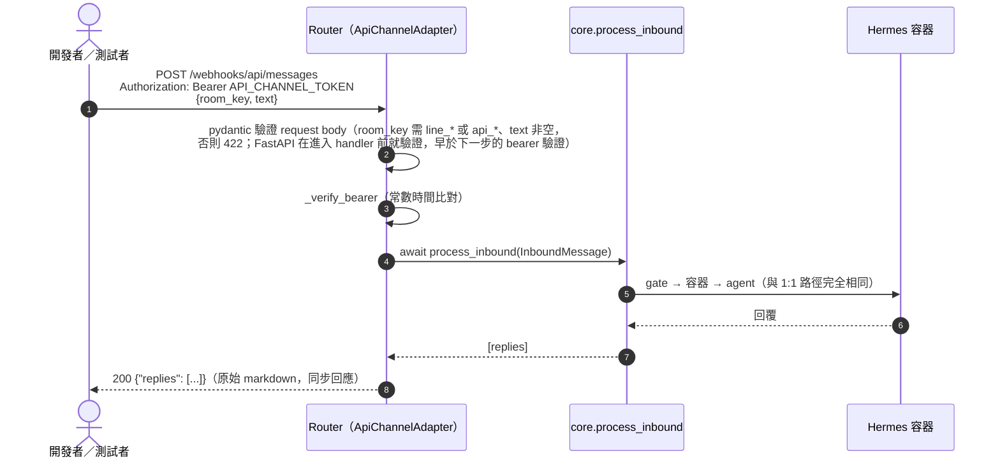
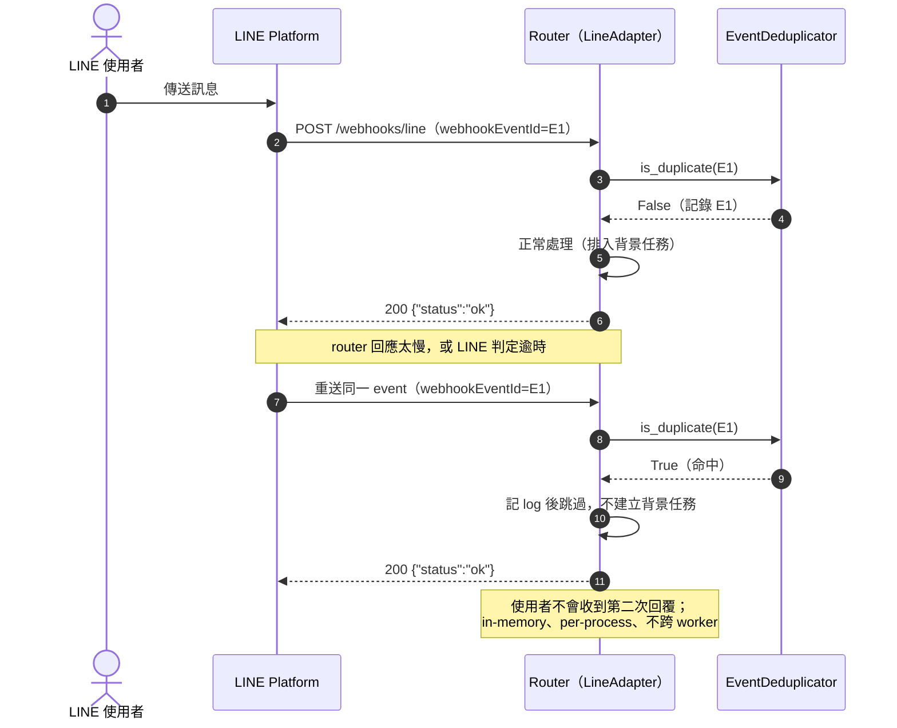

# Sequence Diagrams 彙整 — Alice Office Router

依 2026-08-28 的程式碼現況繪製。這份文件的角色是**導覽索引＋關鍵路徑視覺化**，
比照 AGENTS.md「文件地圖」的精神：每張圖只畫到能看懂分支在哪裡分岔為止，實作
細節（欄位格式、錯誤處理總表、併發推理）一律連到對應的權威文件，不在此重複。
對應的 use case 總覽見 `docs/use-case-diagram.md`。

---

## 1. 1:1 一般訊息（happy path + reply/push fallback）

最基本的路徑：驗簽 → 立即回 200 → 背景任務才真正跑容器與 agent → reply token
優先、過期或被拒才 fallback push。

細節（envelope 解析、多 event 批次、媒體同步下載、錯誤處理總表）見
`docs/line-hermes-message-flow.md`；router↔container 協定欄位見
`docs/router-hermes-agent-protocol.md`。

> 「取得該房間的 turn lock」沒有單獨畫一條 lane：它是 `core._route` 裡一個 process-local
> 的 per-room `asyncio.Lock`，同房間的第二則訊息在這裡排隊（FIFO，不丟訊息，等到時記一筆
> `room_turn_queued` log），不同房間互不影響。`system=DIRECT_SYSTEM_PROMPT` 是部署層對
> 1:1 回覆形狀的規範（精簡、大任務分段交付），見 `docs/prd.md` FR-01。

---

## 2. 群組訊息 — 未點名（僅寫入背景，不回覆）

`userA 跟 userB 問早` 這種情境：訊息被記錄成背景脈絡，但完全不呼叫 agent、
不送任何 LINE 訊息。

觸發判斷（`@mention` vs 呼叫詞）與 observed buffer 的完整格式見
`docs/group-chat-design.md` §4、§6。

---

## 3. 群組訊息 — 點名（讀 buffer → 組 prompt → 呼叫 agent → 清 buffer / silence 判斷）

點名後才把先前的背景一次帶給 agent；agent 回覆若是 silence token 則整段被丟棄，
buffer 只在 agent 成功回覆後才清空（失敗保留，避免背景遺失）。

Prompt 組裝格式（`[名稱|ID]` 標籤、injection 防護）、silence token 集合見
`docs/group-chat-design.md` §7；`group_context.py` 模組 docstring 有 buffer 的
併發推理（單 worker、peek→clear 之間的空窗如何處理）。

---

## 4. Bot 被拉進群組（join event → 自我介紹）

`join` event 直接在 adapter 層用 reply token 回固定文案，完全不經 `core`、
不問 agent。

文案常數與 `leave`/`memberLeft`/`memberJoined` 目前刻意不處理的原因見
`docs/group-chat-design.md` §9。

---

## 5. Google OAuth gate 三態（ok／notice／blocked）對訊息流程的影響

`check_google_authorization` 每則要進 agent 的訊息都跑一次。**重點：`blocked`
時完全不呼叫 agent**——這一步在 observe 短路與手動 reset 之後、`_reply_for`
之前執行。三態判斷本身的邏輯圖見 README「訊息授權判斷流程」，這裡補一張真正的
時序版本。

token 過期/scope 判斷細節、`account_key` 小寫轉換規則、影響既有房間的注意事項見
README「Google Workspace 整合」與 `docs/google-workspace-integration-summary.md`。

---

## 6. Session 重置／自動輪替 — 精簡總覽

換新 session 有**兩條彼此獨立的路徑**，不要混為一談：

- **手動重置**（`/new`／`/reset`／`新對話`；群組要先點名，如 `@bot /new` 或「呼叫詞 +
  指令」）：`process_inbound` 在 OAuth gate **之前**以 `check_reset_command` 短路，
  `reset_session` 把 epoch +1、清 token 水位，群組另清 observed buffer，直接回固定
  確認文案——**不經 `begin_turn`、不要交接摘要、完全不呼叫 agent**（乾淨重來）。
- **自動輪替**（距上次進 agent 的訊息超過 `SESSION_IDLE_RESET_MINUTES`（預設 1 天）、
  上一輪 token 用量超標）：一則正常要進 agent 的
  訊息在 `_ask_agent` 裡由 `begin_turn` 同一次同步呼叫判斷並原子地 bump epoch，
  命中就先跟**剛退役**的 session 要一份 ≤300 字交接摘要、以 user message 前置注入
  新 epoch 的第一則訊息。

**這裡不重畫細節**，權威版本在 `docs/session-hygiene.md`：狀態檔欄位與 session id 推導見
「機制：router 自管 session epoch」、觸發條件與手動重置的時序圖見「三種輪替」、epoch CAS
併發推理見「併發推理（single-worker 前提）」、交接失敗的取捨見「交接流程與注入格式」與
「已知限制」。自動輪替＋交接的時序圖只畫在本節。

---

## 7. Container 冷啟動（第一次訊息進某房間）

第一則訊息落進一個還沒有 container 的房間時，seed（`SOUL.md`／`config.yaml`／
`mcp`／`plugins`）在 `docker run` **之前**完成——因為 `config.yaml` 的渲染要讀
剛 seed 出來的 MCP manifest，且 `SOUL.md` 一旦晚於 `docker run`，Hermes 會自己
先生一份預設版、之後就永遠蓋不掉（write-once）。

命名規則、URL 解析（container 化 vs host 模式）、write-once seed 的完整規則見
`docs/router-hermes-agent-protocol.md`「前置步驟」節與 AGENTS.md
「Hermes Container Model」。

---

## 8. API channel 請求（同步回覆，不經 LINE 驗簽/reply token）

第一方通道給 TUI／mobile／dev 用：Bearer 驗證取代 HMAC 簽章、同一個
`process_inbound` 管線，但**同步**在 HTTP response 裡回原始 markdown（不去
Markdown、不分段、不經 background task）。

與 LINE adapter 的逐項對照（驗證、dedup、回覆時機、出站格式化）見
`docs/channels-walkthrough.md` Step 7。

---

## 9. Webhook 事件去重（同一個 webhookEventId 重送）

LINE 的 webhook 投遞是 at-least-once；router 用 in-memory、有界的
`EventDeduplicator` 擋掉重送，讓使用者不會收到兩次回覆。

有界策略（上限 1000，滿了淘汰最舊 10%）與跨 worker 的限制見
`docs/line-hermes-message-flow.md`「關鍵設計要點小結」。

---

## 與其他文件的關係

- use case 總覽（誰、能做什麼）：`docs/use-case-diagram.md`
- 系統三層結構：`docs/architecture-c4.md`
- 群組聊天完整設計：`docs/group-chat-design.md`
- Session 輪替權威版本：`docs/session-hygiene.md`
- 訊息流程逐檔導讀：`docs/channels-walkthrough.md`、`docs/line-hermes-message-flow.md`
- router↔container 協定：`docs/router-hermes-agent-protocol.md`
