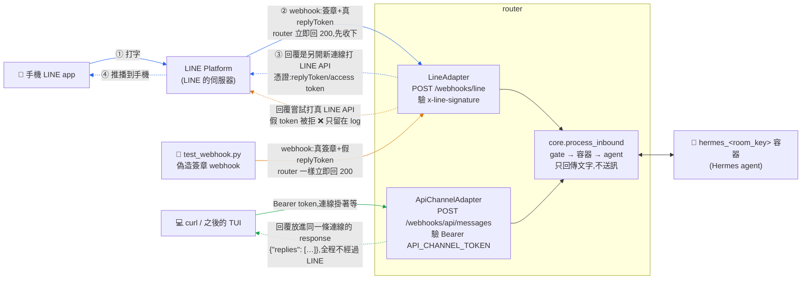

# 訊息進出的三條路:真實 LINE、偽造 webhook、API curl

回答一個問題:**不開手機 LINE app,要怎麼測 end-to-end、又要去哪裡看回覆?**

先講最重要的觀念,看圖才不會迷路:

> **這個系統沒有統一的「送回覆」機制——誰把訊息帶進來,誰負責送回去。**
> `core.process_inbound` 只「回傳」文字給 adapter,它不送訊。
> 所以訊息從哪條路進來,就決定了回覆從哪條路出去、需要什麼憑證。

## 全景圖:三條路的進與出

- **實線 ──▶**:訊息進來的路
- **虛線 -–▶**:回覆走的路



三條路徑用顏色區分:🔵 真實 LINE、🟠 偽造 webhook、🟢 API curl。
三條路在 `core.process_inbound` 之後**完全共用**同一段:gate → 找/建
`hermes_<room_key>` 容器 → 問 Hermes agent。差別全部在「進」和「出」。

## 逐條說明

### 🔵 真實路徑:手機 LINE app

回覆是**兩段式**的:webhook 進來時 router 只回 200 表示「收到」,連線就斷了;
agent 算完後,router **另開一條新連線**打 LINE 的伺服器(先用 replyToken 回覆,
失敗改用 access token push),LINE 再推播到手機。這就是為什麼 LINE 回覆需要
token——回覆是一個獨立的出站 request,對 LINE 來說要驗明正身。

### 🟠 測試路 A:偽造簽章的 webhook(`scripts/test_webhook.py`)

自己扮演 LINE Platform:組一樣格式的事件 JSON,用 `.env` 裡的
`LINE_CHANNEL_SECRET` 算出**真的**簽章,POST 到 `/webhooks/line`——router
驗簽會過,分不出真假。但 replyToken 是捏造的(LINE 從沒發過這個 token),
所以回覆那段打到真 LINE API 時**必定被拒**,只會留在 router log 裡
(**預期行為,不代表管線壞掉**)。

```bash
# router 先跑著:uv run uvicorn alice_office_router.main:app --port 8000
uv run python scripts/test_webhook.py --text "今天天氣如何?"
```

用途:測 LINE 那段 code(驗簽、事件解析、去重、房間路由)。
看回覆:router log 或 `scripts/debug_room.py <room_id>`,不在終端機 response 裡。

### 🟢 測試路 B:API curl(`/webhooks/api/messages`)

回覆是**一段式**的:curl 的連線一直掛著,router 在這條連線裡同步跑完
gate → 容器 → agent,把回覆**塞進同一個 HTTP response** 原路還你。
全程不經過 LINE,所以**不需要 LINE 的任何 token**;唯一要的是
`API_CHANNEL_TOKEN`——你自己在 `.env` 設的一組密碼,擋別人亂打你的 router
(沒設這個環境變數,這個 endpoint 根本不會掛載)。

```bash
curl -s http://localhost:8000/webhooks/api/messages \
  -H "Authorization: Bearer $API_CHANNEL_TOKEN" \
  -H "Content-Type: application/json" \
  -d '{"room_key": "api_test1", "text": "你好"}' | jq
# → {"replies": ["agent 的回覆就在這裡"]}
```

`room_key` 有兩種用法:

| room_key | 意思 | 容器 / session |
|---|---|---|
| `api_<slug>`(如 `api_test1`) | 開一個純測試房 | 全新的 `hermes_api_test1` |
| `line_<native id>`(U/C/R+32hex) | **插話進既有 LINE 房間** | 跟手機共用同一個容器、同一段對話記憶 |

注意:用 `line_…` 插話時,回覆一樣只出現在你的終端機,**不會**推到手機
(回覆跟著進來的路走);但對話記憶是共用的——agent 之後在手機上記得你
curl 說過的話。

## 兩種 token,別搞混

| | LINE 的 token | `API_CHANNEL_TOKEN` |
|---|---|---|
| 是什麼 | replyToken(LINE 每則訊息發的一次性回覆券)+ channel access token | 你自己在 `.env` 亂數自訂的一組密碼 |
| 誰發的 | LINE Platform | 你自己 |
| 用在哪 | router **送回覆給 LINE** 時(出站) | curl **進門**時的 `Authorization: Bearer`(入站) |
| curl 測試需要嗎 | **不需要**(回覆不經過 LINE) | 需要 |

## 總對照

| | 🔵 真實 LINE | 🟠 偽造 webhook | 🟢 API curl |
|---|---|---|---|
| 進來的路 | LINE Platform → `/webhooks/line` | 自己 POST `/webhooks/line`(真簽章) | 自己 POST `/webhooks/api/messages` |
| LINE 段 code(驗簽/解析) | ✅ 測到 | ✅ 測到 | ✘ 跳過 |
| core 段(gate/容器/agent) | ✅ 測到 | ✅ 測到 | ✅ 測到 |
| **回覆方式** | 另開連線打 LINE API → 推播到手機 | 同左,但假 token 被拒 ❌ | **同一條連線的 HTTP response** |
| 在哪看回覆 | 手機 | router log | 終端機(response body) |
| 需要的憑證 | LINE secret + access token(router 端) | `.env` 的 LINE_CHANNEL_SECRET(算簽章用) | `.env` 的 API_CHANNEL_TOKEN |
| 手機 | 要 | 不用 | 不用 |

## 日常怎麼選

- **改 core / 容器 / agent / MCP / plugin** → 🟢 curl(最快、回覆直接看得到、
  能互動,還能用 `line_…` 插進真房間重現問題)。
- **改 `channels/line/` 的解析/驗簽/路由** → 🟠 偽造 webhook。
- **commit 前整條驗一次** → `uv run python scripts/e2e_smoke.py`
  (一鍵自動跑 🟢,加 `--line` 連 🟠 一起跑,測完自己清乾淨)。
- **只有「真的送到 LINE、手機上的顯示效果」**(切則、長訊息、推播)要用手機——
  這段走 LINE 官方 API 的穩定介面,不太會因為改 code 而壞,release 前點一輪即可。

出問題先跑 `uv run python scripts/debug_room.py <room_id>` 一鍵看容器狀態與
log;症狀排查見 `docs/troubleshooting.md`。channel 介面的設計背景見
`docs/channel-interface-design.md`。
