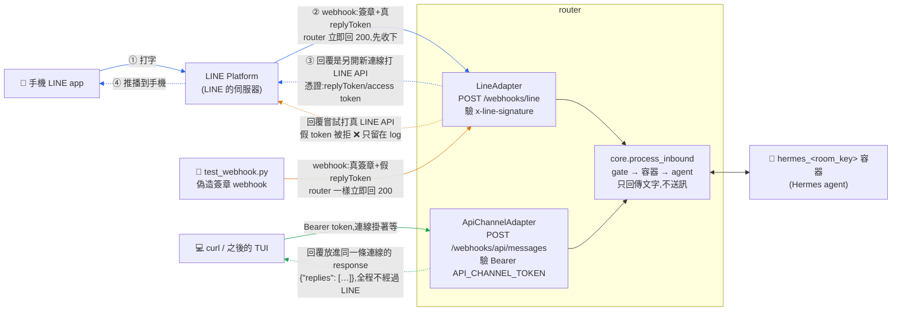

# 訊息進出的三條路:真實 LINE、偽造 webhook、API curl

回答一個問題:**不開手機 LINE app,要怎麼測 end-to-end、又要去哪裡看回覆?**

先講最重要的觀念,看圖才不會迷路:

> **這個系統沒有統一的「送回覆」機制——誰把訊息帶進來,誰負責送回去。**
> `core.process_inbound` 只「回傳」文字給 adapter,它不送訊。
> 所以訊息從哪條路進來,就決定了回覆從哪條路出去、需要什麼憑證。

## 全景圖:三條路的進與出

- **實線 ──▶**:訊息進來的路
- **虛線 -–▶**:回覆走的路


```mermaid
flowchart LR
    PHONE["📱 手機 LINE app"]
    LINEP["LINE Platform<br/>(LINE 的伺服器)"]
    SCRIPT["🧪 test_webhook.py<br/>偽造簽章 webhook"]
    CURL["💻 curl / 之後的 TUI"]

    subgraph ROUTER["router"]
        LA["LineAdapter<br/>POST /webhooks/line<br/>驗 x-line-signature"]
        AA["ApiChannelAdapter<br/>POST /webhooks/api/messages<br/>驗 Bearer API_CHANNEL_TOKEN"]
        CORE["core.process_inbound<br/>gate → 容器 → agent<br/>只回傳文字,不送訊"]
        LA --> CORE
        AA --> CORE
    end

    HERMES["🤖 hermes_&lt;room_key&gt; 容器<br/>(Hermes agent)"]
    CORE <--> HERMES

    PHONE -->|"① 打字"| LINEP
    LINEP -->|"② webhook:簽章+真replyToken<br/>router 立即回 200,先收下"| LA
    LA -.->|"③ 回覆是另開新連線打 LINE API<br/>憑證:replyToken/access token"| LINEP
    LINEP -.->|"④ 推播到手機"| PHONE

    SCRIPT -->|"webhook:真簽章+假replyToken<br/>router 一樣立即回 200"| LA
    LA -.->|"回覆嘗試打真 LINE API<br/>假 token 被拒 ❌ 只留在 log"| LINEP

    CURL -->|"Bearer token,連線掛著等"| AA
    AA -.->|"回覆放進同一條連線的 response<br/>{&quot;replies&quot;: […]},全程不經過 LINE"| CURL

    linkStyle 3,4,5,6 stroke:#2563eb
    linkStyle 7,8 stroke:#d97706
    linkStyle 9,10 stroke:#16a34a
```

三條路徑用顏色區分:🔵 真實 LINE、🟠 偽造 webhook、🟢 API curl。
三條路在 `core.process_inbound` 之後**完全共用**同一段:gate → 找/建
`hermes_<room_key>` 容器 → 問 Hermes agent。差別全部在「進」和「出」。

## 逐條說明

### 🔵 真實路徑:手機 LINE app

回覆是**兩段式**的:webhook 進來時 router 只回 200 表示「收到」,連線就斷了;
agent 算完後,router **另開一條新連線**打 LINE 的伺服器(先用 replyToken 回覆,
失敗改用 access token push),LINE 再推播到手機。這就是為什麼 LINE 回覆需要
token——回覆是一個獨立的出站 request,對 LINE 來說要驗明正身。

### 🟠 測試路 A:偽造簽章的 webhook(`scripts/test_webhook.py`)

自己扮演 LINE Platform:組一樣格式的事件 JSON,用 `.env` 裡的
`LINE_CHANNEL_SECRET` 算出**真的**簽章,POST 到 `/webhooks/line`——router
驗簽會過,分不出真假。但 replyToken 是捏造的(LINE 從沒發過這個 token),
所以回覆那段打到真 LINE API 時**必定被拒**,只會留在 router log 裡
(**預期行為,不代表管線壞掉**)。

```bash
# router 先跑著:uv run uvicorn alice_office_router.main:app --port 8000
uv run python scripts/test_webhook.py --text "今天天氣如何?"
```

用途:測 LINE 那段 code(驗簽、事件解析、去重、房間路由)。
看回覆:router log 或 `scripts/debug_room.py <room_id>`,不在終端機 response 裡。

#### 🟠+ 加掛本機 LINE stub:直接看到 router 回了什麼

偽造 webhook 唯一的缺點就是「回覆看不到」——假 replyToken 一定被真 LINE 拒絕。
把 router 的 `LINE_API_BASE_URL` 指到 `scripts/line_stub.py`(本機假 LINE
Platform,只用標準函式庫),reply / push / 群組成員名稱查詢就全部落在本機,
一行一個 JSON 印到 stdout 並附加到 log 檔:

```bash
# 終端機 1:起 stub(預設 8099 埠,log 預設 data/_line_stub/requests.jsonl)
uv run python scripts/line_stub.py
uv run python scripts/line_stub.py --port 9000 --log /tmp/line.jsonl   # 想換就換

# 終端機 2:router 指向 stub(host 模式;容器模式改在 .env 設同一個變數再 up -d)
LINE_API_BASE_URL=http://localhost:8099 uv run fastapi dev src/alice_office_router/main.py --reload-dir src

# 終端機 3:照常送偽造 webhook
uv run python scripts/test_webhook.py --text "今天天氣如何?"

# 看 router 到底回了什麼(stub 的終端機已經印了,也可以撈檔)
tail -f data/_line_stub/requests.jsonl | jq '{path, texts}'
```

stub 回的是 LINE 官方格式的成功回應(`sentMessages`),所以 router 這邊會判定
「送出成功」,不會再 fallback 或報錯;群組測試時
`GET /v2/bot/group/<groupId>/member/<userId>` 回固定假名稱
`成員-<userId 末四碼>`,不需要真的群組成員。沒對到的端點一律回 200 `{}` 並在
log 標 `"matched": false`,SDK 永遠不會炸。

⚠️ `LINE_API_BASE_URL` 只給本機測試用,正式部署一定要留空(＝真的 LINE
Platform)。log 檔寫在 `data/` 底下,已經在 `.gitignore` 裡,不會進版控。

#### 🟠+ 群組與事件

群組訊息除了 `--group-id`,還可以加 `--sender-id`(模擬 source 裡帶
`userId` 的已加好友成員——LINE 真實群組訊息的樣子;不給就是匿名發話者)與
`--mention`(文字前加對 bot 的 @mention,讓 `_is_addressed` 判定為真)。
`--event follow|join` 送一個沒有 `message` 的事件(加好友/被拉進群組),測
LINE 事件層的分派,不用真的送一則訊息:

```bash
uv run python scripts/test_webhook.py --group-id "C_GROUP" --sender-id "U_A" --mention --text "明天有什麼會"
uv run python scripts/test_webhook.py --event follow --user-id "U_NEW"
uv run python scripts/test_webhook.py --event join --group-id "C_NEW"
```

Google 授權相關的測試不用每次都走瀏覽器:`scripts/google_reauth.py --member
<member_key>` 把授權結果寫進指定成員檔(不給就是 `account_key(room_id)`,
即 1:1 房間的舊行為);`scripts/simulate_oauth.py <room_id> <member_key>
--from-member-file <既有成員檔>` 直接複製一份現成 token 進房間的成員檔,
略過瀏覽器整段流程(見 `docs/google-auth-per-member-plan.md` §6b)。

#### 🟠+ 整段 Google 授權 e2e 的前置條件(2026-09-18 實跑過的組合)

要把 `/oauth/start` → `/oauth/callback` → 寫成員檔 → 自動重跑 pending 訊息整條
在本機跑完(plan §6b 的 T1–T14),四件事先擺好:

1. **假的 Google token 端點**。`/oauth/callback` 要拿 `code` 去跟 Google 換 token,
   本機沒有真的 `code`,所以讓 stub 兼差扮演:

   ```bash
   uv run python scripts/line_stub.py \
     --google-token-file data/<既有房間>/google/members/<member_key>.json
   ```

   router 端同時設 `GOOGLE_TOKEN_URL=http://localhost:8099/token`(`Settings` 的
   欄位,預設是真的 `https://oauth2.googleapis.com/token`)。沒給 `--google-token-file`
   時那個端點一律回 400,免得誤以為換到 token 了。

2. **router 自己跑在 host 上、換一個埠**。`fastapi dev` 在 repo 根目錄要指定檔案
   (`fastapi dev src/alice_office_router/main.py`),直接 `uv run fastapi dev` 會找不到
   app;測 e2e 時用 uvicorn 最省事(順便避開 `data/` 被寫入觸發 reload 的老問題):

   ```bash
   GOOGLE_TOKEN_URL=http://localhost:8099/token \
   LINE_API_BASE_URL=http://localhost:8099 \
   uv run uvicorn alice_office_router.main:app --port 8011
   ```

3. **偽造 webhook 指到那個埠**。`scripts/test_webhook.py` 讀環境變數 `ROUTER_URL`
   (整條 URL,含路徑;預設 `http://localhost:8000/webhook`):

   ```bash
   ROUTER_URL=http://localhost:8011/webhook uv run python scripts/test_webhook.py --text "今天幾號"
   ```

4. **拿來當來源的 token 要是活的**。stub 的 `expires_in` 固定回 3600,但 access
   token 本身是從那份成員檔照抄的——檔案裡的 token 早就過期的話,router 會把它記成
   「還有一小時」,Google MCP 拿去打 API 直接吃 401。先用
   `uv run python scripts/google_reauth.py <room_id> --member <member_key>` 換一份新的
   access token 再當來源,不然就要有心理準備看到 401(授權流程本身仍然驗得過)。

容器名字是 `hermes_` + **房間 key**(`hermes_line_<userId>`),不是裸 LINE ID——
`docker logs` / `docker exec` 找不到容器時先確認這個前綴。

### 🟢 測試路 B:API curl(`/webhooks/api/messages`)

回覆是**一段式**的:curl 的連線一直掛著,router 在這條連線裡同步跑完
gate → 容器 → agent,把回覆**塞進同一個 HTTP response** 原路還你。
全程不經過 LINE,所以**不需要 LINE 的任何 token**;唯一要的是
`API_CHANNEL_TOKEN`——你自己在 `.env` 設的一組密碼,擋別人亂打你的 router
(沒設這個環境變數,這個 endpoint 根本不會掛載)。

```bash
curl -s http://localhost:8000/webhooks/api/messages \
  -H "Authorization: Bearer $API_CHANNEL_TOKEN" \
  -H "Content-Type: application/json" \
  -d '{"room_key": "api_test1", "text": "你好"}' | jq
# → {"replies": ["agent 的回覆就在這裡"]}
```

`room_key` 有兩種用法:

| room_key | 意思 | 容器 / session |
|---|---|---|
| `api_<slug>`(如 `api_test1`) | 開一個純測試房 | 全新的 `hermes_api_test1` |
| `line_<native id>`(U/C/R+32hex) | **插話進既有 LINE 房間** | 跟手機共用同一個容器、同一段對話記憶 |

注意:用 `line_…` 插話時,回覆一樣只出現在你的終端機,**不會**推到手機
(回覆跟著進來的路走);但對話記憶是共用的——agent 之後在手機上記得你
curl 說過的話。

## 兩種 token,別搞混

| | LINE 的 token | `API_CHANNEL_TOKEN` |
|---|---|---|
| 是什麼 | replyToken(LINE 每則訊息發的一次性回覆券)+ channel access token | 你自己在 `.env` 亂數自訂的一組密碼 |
| 誰發的 | LINE Platform | 你自己 |
| 用在哪 | router **送回覆給 LINE** 時(出站) | curl **進門**時的 `Authorization: Bearer`(入站) |
| curl 測試需要嗎 | **不需要**(回覆不經過 LINE) | 需要 |

## 總對照

| | 🔵 真實 LINE | 🟠 偽造 webhook | 🟢 API curl |
|---|---|---|---|
| 進來的路 | LINE Platform → `/webhooks/line` | 自己 POST `/webhooks/line`(真簽章) | 自己 POST `/webhooks/api/messages` |
| LINE 段 code(驗簽/解析) | ✅ 測到 | ✅ 測到 | ✘ 跳過 |
| core 段(gate/容器/agent) | ✅ 測到 | ✅ 測到 | ✅ 測到 |
| **回覆方式** | 另開連線打 LINE API → 推播到手機 | 同左,但假 token 被拒 ❌ | **同一條連線的 HTTP response** |
| 在哪看回覆 | 手機 | router log(掛 stub 後看 stub log) | 終端機(response body) |
| 需要的憑證 | LINE secret + access token(router 端) | `.env` 的 LINE_CHANNEL_SECRET(算簽章用) | `.env` 的 API_CHANNEL_TOKEN |
| 手機 | 要 | 不用 | 不用 |

## 日常怎麼選

- **改 core / 容器 / agent / MCP / plugin** → 🟢 curl(最快、回覆直接看得到、
  能互動,還能用 `line_…` 插進真房間重現問題)。
- **改 `channels/line/` 的解析/驗簽/路由** → 🟠 偽造 webhook(想連回覆內容
  一起看,就再掛 `scripts/line_stub.py`)。
- **commit 前整條驗一次** → `uv run python scripts/e2e_smoke.py`
  (一鍵自動跑 🟢,加 `--line` 連 🟠 一起跑,測完自己清乾淨)。
- **只有「真的送到 LINE、手機上的顯示效果」**(切則、長訊息、推播)要用手機——
  這段走 LINE 官方 API 的穩定介面,不太會因為改 code 而壞,release 前點一輪即可。

出問題先跑 `uv run python scripts/debug_room.py <room_id>` 一鍵看容器狀態與
log;症狀排查見 `docs/troubleshooting.md`。channel 介面的設計背景見
`docs/channel-interface-design.md`。
