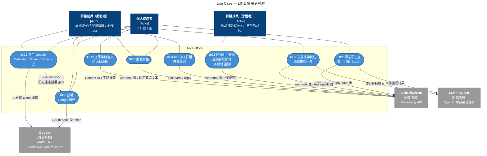
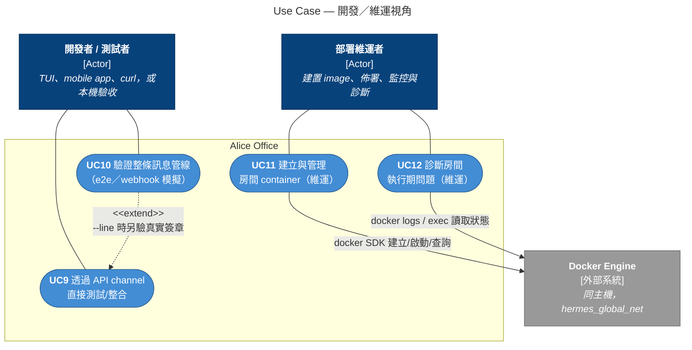

# Use Case Diagram — Alice Office Router

依 2026-08-28 的程式碼現況繪製（含群組聊天功能，`e9af294 feat: serve LINE group chats`
已合併）。內容是「系統對外能做什麼」的總覽，不含流程細節——流程細節見
`docs/sequence-diagrams.md`；系統結構見 `docs/architecture-c4.md`。

**記法沿用 `docs/architecture-c4.md` 的風格**：Mermaid 目前（查證至 2026 年中）沒有
穩定的原生 use case diagram 語法，一樣用 flowchart 手工畫，避免原生語法的排版引擎讓
標籤重疊。

**圖例（兩張圖共用）**：深藍框＝Actor（人）；灰框＝secondary actor／外部系統；
淺藍 stadium `([ ])`＝Use Case；沒有額外上色的大框＝系統邊界（比照 C4 doc 的
subgraph 預設樣式）；虛線箭頭＝`<<include>>`/`<<extend>>` 關係；實線＝actor 與
use case 的關聯。每個 use case 標了編號（UC1…），對應圖後方的程式碼／文件表。

---

## 圖一：LINE 使用者視角

三種人類 actor：1:1 聊天室的個人使用者、群組裡主動點名 bot 的成員、群組裡只是
被動提供背景脈絡的旁觀成員。三個 secondary actor（外部系統）：LINE Platform（訊息
進出的唯一通道）、Google（OAuth 授權與 Calendar/Gmail/Drive API）、LLM Provider
（agent 產生回覆時呼叫的推理服務）。

### UC1–UC8 對應的程式碼／文件

| # | Use case | 主要程式碼 | 相關文件 |
|---|---|---|---|
| UC1 | 傳送訊息並取得回覆（1:1） | `core.py::process_inbound`／`_ask_agent`、`channels/line/adapter.py::_dispatch_message` | `docs/line-hermes-message-flow.md` |
| UC2 | 在群組中點名助理取得回覆 | `channels/line/adapter.py::_is_addressed`／`_schedule_group_message`、`core.py::_ask_group_agent`、`group_context.py::build_group_prompt` | `docs/group-chat-design.md` §4、§7 |
| UC3 | 在群組中被動提供背景脈絡 | `core.py::process_inbound`（observe short-circuit）、`group_context.py::record_observed` | `docs/group-chat-design.md` §6 |
| UC4 | bot 加入群組自我介紹 | `channels/line/adapter.py::_schedule_join_greeting`（`_GROUP_JOIN_GREETING`，不經 core） | `docs/group-chat-design.md` §9 |
| UC5 | 重置對話 | `session_hygiene.py::check_reset_command`／`reset_session`、`core.py::process_inbound`（manual reset 短路） | `docs/session-hygiene.md`「手動指令」節 |
| UC6 | 授權 Google 服務 | `google_oauth.py::oauth_start`／`oauth_callback`／`_store_token` | README「Google Workspace 整合」、`docs/google-workspace-integration-summary.md` |
| UC7 | 使用 Google Calendar／Gmail／Drive 工具 | `google_oauth.py::check_google_authorization`（gate）、`src/hermes/mcp/{gmail,drive,google-calendar}/` | README「訊息授權判斷流程」 |
| UC8 | 上傳媒體檔案給助理處理 | `channels/line/events.py::_download_and_note_media`／`resolve_inbound_text` | `docs/line-hermes-message-flow.md` §3 |

> **UC2 的部署前提（呼叫詞）**：`addresser` 能點名 bot 只有兩種管道——
> @提及（需成員用 LINE 行動版 14.17.0+，且 LINE 桌面版／舊版完全無法 @ 官方
> 帳號）、或以部署維運者設定的 `GROUP_TRIGGER_PREFIXES` 呼叫詞開頭
> （`channels/line/adapter.py::_is_addressed`）。呼叫詞預設為空字串（只靠
> @提及），因此**部署時必須至少設定一個呼叫詞**，群組裡的桌面版使用者才叫得動
> bot，否則群組服務只對行動版使用者可用（見 `docs/group-chat-design.md`
> §14「部署前提」）。

> **UC6／UC7 也適用於群組**：`check_google_authorization` 是以 `room_key` 為
> 單位判斷（`core.py::process_inbound`），不分 1:1／群組——一則被點名的群組訊息
> 一樣會先過 Google OAuth gate，該房間（群組）尚未授權時，點名者會收到與 1:1
> 相同的授權連結；因此 `addresser` 也關聯到 UC6、UC7（整個群組共用房間層級的
> 一份 Google 授權，不是每個成員各自授權）。

> **UC8 的群組限制**：`_is_addressed` 對非 text 訊息一律回 `False`（見
> `channels/line/adapter.py`），所以群組裡的媒體檔案雖然照樣會被下載落地，
> 但只會被記進 UC3 的 observed buffer 當背景脈絡，不會馬上觸發 agent 處理——
> 除非後續有一則點名訊息把它帶進 prompt。1:1 沒有這個限制，媒體訊息永遠立刻處理。

---

## 圖二：開發／維運視角

第一方 API channel 讓開發者/測試者不經 LINE 就能直接對話或跑自動化驗證；部署維運者
負責房間 container 的生命週期與問題排查。這兩種 actor 都不受群組/1:1 區分影響——
API channel 目前只走 1:1 語意的 `InboundMessage`（`is_group` 預設 `False`）。

### UC9–UC12 對應的程式碼／文件

| # | Use case | 主要程式碼 | 相關文件 |
|---|---|---|---|
| UC9 | 透過 API channel 直接測試/整合 | `channels/api.py::ApiChannelAdapter`（`POST /webhooks/api/messages`，同步回傳，不去 Markdown/不分段） | `docs/channels-walkthrough.md` Step 7、README「用 API 通道打進房間」 |
| UC10 | 驗證整條訊息管線（e2e／webhook 模擬） | `scripts/test_webhook.py`（模擬簽章）、`scripts/e2e_smoke.py`（`--line` 額外驗真實簽章） | `docs/testing-paths.md` |
| UC11 | 建立與管理房間 container（維運） | `container_manager.py::get_or_create_container`／`_create_container`／`_ensure_config_yaml`；`room_seed.py::ensure_mcp_seed`／`ensure_plugin_seed`／`ensure_soul_seed` | `docs/architecture-c4.md` Level 2、AGENTS.md「Hermes Container Model」 |
| UC12 | 診斷房間執行期問題（維運） | `scripts/debug_room.py` | `docs/troubleshooting.md` |

---

## 與其他文件的關係

- 六段關鍵流程的完整時序：`docs/sequence-diagrams.md`
- 系統三層結構（Context／Container／Component）：`docs/architecture-c4.md`
- LINE 群組聊天的完整設計與取捨：`docs/group-chat-design.md`
- channel adapter 的分層契約：`docs/channels-walkthrough.md`
