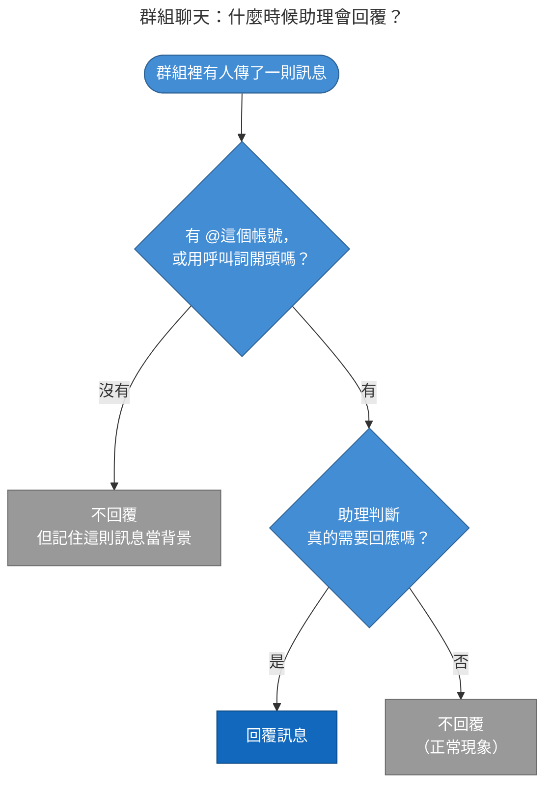

# 使用手冊 — 你的 LINE AI 助理

這份手冊給實際使用 LINE 的你，說明怎麼跟你的專屬 AI 助理互動。內容依現行系統行為
整理（2026-09-14）。如果你的部署方另外調整過設定（例如呼叫詞是哪幾個字），請以他們
另外告知的為準。

## 這是什麼

只要用 LINE 加這個官方帳號為好友，你就有一個**只服務你**（或你所在的那個群組）的
專屬 AI 助理——你的訊息與對話記憶不會被其他人看到，別人的也看不到你的。私訊是一對
一的專屬助理；群組聊天則是那個群組共用一個助理。

## 開始使用

1. 用 LINE 加這個官方帳號為好友（加好友方式由提供服務的單位告訴你：可能是 QR
   code、搜尋官方帳號 ID，或是一個邀請連結）。
2. 加好友後直接傳訊息就可以開始，不需要額外註冊或設定帳號。
3. **第一次**傳訊息時，助理需要花一點時間準備屬於你的專屬環境，回覆可能要等
   30–60 秒；準備好之後，之後的對話就會恢復正常速度。這是正常現象，不是故障
   （詳見下方 FAQ）。

## 私人聊天怎麼用

- 這是一對一對話，你傳的**每一則**訊息都會被回覆。
- 助理會記得你們之前聊過的內容，可以直接接續脈絡問後續問題，不需要每次都重講
  一次背景。
- 想換話題不需要特別做什麼，直接聊就好；真的想讓助理徹底忘掉之前聊的，才需要用
  下面「常用指令」的重置指令。

## 群組聊天怎麼用

- **被拉進群組時**：助理會先發一則自我介紹，說明怎麼跟它互動。
- **什麼時候會回覆**：
  - 在訊息裡 **@這個帳號**（提醒：手機版 LINE 較新版本才能 @ 官方帳號，桌面版
    目前無法這樣做）；
  - 或用設定好的**呼叫詞**開頭跟它說話（呼叫詞是什麼由提供服務的單位決定，通常會
    寫在自我介紹或群組公告裡）。呼叫詞要放在訊息**最前面**，而且**區分大小寫**，
    請照對方告訴你的字樣原樣打，不要自己改大小寫或加空白。
- **什麼時候不會回覆（但其實有在聽）**：
  - 群組裡其他所有沒有點名它的訊息——包含閒聊、貼圖、圖片、位置分享等。這些訊息
    **不會**收到回覆，這是正常設計，不代表助理故障或沒反應。
  - 助理會把最近這些訊息記在心裡當作背景脈絡，等到真的被點名時，可以理解「你們
    剛剛在聊什麼」，回覆會更貼合當下的情境。
  - 補充：就算被點名了，如果助理判斷這則訊息其實不需要它回應（例如只是隨口提到
    它、不是真的在問問題），它也可能選擇不回——這也是正常設計，不代表出錯。

## 常用指令

| 指令 | 什麼時候用 | 效果 |
|---|---|---|
| `/new` | 想徹底重新開始一段對話，不要助理再參考之前聊過的內容 | 立刻收到確認訊息，之後助理不會再想起這之前聊過的內容 |
| `/reset` | 同上，效果完全一樣，寫哪一個都可以 | 同上 |
| `新對話` | 同上，中文版寫法 | 同上 |

- **群組聊天要先點名才有效**，例如「@助理 /new」或「小幫手 /new」（呼叫詞 + 指令）。
  呼叫詞後面要**直接接**指令，中間只能空一格或完全不空，不能夾標點符號——
  「小幫手，新對話」這種寫法不會觸發重置，會被當成一般的點名訊息送給助理處理。
- 換話題**不需要**特別打 `/new`——平常聊天換話題，助理自己接得上；`/new` 是留給你
  想要「讓助理徹底忘記之前聊過什麼」的時候才用的。

## Google 服務整合（如果你的部署方有開通）

- 有些部署會讓助理串接你的 Google 帳號（行事曆／信箱／雲端硬碟）。
- **授權流程**：如果你的部署方有開通且要求先授權，在你完成 Google 授權之前，
  **不管你傳什麼內容**（不限於行事曆／信箱／雲端硬碟相關的問題），助理都只會回
  一則附上授權連結的訊息，不會真的回答；點擊連結 → 用你的 Google 帳號登入並同意
  → 跳回 LINE 即完成。完成後把原本想問的問題再傳一次就可以了。等待你授權的
  同時，系統已在背景準備你的專屬助理環境，所以授權後的第一則通常不用再等。
- **可以做什麼**：
  - 行事曆：查詢／新增行程
  - 信箱：讀信、搜尋、寄信、回信
  - 雲端硬碟：列出／搜尋檔案、建立文件與資料夾等
- **什麼時候會被要求（重新）授權**：
  - 完全沒授權過，或授權已經失效——助理會擋下你的訊息，請你先完成授權才會回答；
  - 已經授權但少了雲端硬碟的存取權限——助理仍會正常回答行事曆／信箱相關問題，但
    會額外提醒你重新授權一次以啟用雲端硬碟功能。
- 你的授權資料只屬於你所在的這個聊天室，不會被其他聊天室的助理看到或使用。

## 支援的訊息類型

| 類型 | 助理怎麼處理 |
|---|---|
| 文字 | 直接理解並回覆 |
| 圖片 | 讀取圖片內容（視覺辨識），依你的問題回覆 |
| 語音 | 嘗試聽懂語音內容並回覆 |
| 影片 | 嘗試讀取影片內容 |
| 檔案（如 PDF） | 嘗試讀取檔案內容 |
| 貼圖 | 知道你傳了貼圖，但看不懂貼圖真正想表達的情緒／含意 |
| 位置 | 知道你分享了哪個地點的名稱與地址 |

處理圖片／語音／影片／檔案可能需要多一點時間，屬正常現象。

## 已知限制

- 助理目前只會用**文字**回覆你，不會主動傳圖片／語音／影片訊息回來——就算你請它
  畫圖或錄音，它也只能用文字描述結果。
- 沒有可以點擊的按鈕或快速選單，所有互動都是純文字對話。
- 群組裡助理不會主動插話或主動提醒，即使看到相關討論，沒被點名也不會自己跳出來。
- 太長的回覆會被自動切成好幾則訊息傳送；極端情況下超長的回覆可能會被截斷。
- 回覆是純文字，不會有像網頁那樣的粗體／清單排版效果。

## 常見問題 FAQ

**Q1：為什麼 bot 沒回我在群組裡講的話？**
群組裡助理只會回覆被「點名」的訊息（@它或用呼叫詞開頭）。其他訊息不會收到回覆——
這是設計好的行為，避免助理在大家聊天時隨意插話。助理仍然有在背景記錄這些訊息，
等你之後點名它時可以派上用場。

**Q2：換話題需要打 `/new` 嗎？**
不需要。平常聊天換話題，助理自己接得上，不用特別重置。`/new` 是留給你想要「徹底
重新開始、不要助理記得之前聊過什麼」的時候用的。

**Q3：為什麼第一次傳訊息等比較久才回？**
因為這是你（或這個群組）第一次使用，系統需要幫你準備一份完全屬於這個聊天室的
專屬助理環境，大約需要 30–60 秒。準備好之後，之後的對話都會恢復正常速度，不需要
每次都等。如果你第一則訊息先收到的是授權提示，這段準備會在你授權期間於背景完成。
等待期間，一對一聊天會看到 LINE 的「…」載入動畫，代表助理正在處理（群組沒有這個
動畫）。

**Q4：助理好像突然「忘記」之前聊的內容，為什麼？**
兩種情況都會讓助理自動開始一段新的對話：一是太久沒有互動（預設是超過一天沒有新
訊息）；二是這段對話已經聊得夠久、內容累積得夠多（就算你一直在聊，沒有中斷也一
樣），這時助理也會換一段新的，避免對話品質因為累積太久而變差。這是正常設計，不
是故障。換過去的時候，助理會拿到一份簡短的交接摘要，通常還接得上大概的脈絡，但
細節不一定記得，建議把重點再說一次。

**Q5：我的訊息／檔案會被其他聊天室或其他人看到嗎？**
不會。每個聊天室（不管是你的私人對話，還是某個群組）都有各自獨立、互相隔離的助理
與資料，不同聊天室之間完全無法互相存取。

**Q6：已經授權 Google 了，為什麼又叫我重新授權？**
可能是你當初授權時少給了雲端硬碟的存取權限，或授權在 Google 那邊過期／被你自己
收回了。照著訊息裡的連結重新走一次授權流程即可，不影響行事曆／信箱既有的授權。

**Q7：為什麼助理有時候明明被 @了卻沒回？**
助理會先判斷這則訊息是不是真的需要它回應——如果它判斷這只是提到它、不是真的在
請它做事，可能會選擇不回。這是為了避免不必要的插話；如果你確實需要它回應，直接
把需求講清楚即可。

**Q8：助理的個性或自我介紹可以調整嗎？**
可以。助理預設把自己定位成「企業級的個人助理」——專業、可靠，熟悉行程、文件、
郵件與任務追蹤這類辦公室工作，也會在合適時機主動舉例提示能幫上什麼忙（但不代表
只能做那些事，有其他需求都可以直接問或直接試）。這個人設是每個聊天室各自一份的
設定，提供服務的單位可以針對你的聊天室單獨調整（例如改稱呼、改語氣、加上你們的
慣例）。有需要請聯絡你的部署方。
